# smartMall — 多模态电商 AI Agent 体系

> 一套以**数据中台**为心脏、以**数据飞轮**为驱动的电商多模态 AI 系统。
> 从 AI 客服出发，串起素材生产、直播切片、销售考核与模型微调，形成可自我增强的闭环。


---

## 目录

- [功能](#功能)
- [架构设计](#架构设计)
- [快速开始](#快速开始)
- [环境变量](#环境变量)
- [项目结构](#项目结构)
- [技术栈](#技术栈)
- [文档](#文档)

---

## 功能

### 电商底座

- **商品域**：商品 / SKU CRUD，上架前四道自检（没有可售 SKU、没有结构化属性都不让上架）
- **订单域**：下单 → 支付 → 发货 → 收货 → 完成，含取消、超时自动释放库存、退款申请与审核
- **防超卖与幂等**：库存扣减走带条件的 `UPDATE`，`request_id` 唯一索引兜住重复提交
- **鉴权**：JWT 签发与校验，**身份来自签名令牌而不是请求参数**；订单归属只认令牌，改浏览器里任何字段都越权不了
- **买家端**：店铺前台（商品列表 / 详情 / 搜索 / 收藏 / 下单 / 客服浮窗）、登录与注册
- **商家端**：后台上架商品、看订单、发货、审退款、审素材

### 四个 Agent

| Agent | 干什么 | 入口 | 它最要紧的一条判据 |
|---|---|---|---|
| **客服** | 答商品 / 售后 / 物流问题，答不了转人工 | `smartmall-agent chat` | 检索**失败**与检索到 **0 条**是两回事：0 条能进澄清流程，失败只能转人工——对用户说"没找到"而真相是服务宕了，那是撒谎 |
| **导购** | 多轮问出需求，从在售商品里挑 | `smartmall-agent shop` | 零候选时**不硬推**。放宽了哪些条件要如实说出来，否则用户以为这就是他要的 |
| **知识运维** | 把知识盲点补成待审条目 | `smartmall-agent kb` | **不写**是随时可以、而且经常应该做的决定。没有依据不起草，数字没出处不落库 |
| **运营** | 写文案、生成商品图与宣传视频 | `smartmall-agent copy` / `media` | 产出是**对外发布**的，归《广告法》管。极限词、功效宣称、属性表里没有的成分一律拦截，且**不自动改写**——改完没人再看一眼，而责任在店铺不在模型 |

四个 Agent 共用一套编排底座（`app/agent/nodes.py` 的 `run_node`），页面上那个
执行轨迹面板对四个都有效，不用各写一份。它们之间靠一张 `agent_task` 表派活：
客服答不上来 → 知识运维补写 → 运营更新文案，中间没有人点按钮。

### 数据中台与 RAG

- **四道清洗关卡**：机器（去重 / PII 脱敏 / 质量分）→ 规则（剥离转人工话术、参数化订单号）→ 模型（判定可复用性、结构化抽取）→ 人工（只推低置信度样本）
- **统一知识抽象**：对话 QA、素材描述、直播口播、商品属性、售后政策全部归一到 `knowledge_item`
- **混合检索**：Milvus 2.5 原生 BM25 + 稠密向量双路召回，本地 RRF 融合，硬性过滤（审核状态 / 时效 / 版本）下推到两路
- **发版门禁**：7 项质量检查 + 类目 × 知识类型覆盖度矩阵，不达标不发版

### 多模态

- 用户发图提问 → VLM 转述 → 走同一条检索链路（图片先过 PII 脱敏，**失败关闭**）
- 商品图生知识：VLM 只报"看见的"，"知道的"来自数据库
- 答案回挂素材：只挂审核通过的，且只在该挂的问题上挂
- AI 生成内容按《标识办法》强制打标（`watermark=True` **不做成参数**——能关掉就意味着某天会被关掉）

### 评测

不只有单元测试。`evals/` 下是**测量**而非断言的部分：

| 评测集 | 规模 | 量什么 |
|---|---|---|
| `retrieval` + `retrieval-corpus` | 115 查询 / 100 语料 | 单路 vs 混合的 Recall@k 与 MRR |
| `retrieval-negative` | 40 | 知识库答不了的问题，闸门拦不拦得住 |
| `intent` | 101 | 七类意图分类 |
| `negative` | 20 | 拒答 |
| `safety` | 25 | 注入与违禁拦截，同时不误伤正常提问 |

实测结论都写在 [evals/README.md](evals/README.md)，包括**与预期相反**的那些
（等权 RRF 融合的 Recall@5 低于纯向量，机理与留出验证一并记着）。

---

## 架构设计

```mermaid
flowchart TB
    subgraph SRC["数据来源"]
        D1["公开数据集<br/>JDDC / ECD"]
        D2["对话 Trace"]
        D3["AI 素材<br/>素材中心"]
        D4["直播切片<br/>SRS + FunASR"]
    end

    subgraph DP["数据中台"]
        ODS["ODS 原始层"] --> DWD["DWD 明细层"]
        DWD --> DWS["DWS 服务层"]
        DWS --> DA["数据资产（版本化）"]
        CLEAN["四道清洗关卡<br/>机器 → 规则 → 模型 → 人工"]
    end

    subgraph OUT["数据出口"]
        KB["RAG 知识库<br/>knowledge_item"]
        SFT["微调数据集<br/>sft_sample"]
        KPI["考核指标集"]
    end

    subgraph AG["Agent 集群（agent_task 串起来）"]
        A1["客服 Agent"]
        A2["导购 Agent"]
        A3["知识运维 Agent"]
        A4["运营 Agent"]
    end

    SRC --> ODS
    CLEAN -.贯穿.-> DWD
    DA --> KB
    DA --> SFT
    DA --> KPI
    KB --> A1
    KB --> A2
    SFT --> A1
    A1 -.对话回流.-> D2
    A4 -.素材回流.-> D3

    A1 ==>|"答不上来，派活"| A3
    A3 ==>|"知识补完，派活"| A4
    A3 -.写入待审.-> KB
```



### 三条设计主张

**1. 数据中台是心脏，不是配角。** 所有 Agent 要么是它的生产者，要么是消费者。
整个体系收敛到两张表：`knowledge_item`（进 RAG）与 `sft_sample`（进微调）。
"素材 → RAG"、"直播切片 → RAG"、"对话 → 微调"是同一套管道的三个入口，
不是三套系统。

**2. 多模态走「VLM 转述 + 文本索引 + 素材回挂」，不做端到端多模态检索。**
图片入库时用 VLM 生成结构化描述 → 描述进向量库 → 命中后把素材挂到答案上。
单卡预算下端到端双塔召回不稳、调试成本高；转述方案可解释、可人工审核、
复用同一套混合检索，而用户体感完全一致。

**3. 鉴权放在被访问的那一端，不是只放在网关上。** Python 侧直接调
`mall-product:8081`，只在网关拦等于没拦。前端藏按钮、跳登录页都只是体验，
判定在 `@RequireMerchant` 与 `AuthService` 上。

### 服务划分

| 服务 | 端口 | 职责 |
|---|---|---|
| `mall-gateway` | 8080 | 网关与路由 |
| `mall-product` | 8081 | 商品 / SKU / 订单 / 鉴权 |
| `mall-asset` | 8082 | AI 素材中心 |
| `mall-dataplat` | 8083 | 数据中台业务侧 |
| `mall-kpi` | 8084 | 销售考核 |
| `ai-agent` | 9002 | LangGraph 编排 + 店铺前台 |
| `ai-rag` | 9001 | 切分 / 向量化 / 混合检索 |

---

## 快速开始

### 前置

- **JDK 21**
- **MySQL 8**（本机装的就行，不需要 Docker）
- **Python 3.11**

### 起起来

```powershell
# Windows
$env:MYSQL_ADMIN_PASSWORD="你的 root 密码"
.\smartmall.ps1 db-init      # 建库 + 建应用账号 + 建表 + 跑迁移
.\smartmall.ps1 build        # 构建 5 个 Java 服务的 jar
.\smartmall.ps1 up           # 后台起全部 Java 服务，等到就绪才返回
.\smartmall.ps1 serve        # 店铺页 :9002（另开一个终端）
```

```bash
# Linux / macOS
export MYSQL_ADMIN_PASSWORD="你的 root 密码"
make db-init && make build && make up
make serve                                       # 另开一个终端
```

打开 <http://127.0.0.1:9002/>，可以逛、搜、下单、跟客服对话。

演示账号 `demo` / `buyer2`（买家）、`merchant`（商家），密码统一
`smartmall123`。**这是公开的演示口令，别在任何真实环境里用这份种子数据。**

### 起不来先自检

```powershell
.\smartmall.ps1 doctor       # 一次查完 JDK、依赖、数据库、账号、迁移、端口
.\smartmall.ps1 status       # 5 个服务各自的状态与 MySQL 连通性
```

### 跑测试

```bash
# Python 三个包（不需要 MySQL，也不需要 API Key）
pip install -e pipelines && pytest -q pipelines/tests                     # 434
pip install -e apps/python/ai-agent && pytest -q apps/python/ai-agent/tests deploy/tests   # 720
pip install -e apps/python/ai-rag && pytest -q apps/python/ai-rag/tests   # 74

# Java（H2 内存库，不碰 MySQL）
cd apps/java && ./mvnw -B test                                            # 124
```

> **三个 Python 包要分开跑，不能合成一条 `pytest`。** ai-agent 与 ai-rag
> 的顶层包**都叫 `app`**，合在一次收集里先导入的那个会赢，另一个报
> `ModuleNotFoundError: No module named 'app.xxx'`。这是包命名的历史包袱，
> 不是测试坏了。

### 跑检索评测

不需要 API Key —— 默认走 91MB 的本地 ONNX 向量模型：

```bash
# 下载模型（huggingface.co/Xenova/bge-small-zh-v1.5 的 onnx/model.onnx 与 tokenizer.json）
export EMBEDDING_ONNX_DIR=/path/to/bge-small-zh
cd apps/python/ai-rag
python -m app.eval_cli --gate --sweep 0.1,0.5,1.0 --holdout
```

更详细的走查（数据中台全流程、Agent 对话、商家后台、素材生成、Milvus 切换）
见 [16 · 使用手册](docs/16-walkthrough.md)。

---

## 环境变量

复制 `deploy/.env.example` 为 `deploy/.env` 后按需修改。**`.env` 已在
`.gitignore` 里，不要提交。**

### 必需

| 变量 | 默认 | 说明 |
|---|---|---|
| `MYSQL_ADMIN_PASSWORD` | — | MySQL **管理员**密码，只给 `db-init` 建库建账号用 |
| `MYSQL_HOST` / `MYSQL_PORT` | `localhost` / `3306` | 数据库地址 |
| `MYSQL_DATABASE` | `smartmall` | 库名 |
| `MYSQL_USER` / `MYSQL_PASSWORD` | `smartmall` / `smartmall` | **应用**账号，由 `db-init` 创建 |

> 管理员密码与应用密码是两个东西。混用会拼出 `smartmall/<root密码>`
> 这种不存在的组合，而现象是"迁移成功、应用连不上"。

### 模型（用到 AI 能力时才需要）

| 变量 | 说明 |
|---|---|
| `DASHSCOPE_API_KEY` | 百炼 API Key，对话 / 文案 / 向量化 / 图片视频生成 |
| `DEEPSEEK_API_KEY` | 备用对话通道 |
| `EMBEDDING_BACKEND` | `dashscope`（默认）/ `local`（bge-m3，需 torch）/ `onnx`（91MB，评测用） |
| `EMBEDDING_MODEL` | 向量模型名，默认 `text-embedding-v4` |
| `EMBEDDING_ONNX_DIR` | `onnx` 后端的模型目录，需含 `model.onnx` 与 `tokenizer.json` |
| `SMARTMALL_INTENT_MODEL` / `_ANSWER_MODEL` / `_EXTRACT_MODEL` | 各环节单独指定模型，留空走默认 |
| `SMARTMALL_LLM_BASE_URL` / `_API_KEY` | 指向自建网关（LiteLLM）时用 |

### 检索

| 变量 | 默认 | 说明 |
|---|---|---|
| `KB_MILVUS_URI` | 空 | 留空走本地检索（MySQL + 内存）；给**文件路径**是 Milvus Lite（嵌入式，无需 Docker）；给 `http://host:19530` 是 Milvus 服务端 |
| `MILVUS_COLLECTION` | `kb_chunk` | collection 名 |
| `MILVUS_ANALYZER` | `jieba` | 中文分词器。Lite 只认 `standard`/`jieba`，服务端只认 `chinese` |
| `KB_VERSION` | 空 | 知识库版本，检索时作硬性过滤 |

> 变量名是 `KB_MILVUS_URI` 不是 `MILVUS_URI`：后者被 pymilvus 自己占用，
> 它会按 URL 校验，给文件路径直接抛 `Illegal uri`。

### 其他

| 变量 | 默认 | 说明 |
|---|---|---|
| `ENV` | `dev` | `prod` 时异常详情不进响应体 |
| `LOG_LEVEL` / `LOG_JSON` | `INFO` / `false` | 日志级别与格式 |
| `TZ` / `DB_SESSION_TIME_ZONE` | `Asia/Shanghai` / `+08:00` | JVM 与 MySQL 会话时区，**两侧都要钉**，只钉一侧会差整 8 小时 |
| `SMARTMALL_ASSET_DIR` | `deploy/assets` | 生成素材的落盘目录 |
| `ORDER_BASE_URL` | `http://localhost:8081` | ai-agent 转发订单请求的目标（mall-product）|
| `RAG_BASE_URL` | `http://localhost:9001` | ai-agent 调检索服务的目标（ai-rag）|

Docker 全家桶（Kafka / Milvus / ClickHouse / SeaweedFS / Langfuse）另有一批
端口与凭据变量，见 `deploy/.env.example` 与 [deploy/README.md](deploy/README.md)。

---

## 项目结构

```
smartMall/
├── apps/
│   ├── java/                    Spring Boot 3，业务侧
│   │   ├── mall-common/         统一响应体、错误码、JWT、时区
│   │   ├── mall-gateway/        网关与路由
│   │   ├── mall-product/        商品 · SKU · 订单 · 鉴权
│   │   ├── mall-asset/          AI 素材中心
│   │   ├── mall-dataplat/       数据中台业务侧
│   │   └── mall-kpi/            销售考核
│   └── python/                  FastAPI，AI 侧
│       ├── ai-common/           跨服务共用的响应体与日志
│       ├── ai-agent/            LangGraph 编排 + 店铺前台 + 商家后台
│       │   ├── app/agent/       状态机、节点、工具层、检索客户端
│       │   ├── app/eval/        评测器（意图 / 拒答 / 安全）
│       │   ├── app/routers/     HTTP 与 WebSocket
│       │   └── web/             店铺页、商家后台、登录页、公共样式
│       ├── ai-rag/              切分 · 向量化 · 混合检索 · 检索评测
│       ├── ai-media/            图片与视频生成
│       ├── ai-clip/             直播切片
│       ├── ai-train/            微调
│       └── ai-gateway/          LiteLLM 统一模型网关
├── pipelines/                   数据中台流水线
│   └── smartmall_pipeline/
│       ├── ingest/              数据接入（JDDC 适配器、合成数据）
│       ├── gates/               四道清洗关卡 + PII 脱敏
│       ├── rag/                 切分 · 向量化 · 索引 · BM25
│       ├── orchestrator.py      四关编排
│       ├── publish.py           发版门禁
│       └── coverage.py          覆盖度矩阵
├── deploy/
│   ├── sql/                     建表 DDL 与迁移
│   ├── scripts/                 迁移器、服务管理、自检
│   └── docker-compose.*.yml     整套 Docker 部署（本地开发用不到）
├── evals/                       评测集与实测结论
├── docs/                        16 篇设计文档
├── Makefile                     Linux / macOS 入口
└── smartmall.ps1                Windows 入口
```

---

## 技术栈

| 层 | 选型 |
|---|---|
| 业务后端 | Java 21 · Spring Boot 3 · MyBatis-Plus · MySQL 8 |
| AI 后端 | Python 3.11 · FastAPI · LangGraph · LiteLLM |
| 向量检索 | Milvus 2.5（内置 BM25 混合检索）· bge-m3 / text-embedding-v4 |
| 数据处理 | Data-Juicer（自动清洗）· Label Studio（人工标注）· Airflow 3（调度）· ClickHouse（分析） |
| 对话与文案 | 百炼 Qwen · DeepSeek（云 API） |
| 图像 | 百炼 `qwen-image-2.0-pro`（同步，秒级） |
| 视频 | 百炼 `wan2.7-t2v`（异步，任务轮询） |
| 语音 | FunASR（ASR）· CosyVoice2（TTS） |
| 训练 | LLaMA-Factory（LoRA SFT + DPO）· vLLM |
| 可观测 | Langfuse · Ragas · promptfoo |
| 前端 | 原生 HTML/CSS/JS，零构建、零外部请求 |

**模型策略**：混合部署 —— 对话、文案、图像、视频走云 API，ASR / TTS /
Embedding 可本地自建，微调本地 LoRA。

> 图像与视频原方案是本地 ComfyUI + FLUX / Wan2.2，实际改走云 API：
> 单卡 24G 要分时复用，而生成商品图不涉及私有数据、也不需要 LoRA，
> 没有任何必须本地跑的理由。取舍过程见
> [02 · 技术选型](docs/02-tech-selection.md)。

---

## 文档

| 文档 | 内容 |
|---|---|
| [00 · 项目全景](docs/00-overview.md) | 数据飞轮、业务场景、名词表 |
| [01 · 总体架构](docs/01-architecture.md) | 服务拆分、部署拓扑、关键链路时序图 |
| [02 · 技术选型](docs/02-tech-selection.md) | 选型结论表、理由、**被否决项与否决原因** |
| [03 · 数据中台](docs/03-data-platform.md) | 分层模型、核心表 DDL、四道清洗流水线 |
| [04 · RAG 知识库](docs/04-rag-knowledge.md) | `knowledge_item` 模型、切分、混合检索、评测 |
| [05 · 客服 Agent](docs/05-agent-customer-service.md) | 状态图、工具集、多模态入口、兜底与转人工 |
| [06 · 运营 Agent](docs/06-agent-marketing.md) | 文案 / 图 / 视频三条子链路、合规拦截 |
| [07 · AI 素材中心](docs/07-asset-center.md) | 数据模型、生命周期、审核流、AI 标识 |
| [08 · 直播切片](docs/08-agent-live-clip.md) | SRS → ASR → 语义分段 → 商品对齐 → 回灌 |
| [09 · 销售考核](docs/09-sales-kpi.md) | 指标体系、Judge rubric、人工校准 |
| [10 · 模型微调](docs/10-finetune.md) | 「去 AI 味」目标、SFT/DPO 数据构造、A/B |
| [11 · Agent 集群协作](docs/11-agent-cluster.md) | MCP 工具层、任务总线 |
| [12 · 评测与可观测](docs/12-eval-observability.md) | trace、回归集、线上看板 |
| [13 · 里程碑路线图](docs/13-roadmap.md) | 排期与每阶段验收标准 |
| [14 · 基础设施](docs/14-infra.md) | 硬件清单、compose 拓扑、GPU 调度、成本 |
| [15 · 风险与合规](docs/15-risks-compliance.md) | 风险登记册、AI 标识、广告法、数据来源 |
| [16 · 使用手册](docs/16-walkthrough.md) | 各条链路的详细走查与命令 |

---

## 许可

MIT，见 [LICENSE](LICENSE)。

商品图片来自 Unsplash / Pexels（CC0 / 可商用授权），已随仓库下载，
清单见 `apps/python/ai-agent/web/img/README.md`。
