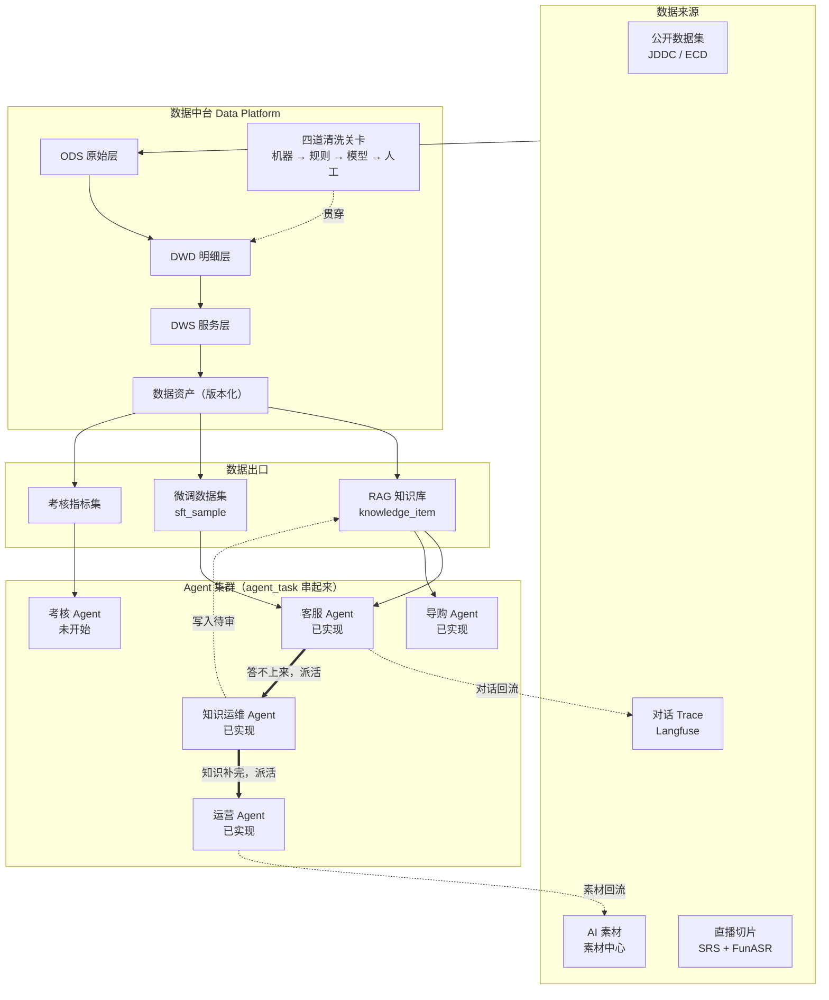

# smartMall — 多模态电商 AI Agent 体系

> 一套以**数据中台**为心脏、以**数据飞轮**为驱动的电商多模态 AI 系统。
> 从 AI 客服出发，串起素材生产、直播切片、销售考核与模型微调，形成可自我增强的闭环。

---

## 这个项目在解决什么问题

电商场景里，AI 能力往往是割裂的：客服机器人是一套、生成宣传图是一套、直播剪辑是一套、质检考核又是一套。每套都各自攒数据、各自调模型，数据不流动，能力不叠加。

smartMall 的主张是：**把所有 AI 能力接到同一个数据中台上，让它们互相喂养。**

- 运营 Agent 生成的宣传图/视频 → 进素材中心 → 经数据中台清洗 → 变成 AI 客服回答"这件衣服什么面料"时能甩出来的图
- 主播直播的口播话术 → 自动切片 → 转写清洗 → 变成 AI 客服的卖点知识
- AI 客服的真实对话 → 回流数据中台 → 一份喂给 RAG 知识库，一份喂给微调，让客服越来越不像机器人
- 同一批对话 → 喂给销售考核系统，量化人和 AI 的服务质量

数据转得越快，每个 Agent 都越强。这就是飞轮。

---

## 架构总览



**那两条粗箭头是「集群」与「四个共用底座的 Agent」的区别**：客服答不上来
自动给知识运维派一个补写任务，补完了、且这个盲点属于某个商品，再自动给运营
派一个更新文案的任务。中间没有人点按钮。串起来的是一张 `agent_task` 表，
判据在 `tasks/dispatch.py` —— 那里最要紧的是**不派**的五种情况（自伤求助、
用户主动要人工、议价投诉退款、服务故障、内部异常），详见[跨 Agent 闭环](#跨-agent-闭环)。

---

## 文档索引

### 总纲

| 文档 | 内容 |
|---|---|
| [00 · 项目全景](docs/00-overview.md) | 数据飞轮、业务场景、名词表、三个核心主张 |
| [01 · 总体架构](docs/01-architecture.md) | 服务拆分、部署拓扑、关键链路时序图 |
| [02 · 技术选型](docs/02-tech-selection.md) | 选型结论表、理由、**被否决项与否决原因** |

### 数据与知识

| 文档 | 内容 |
|---|---|
| [03 · 数据中台](docs/03-data-platform.md) | 分层模型、核心表 DDL、四道清洗流水线、数据资产版本化 |
| [04 · RAG 知识库](docs/04-rag-knowledge.md) | `knowledge_item` 统一模型、切分、混合检索、多模态索引、评测 |

### Agent 集群

| 文档 | 内容 |
|---|---|
| [05 · 客服 Agent](docs/05-agent-customer-service.md) | 状态图、工具集、多模态入口、兜底与转人工 |
| [06 · 运营 Agent](docs/06-agent-marketing.md) | 文案 / 宣传图 / 宣传视频三条子链路、合规拦截 |
| [07 · AI 素材中心](docs/07-asset-center.md) | 素材数据模型、生命周期、商品关联、审核流、AI 标识 |
| [08 · 直播切片 Agent](docs/08-agent-live-clip.md) | SRS 录制 → ASR → 语义分段 → 商品对齐 → 回灌 |
| [11 · Agent 集群协作](docs/11-agent-cluster.md) | MCP 工具层、Agent Card 注册、Kafka 任务总线 |

### 模型与度量

| 文档 | 内容 |
|---|---|
| [09 · AI 销售考核](docs/09-sales-kpi.md) | 指标体系、Judge rubric、人工校准与验收阈值 |
| [10 · 模型微调](docs/10-finetune.md) | 「去 AI 味」目标、SFT/DPO 数据构造、评测、A/B 上线 |
| [12 · 评测与可观测](docs/12-eval-observability.md) | Langfuse trace、Ragas 回归集、线上看板 |

### 工程落地

| 文档 | 内容 |
|---|---|
| [13 · 里程碑路线图](docs/13-roadmap.md) | M0–M7 排期与每阶段可演示验收标准 |
| [14 · 基础设施](docs/14-infra.md) | 硬件清单、docker-compose 拓扑、GPU 分时调度、成本 |
| [15 · 风险与合规](docs/15-risks-compliance.md) | 风险登记册、AI 生成内容标识、广告法、数据来源合规 |

---

## 技术栈速览

| 层 | 选型 |
|---|---|
| 业务后端 | Java 21 / Spring Boot 3 / MyBatis-Plus / MySQL 8<br><sub>本地跑只要 MySQL 一个外部组件；Redis / Kafka 属于整套 Docker 部署，mall-* 目前不依赖它们</sub> |
| AI 后端 | Python 3.11 / FastAPI / LangGraph / LiteLLM |
| 向量检索 | Milvus 2.5（内置 BM25 混合检索）+ bge-m3 + bge-reranker-v2-m3 |
| 数据处理 | Data-Juicer（自动清洗）+ Label Studio（人工标注）+ Airflow 3（调度）+ ClickHouse（分析） |
| 语音 | FunASR（ASR）+ CosyVoice2（TTS） |
| 图像 | **已落地**：百炼 `qwen-image-2.0-pro`（同步，秒级）<br><sub>方案里原本是本地 ComfyUI + FLUX，实际改走云 API —— 单卡 24G 要分时复用，而生成商品图这件事没有任何需要本地跑的理由（不涉及私有数据、不需要 LoRA）。ComfyUI + IP-Adapter + CatVTON 虚拟试穿留作后续</sub> |
| 视频 | **已落地**：百炼 `wan2.7-t2v`（异步，任务轮询，1–5 分钟）<br><sub>同上，本地 Wan2.2-TI2V-5B 的方案见 docs/02。SRS 直播切片未开始</sub> |
| 训练 | LLaMA-Factory（LoRA SFT + DPO）+ vLLM（推理与 A/B） |
| 可观测 | Langfuse + Ragas + promptfoo |

**模型策略**：混合部署 —— 对话与文案走云 API（DashScope / DeepSeek），ASR、TTS、图像、视频、Embedding 本地自建，微调本地 LoRA。
**硬件基线**：单卡 24G（RTX 4090 / A10），重任务分时复用。详见 [14 · 基础设施](docs/14-infra.md)。

---

## 快速开始

**只要两样东西：JDK 21 和一个本机 MySQL 8。不需要 Docker。**

```powershell
$env:MYSQL_ADMIN_PASSWORD="你的 root 密码"   # 只给 db-init 用，见下方说明
.\smartmall.ps1 db-init      # 建库 + 建应用账号 + 建表 + 跑迁移
.\smartmall.ps1 build        # 构建 5 个 Java 服务的 jar
.\smartmall.ps1 up           # 后台起全部 Java 服务，等到就绪才返回
.\smartmall.ps1 serve        # 店铺页 :9002（前台，另开一个终端）
```

```bash
export MYSQL_ADMIN_PASSWORD="你的 root 密码"     # Linux / macOS
make db-init && make build && make up
make serve                                       # 另开一个终端
```

打开 <http://127.0.0.1:9002/> 就能下单。起不来先跑 `doctor`：

```powershell
.\smartmall.ps1 doctor       # 一次查完 JDK、依赖、数据库、账号、迁移、端口
.\smartmall.ps1 status       # 5 个服务各自的状态与 MySQL 连通性
```

细节见下面的[启动](#启动)一节。整套 Docker 部署（Kafka / Milvus / MinIO /
ClickHouse 全家桶）是另一条路，本地开发用不到，见
[deploy/README.md](deploy/README.md) 与 `make docker-up`。

---

## 当前状态

| 里程碑 | 状态 | 内容 |
|---|---|---|
| **M0 基础设施** | ✅ 已完成 | monorepo 骨架、11 个服务、compose 三件套、30 张表、Kafka 契约、健康探针 |
| **M1 数据中台 + RAG** | 🟡 核心已完成 | 四道清洗关卡、`knowledge_item`、混合检索、发版门禁、覆盖度矩阵、3 个 DAG（434 测试）、ai-rag `/search` 接通 Milvus（含跑在 Milvus Lite 上的集成测试）<br/>待接真实环境：JDDC 导入、Label Studio 项目配置、bge-reranker |
| **M2 文本 AI 客服** | ✅ 已完成 | LangGraph 状态机、七类意图分流、引用溯源、转人工、Trace 落库、点赞点踩、知识盲点回流、只读业务工具（含越权校验）、WebSocket 流式、店铺前台与客服浮窗、评测集与门禁<br/>待做：Redis 会话（多实例部署才需要） |
| **M3 运营 Agent + 素材** | 🟡 核心已完成 | 文案生产（卖点溯源 + 广告法合规拦截）、商品图与宣传视频生成（云 API）、素材一律待审、**人工审核闭环**（通过后买家页才看得到）、《标识办法》要求的 AI 生成标识<br/>未做：CosyVoice2 口播、ComfyUI 工作流版本化、虚拟试穿 |
| **M4 多模态客服** | 🟡 核心已完成 | 图片理解入口（qwen-vl-max）、图片 PII 脱敏（失败关闭）、单据/商品图分流<br/>未做：把素材作为答案挂载回去 |
| **M2.5 商城底座** | ✅ 已完成 | JWT 鉴权、商品/SKU CRUD、订单全生命周期、防超卖与幂等、退款审核、商家后台<br/>促销与权限模块仍是**零代码**，别当成已有 |
| **M2.6 Agent 集群** | ✅ 已完成 | `agent_task` 跨 Agent 派活：客服 → 知识运维 → 运营，去重、优先级、原子认领、重试与 needs_human 分离 |
| M5 直播切片 | ⬜ | SRS + FunASR + 语义分段 |
| M6 销售考核 | ⬜ | Judge + 校准 |
| M7 模型微调 | ⬜ | LoRA SFT + DPO |

排期与每阶段验收标准见 [13 · 里程碑路线图](docs/13-roadmap.md)。
**里程碑编号与最初的方案对不齐**是有意保留的：M2.5 / M2.6 是做的过程中才发现
必须先有的东西（没有商城底座，运营 Agent 没有真商品可写；没有任务表，四个
Agent 只是各跑各的）。改成漂亮的连续编号会把这段真实的次序抹掉。

### 四个 Agent

| Agent | 干什么 | 入口 | 它最要紧的一条判据 |
|---|---|---|---|
| **客服** | 答商品/售后/物流问题，答不了转人工 | `smartmall-agent chat` | 检索**失败**与检索到**0 条**是两回事：0 条能进澄清流程，失败只能转人工——对用户说"没找到"而真相是服务宕了，那是撒谎 |
| **导购** | 多轮问出需求，从在售商品里挑 | `smartmall-agent shop` | 零候选时**不硬推**。放宽了哪些条件要如实说出来，否则用户以为这就是他要的 |
| **知识运维** | 把盲点补成待审知识条目 | `smartmall-agent kb` | **不写**是随时可以、而且经常应该做的决定。没有依据不起草，数字没出处不落库 |
| **运营** | 写文案、生成商品图与宣传视频 | `smartmall-agent copy` / `media` | 产出是**对外发布**的，归《广告法》管。极限词、功效宣称、属性表里没有的成分一律拦截，且**不自动改写**——改完没人再看一眼，而责任在店铺不在模型 |

四个 Agent 共用一套编排底座（`app/agent/nodes.py` 的 `run_node`），所以
页面上那个执行轨迹面板对四个都有效，不用各写一份。

### M0 已交付

```
apps/java/      mall-{gateway,product,asset,dataplat,kpi} + mall-common
apps/python/    ai-{rag,agent,media,clip,train} + ai-common；ai-gateway 用 LiteLLM 官方镜像
deploy/         compose 四件套、30 张表 DDL、ClickHouse 分析表、5 个运维脚本
pipelines/      Airflow DAG 与 Data-Juicer 配方目录
comfyui-workflows/  工作流注册表契约
evals/          13 个评测集的规格与门禁阈值
```

**已验证**：6 个 Java 模块编译通过；10 个服务本地启动并 `/health` 全绿；
网关经 `StripPrefix` 正确转发到各后端；Java 与 Python 两侧 `ApiResponse` JSON 形状一致；
Kafka Topic 契约校验通过（含负向测试）；四个 compose 文件语法校验通过。

### M1 已交付

```
pipelines/smartmall_pipeline/
  models.py         领域模型（Dialogue / KnowledgeItem / SftSample / 漏斗报表）
  ingest/           JDDC 适配器 + 合成数据生成器
  gates/            四道清洗关卡 + PII 脱敏
  orchestrator.py   四关编排（不依赖 Airflow，可在 pytest 跑通）
  publish.py        7 项发版质量门禁 + JSONL 快照
  coverage.py       类目 × 知识类型覆盖度矩阵 → 补写任务
  repository.py     SQLAlchemy Core 数据访问
pipelines/dags/     3 个 Airflow DAG
pipelines/recipes/  Data-Juicer 配方 + 算子校验工具
apps/python/ai-rag/app/
  chunking.py       按 biz_type 分策略切分
  retrieval.py      硬性过滤 · RRF 融合 · 阈值裁剪
  milvus_store.py   Milvus 检索层：分路召回（继承 pipeline 的索引层）
  search.py         /search 的服务层：向量化 · 硬性过滤 · 判据补全
pipelines/smartmall_pipeline/rag/
  store.py          LocalVectorStore（MySQL + 内存，无 Milvus 也能跑）
  milvus.py         Milvus 索引层：schema · 建表 · 写入
  bm25.py           中文 BM25 + LexicalStats（词汇覆盖率）
```

**测试**：499 个（pipeline 434 + ai-rag 65），`pytest` 全绿。
端到端用例从 300 条合成对话跑到可发布的知识条目，断言漏斗单调递减、
PII 零残留、全链路可溯源、流水线可复现。ai-rag 里有 28 条**真跑
Milvus**（Milvus Lite，嵌入式，不需要 Docker）的集成测试——
`milvus_store.py` 曾经是没人实例化过的死代码，三个阻塞缺陷全部是
纯逻辑测试发现不了、只有真实例才会报的。

```bash
cd pipelines && pip install -e ".[dev]" && pytest -q   # 434 passed
cd apps/python/ai-rag && pip install -e ../ai-common -r requirements.txt && pytest -q   # 65 passed
```

### 跑一遍数据中台

只需要 MySQL（不需要 Docker、GPU、也不需要 API Key）：

```bash
cd pipelines
pip install -e .

export MYSQL_HOST=localhost MYSQL_USER=smartmall MYSQL_PASSWORD=smartmall MYSQL_DATABASE=smartmall

smartmall-pipeline check                  # 校验连通性、表结构、中文编码
smartmall-pipeline ingest --count 400     # 生成合成对话写入 ODS
smartmall-pipeline clean --fake-llm       # 跑四道关卡，打印漏斗报表
smartmall-pipeline stats                  # 各层数据量
smartmall-pipeline peek                   # 抽查产出的实际内容
smartmall-pipeline dedup --yes            # 清掉同题重复（清洗流水线已内置，这条修存量）
smartmall-pipeline coverage               # 知识覆盖度矩阵
smartmall-pipeline publish --version kb-v1
```

`--fake-llm` 用假模型跑通链路，不产生 API 费用——但产出的是占位文本，
只能验证管道，不能当知识库用。真实清洗按下表选一个通道：

| 通道 | 命令 | 需要什么 |
|---|---|---|
| 阿里云百炼 | `clean --llm dashscope` | `DASHSCOPE_API_KEY`（默认通道） |
| 任意 OpenAI 兼容服务 | `clean --llm openai` | `SMARTMALL_LLM_BASE_URL` + `SMARTMALL_LLM_API_KEY` + 三个 `SMARTMALL_*_MODEL` |
| LiteLLM 网关 | `clean --llm gateway` | Docker 起 `ai-gateway`，统一记账与降级 |

`--llm openai` 接的是**任何** OpenAI 兼容端点——DeepSeek、Kimi、智谱、
硅基流动、本地 vLLM 都行。模型名三个阶段分开配（粗筛量最大，用便宜的）：

```bash
export SMARTMALL_LLM_BASE_URL=https://api.deepseek.com
export SMARTMALL_LLM_API_KEY=sk-xxx
export SMARTMALL_TRIAGE_MODEL=deepseek-chat    # 粗筛，全量跑
export SMARTMALL_EXTRACT_MODEL=deepseek-chat   # 抽取，只跑粗筛通过的
export SMARTMALL_STYLE_MODEL=deepseek-chat
smartmall-pipeline clean --llm openai --limit 20
```

先用 `--limit 20` 试水。调用失败一律不会把 ODS 记录标记为已处理，
修好配置后直接重跑 `clean` 就会接着处理，不会丢数据也不会重复。

Windows PowerShell 用 `$env:MYSQL_HOST="localhost"` 设置环境变量，
且不支持 `&&`，命令需分行执行。也可以把上面这些写进 `deploy/.env`，
CLI 会自动读取（见 `deploy/.env.example`）。

### 换到 Milvus（Windows 上也不需要 Docker）

默认的 `LocalVectorStore` 把向量放 MySQL、检索在内存里做，不需要额外
部署任何东西。要走 Milvus 那条路，**在 Windows 上也不需要 Docker 或
Linux 服务器**——`milvus-lite` 3.2 起是纯 Python 包：

```bash
pip install pymilvus "milvus-lite[chinese]"

# 把索引写进 Milvus。--milvus-uri 给一个文件路径 = Milvus Lite（嵌入式）
smartmall-pipeline index --backend both --milvus-uri ./data/kb.db

# 起检索服务
export KB_MILVUS_URI=$PWD/data/kb.db      # PowerShell: $env:KB_MILVUS_URI="D:\smartMall\data\kb.db"
cd apps/python/ai-rag && uvicorn app.main:app --port 9001

# Agent 指过来
smartmall-agent chat --rag-url http://localhost:9001
```

`--backend both` 是两边都写。上线到 Milvus 服务端时只改两处：
`KB_MILVUS_URI=http://host:19530`，以及 `MILVUS_ANALYZER=chinese`
（Lite 只认 `jieba`，服务端只认 `chinese`，两边合法取值不同）。

**三个踩过的坑**，都写进测试了：

- **`MILVUS_URI` 这个变量名不能用** —— pymilvus 自己读它并按 URL 校验，
  设成文件路径会在 import 阶段抛 `Illegal uri`，报错点在 pymilvus 内部。
  所以本项目用 `KB_MILVUS_URI`。
- **接 Milvus 不能直接用 `hybrid_search`** —— 它只返回融合后的 RRF 分
  （上限 `2/(k+1)≈0.033`），而 Agent 的拒答阈值 `handover_below=0.30`
  是照余弦相似度量出来的。喂 RRF 分进去，**每一条查询都会转人工**，
  且不报错。所以走的是分路召回 + 本地 RRF。
- **Milvus 给不出 `lexical_overlap`** —— 那是 `has_lexical_support` 用来
  区分「转人工」和「澄清」的判据。缺了它闸门退回 `bm25 > 0`，而那个
  判据近乎恒真。补法见 `LexicalStats`：只存语料级 `term→df`
  （内存 O(词表)），覆盖率对命中自身的文本算。

什么时候才真需要 Milvus 服务端，见
[docs/02-tech-selection.md](docs/02-tech-selection.md#23-向量库milvus-standalone)——
判据不是条数，是内存装不下 / 要免重启增量 / 要多进程共享索引。

### 跟客服 Agent 对话

知识库建好之后（`clean` → `index`）就能直接对话，同样只需要 MySQL。
注意路径是相对**仓库根**的，上一节结束时还在 `pipelines/` 里：

```bash
cd ..                              # 回到仓库根
pip install -e apps/python/ai-agent

smartmall-agent chat -v                      # 交互式多轮，-v 显示意图与命中分数
smartmall-agent ask "这件是什么面料" -v
smartmall-agent trace "会起球吗"              # 单轮 + 完整 Trace
smartmall-agent chat --product-id 1024       # 带商品上下文，检索按商品收窄
```

`-v` 会打印意图分类结果、命中的知识条目与相似度、以及为什么转人工——
调阈值时这些是唯一有用的信息。答不上来时它会转人工并生成交接摘要，
而不是硬编一个答案。

### 店铺前台 + 客服浮窗

```bash
pip install -e "apps/python/ai-agent[server]"
smartmall-agent serve          # → http://127.0.0.1:9002/
```

商品列表 → 商品详情（价格 / SKU 库存 / 尺码表）→ 选规格下单 → 右下角「智能客服」浮窗。
浮窗里两个页签：**智能客服**（答问题）与**智能导购**（多轮问出需求再挑商品），
两边共用一条 WebSocket 和一个会话，服务端按 `agent` 字段分流——所以用户从
"这件什么面料"聊到"再帮我挑一件"，上下文是连续的一份。

做成显式的两个页签而不是让一个 Agent 自动判断该走哪条链路：意图分类会错，
错了用户完全看不出发生了什么，只觉得"它答非所问"。页签是用户自己选的，
选错了他自己知道怎么改回来。

右上角头像切换演示身份（演示买家 / 另一位买家 / 店铺管理员），背后是真的
重新登录换一枚令牌——**订单归属只认令牌里的身份**，改浏览器里的任何字段
都越权不了。商家后台在 [/merchant](#商家后台)。

### 启动

**这个项目本地跑起来只需要两样东西：JDK 21，和一台本机 MySQL 8。**
Redis、Kafka、Milvus 那些都不需要 —— 曾经 pom 里挂着 Redis / Kafka 的 starter，
但代码对它们是零引用，只会在没起这些中间件时刷一屏连接重试日志、把
`/actuator/health` 长期钉在 DOWN，让人以为自己环境没装齐。现在已经摘掉了。

五个 Java 服务：

| 服务 | 端口 | 作用 |
|---|---|---|
| `mall-product` | 8081 | **商品 / SKU / 订单全链路 —— 店铺页下单只要它** |
| `mall-asset` | 8082 | 素材中心（骨架） |
| `mall-dataplat` | 8083 | 数据平台（骨架） |
| `mall-kpi` | 8084 | 考核域（骨架） |
| `mall-gateway` | 8080 | 反向代理，把 `/api/**` 分发到上面几个与 Python 服务 |

只想让购买按钮能用的话，起 `mall-product` 一个就够：

```powershell
.\smartmall.ps1 up mall-product
```

#### 第一次

```powershell
$env:MYSQL_ADMIN_PASSWORD="你的 root 密码"
.\smartmall.ps1 db-init      # 建库 + 建应用账号 + 建表 + 跑迁移（可反复执行）
.\smartmall.ps1 build        # 构建 jar，第一次要下 Maven 依赖，几分钟
.\smartmall.ps1 up           # 后台起全部服务，等到 /health 有应答才返回
.\smartmall.ps1 serve        # 店铺页 :9002（前台，另开一个终端）
```

之后每天只要 `up` + `serve`。改了 Java 代码就 `build` 再 `restart`。

```powershell
.\smartmall.ps1 status              # 谁在跑、连没连上 MySQL
.\smartmall.ps1 logs mall-product   # 看日志尾部（完整日志在 logs/ 下）
.\smartmall.ps1 run  mall-product   # 前台起一个，日志直接打在终端上，Ctrl-C 停
.\smartmall.ps1 down                # 全停
```

Linux / macOS 用 `make`，目标名一一对应：`make db-init` / `build` / `up` /
`status` / `logs S=mall-product` / `down` / `serve`。

#### 两套数据库凭据，别混用

| 变量 | 谁用 | 默认值 |
|---|---|---|
| `MYSQL_ADMIN_USER` / `MYSQL_ADMIN_PASSWORD` | **只有 `db-init`**：建库、建表、建账号 | `root` / 空 |
| `MYSQL_USER` / `MYSQL_PASSWORD` | **应用**（mall-* 与店铺页）连库 | `smartmall` / `smartmall` |

`db-init` 会顺带建出应用账号 `smartmall/smartmall` 并**真的试连一次**确认可用 ——
迁移走的是 root，而 `application.yml` 与 `repository.py` 里写死的默认账号是
`smartmall`。不建它的话迁移成功、应用却连不上，页面表现为「商品数据读取失败」。
想用别的账号：`$env:MYSQL_USER` / `$env:MYSQL_PASSWORD`（两个要一起设）。

**别把 root 密码设进 `MYSQL_PASSWORD`。**这是实测卡过一整轮的坑：只设它、不设
`MYSQL_USER`，应用就会拿 `smartmall` + 你给的 root 密码去连，报
`Access denied for user 'smartmall'@'localhost'` —— 错误指向应用账号，看起来
像账号没建好，其实是密码张冠李戴。`up` / `serve` 起动前会检测这种半设状态并警告，
`doctor` 也会单独列一项。

#### 数据库怎么初始化的

`db-init` 就是 `python deploy/scripts/migrate.py`，**PyMySQL 直连本机 MySQL**，
不需要 `mysql.exe` 在 PATH 上（Windows 上常常不在），也不需要 Docker。它做四件事：

1. `CREATE DATABASE IF NOT EXISTS smartmall`（utf8mb4）
2. 建应用账号，用 `ALTER USER` 把密码校准，`@%` 与 `@localhost` 两个都建，然后试连确认
3. 库是空的就先跑 `deploy/sql/mysql/*.sql` 建基础表 —— 容器版由 MySQL 镜像的
   initdb 自动做，本机 MySQL 没有这机制，不补的话迁移会在第一条 `ALTER TABLE`
   上找不到表
4. 按序应用 `deploy/sql/migrations/*.sql`，用 `schema_migrations` 表记账

**它是个真的迁移器，不是 `for f in *.sql`。**迁移里有 `ALTER TABLE ... ADD COLUMN`，
那不幂等 —— 第二次跑就是 `Duplicate column name`。而且是**逐条语句执行**的，
「已存在」的那条跳过：之前手工跑过一部分迁移的库也能直接 `db-init`，已有的略过、
缺的补上，收敛到与全新安装完全相同的 schema（逐表比对验证过）。只有语法错误、
缺表这类真错误才会中断。

```powershell
.\smartmall.ps1 db-status     # 看还差哪些迁移
```

#### 构建为什么用 `./mvnw` 和 `java -jar`

**用 `./mvnw` 而不是 `mvn`**（Windows 是 `.\mvnw.cmd`）。仓库自带 Maven Wrapper，
首次运行自动下载锁定版本的 Maven，**机器上装没装、装的哪版都不影响**。

这不是洁癖。同一份代码在老 Maven（3.3.9，2015 年）上连撞三个错：

| 现象 | 真正的原因 |
|---|---|
| `不再支持源选项 5` | 超级 POM 给了 compiler 3.1，它不认识 `maven.compiler.release`，回退到 1.5 —— 而 pom 里明明写着 `release 21`，报错和配置对不上 |
| `requires Maven version 3.6.3` | 锁了插件版本之后暴露出的下一层：Spring Boot 3.x 本身就要求 3.6.3+ |
| **测试静默归零** | 老 Maven 默认 surefire 2.12.4，那是 JUnit 5 之前的版本，一个测试都不跑还报 BUILD SUCCESS |

第三个最危险 —— 前两个至少会红，它是绿的。真要用自己的 `mvn`，得 ≥ 3.6.3，
否则 enforcer 会在 `validate` 阶段（第一步）拦下并告诉你怎么办。

**起服务用 `java -jar`，不用 `mvn spring-boot:run`。**后者对多模块项目走不通，
两种写法都会失败：

| 命令 | 报错 | 原因 |
|---|---|---|
| `mvn -pl mall-product spring-boot:run` | `Could not find artifact com.smartmall:mall-common` | `-pl` 只把 mall-product 放进 reactor，它依赖的 mall-common 既不在 reactor 里、本地仓库也没有 |
| `mvn -pl mall-product -am spring-boot:run` | `Unable to find a suitable main class` | `-am` 把 parent 一起拉进 reactor，而 `spring-boot:run` 对每个模块都跑一遍，轮到 parent 就没有 main class |

绕过去要「先 install 再 run」两步，而五个服务就是五次 Maven 启动 + 五次依赖解析。
`build` 一次打出全部 fat jar，`up` 之后只剩 JVM 本身的启动时间。

#### 店铺页

`serve` 会先装三个本地包（顺序不能变，都不在 PyPI 上）：

```bash
pip install -e pipelines -e apps/python/ai-common -e "apps/python/ai-agent[server]"
```

**PyMySQL 不用单独装** —— 它是 Python 连 MySQL 的驱动（不是数据库），
`pipelines` 已经依赖它了。少装 `pipelines` 的症状很隐蔽：页面照常打开、
商品列表是空的、点购买没反应，只有 `/api/products` 的响应体里留一句
`"error":"ModuleNotFoundError"`。

下单由 `mall-product` 实现（Java），店铺页通过 ai-agent 的 `/api/orders` 转发过去。
只跑 `serve` 不起 `mall-product` 的话，页面能逛，点购买会明确提示订单服务没起来。

#### 对着真库复核一遍

```powershell
.\smartmall.ps1 verify        # 需要先 up
```

跑两项：整条状态机（下单→支付→发货→送达→收货→退款申请/驳回/同意）和
50 并发抢 5 件的防超卖。**107 个 Java 单测之外还要这个，因为单测跑在 H2 上，
而 H2 不是 MySQL** —— `UPDATE` 的 SET 子句求值顺序、InnoDB 的行锁语义，两处
都真实咬过人，详见 `deploy/scripts/verify-orders.py` 的文件头注释。

完整生命周期：

```
pending_payment ──pay──> paid ──ship──> shipped ──deliver──> delivered ──confirm──> completed
       │                  │              │                      │             │
       │                  └──────────────┴──────────────────────┴─────────────┘
    cancel                                  applyRefund
       │                                         │
       ▼                                         ▼
   cancelled                                 refunding ──approve──> refunded（回补库存）
  （回补库存）                                     │
   超时未支付                                      └──reject──> 回到申请前的状态
   自动走这条
```

```
用户侧（需登录）                                  商家侧（@RequireMerchant）
POST /api/product/orders                          POST /api/product/admin/orders/{no}/ship
POST /api/product/orders/{no}/pay                 POST /api/product/admin/orders/{no}/deliver
POST /api/product/orders/{no}/cancel              POST /api/product/admin/orders/{no}/refund/approve
POST /api/product/orders/{no}/confirm             POST /api/product/admin/orders/{no}/refund/reject
POST /api/product/orders/{no}/refund
GET  /api/product/orders/{no}
```

商家动作单独放在 `/admin` 前缀下：现在 `@RequireMerchant` 一条类级注解就把整片
挡住了。和用户动作混在一起的话，得一个方法一个方法判断该不该拦，漏一个就是一个洞。

**退款不会自动放行。** 申请只把订单挂到 `refunding`，不动钱也不动库存；同意退款
才回补，而那需要人点头。这与工具层全只读是同一条原则：不可逆的动作不能被自动触发。

驳回后订单回到**申请前**的状态（`status_before_refund`）——已发货的单被驳回后
必须还是 `shipped`。写死成 `paid` 会让"这单发没发货"凭空改变，而客服正是照着
这个字段回答"我的货到哪了"。

四条不变式，各自对应代码里一处具体写法：

| 不变式 | 靠什么保证 |
|---|---|
| **不超卖** | `UPDATE sku SET stock=stock-? WHERE sku_no=? AND stock>=?` —— 判断与扣减在同一条 UPDATE 里，InnoDB 持行锁求值谓词，并发自动串行 |
| **不重单** | `request_id` 唯一索引 + 快慢两条回查路径 |
| **不漏库存** | 扣库存与建单同事务；幂等落败的那笔整体回滚，扣掉的库存跟着吐回来 |
| **库存至多回补一次** | 三条会回补的路径（手动取消 / 超时回收 / 同意退款）全靠条件更新裁决，谁的 UPDATE 返回 1 谁才有资格回补；前置状态互斥，已取消的单进不了退款流程 |

**下单即扣库存（预占）**，因为"判断有没有货"和"把货占住"必须是同一个动作，
放到支付时再扣就又出现窗口。代价是没付钱的单占着货，所以有个定时任务回收——
不回收的话，一批放弃支付的订单能把热销 SKU 永久锁死：页面显示无货而一件没卖出去。

```yaml
smartmall.order.payment-ttl: PT30M              # 多久算超时
smartmall.order.release-expired.enabled: true   # 关掉它
smartmall.order.release-expired.interval: PT1M  # 扫描间隔（fixedDelay）
```

**30 分钟是拍的不是算的**，真实场景由支付渠道超时与大促周转速度决定（通常 15–30 分钟），
上生产前按实测重定。页面上的「几点前未支付将自动释放」由服务端按这个配置算出来
（`OrderView.expiresAt`），不在前端写死——写死的话改了配置页面就开始骗人。

**多实例不需要分布式锁**：两个 mall-product 的定时任务会扫到同一批订单，但都要过
那句条件 UPDATE，同一笔订单只有一个实例拿得到 1。重复扫描浪费几次查询，
正确性由数据库的行锁保证。

最危险的一刻是**用户在超时那一秒点支付**：支付与回收必须恰好成功一个。
支付赢则订单 paid、库存保持扣减；回收赢则订单 cancelled、库存回补，
而支付**必须报错**——若此时还允许置为 paid，就会出现"付了钱但货已还回库存"，
超卖从这个口子漏出来。有一条 15 轮的竞态测试盯着它。

**为什么订单放在 mall-product 而不是独立的 mall-order**：扣库存与建单必须原子，
而库存归 mall-product 管。拆开这个原子性就得靠 Saga / TCC 补偿维持，而整个项目
跑在一个 MySQL 上，付出分布式事务的复杂度换不来任何东西。真要拆时接缝是
`OrderService` 的公开方法，不是数据库。

**下单接口在 ai-agent 这边只是转发，不是实现。**工具层是刻意全只读的（AI 误触发的
退款、改价是不可逆的资金损失），在 Python 侧再写一份扣库存逻辑等于给那道边界开
口子，还会出现两份实现漂移——库存以谁为准就说不清了。转发只是因为演示页由
ai-agent 托管，跨域调另一个端口不如在这里转一次省事。

超卖这类问题在手工点击下永远复现不出来，所以有测试盯着：107 个 Java 测试，
其中并发那组是 50 线程抢 5 件、100 线程抢 3 件，另有 15 轮的支付/回收竞态。

**但单元测试跑在 H2 上，而 H2 与 MySQL 有两处语义不同，都真实咬过人：**

| 差异 | 后果 | H2 表现 |
|---|---|---|
| `UPDATE` 的 SET 子句求值顺序 | MySQL 后面的赋值看得见前面写入的新值，`SET status='refunding', status_before_refund=status` 会把 `refunding` 存进去，驳回时"还原"成 refunding，订单永远卡在审核中 | 假绿 |
| 行锁实现 | 防超卖的全部保证压在条件 UPDATE 的原子性上，而它取决于存储引擎 | 通过不代表 InnoDB 通过 |

所以有一个脚本对**真库**复核，两处坑都是这么发现的（先 `up` 起 mall-product）：

```powershell
.\smartmall.ps1 verify                                  # 两项都跑
python deploy/scripts/verify-orders.py lifecycle        # 只跑状态机
python deploy/scripts/verify-orders.py concurrency      # 只跑防超卖
```

**时区那条也在里面**：业务代码用 `LocalDateTime.now()` 写的列走 JVM 时区，
SQL 里 `NOW()` 写的列走 MySQL 会话时区。两者不一致时，一笔订单会「15:25 下单、
23:25 发货」—— 而客服正是照着这些字段回答"我的货什么时候发的"，于是它会
向用户陈述一段根本没发生过的 8 小时延迟。这是存进库里的脏数据，不是显示问题。

两侧都要钉死，钉一侧不够：

- JVM 侧 —— 应用启动时 `AppTimeZone.apply()`，五个服务都调，在 `run()` 之前。
- MySQL 侧 —— Hikari 的 `connection-init-sql` 每条连接执行
  `SET time_zone = '+08:00'`。**只钉 JVM 这一侧是不够的**：`NOW()` 在服务器上
  求值，用的是会话时区。实测本机 MySQL 跑在 UTC 时，`created_at` 与
  `shipped_at` 相差整 480 分钟，而复核脚本正是这么抓到的。用数字偏移不用
  `'Asia/Shanghai'`，因为后者要求 MySQL 装过时区表（`mysql_tzinfo_to_sql`），
  Windows 上默认没装，会直接报 `Unknown or incorrect time zone` 连不上。

**身份由 JWT 决定，不由请求参数决定。** `CreateOrderRequest` 里没有 `userId`——
它曾经有过，那意味着**改浏览器里一个数字就能替别人下单**，越权校验的 SQL 写得
再对也没用，因为 `WHERE user_id = ?` 里那个值本身就是攻击者填的。现在归属来自
签名校验过的令牌（`AuthPrincipal`），前端连伪造的机会都没有。

越权口径与客服工具层一致：不属于你的订单，返回的错误与「订单不存在」一字不差，
不给攻击者存在性预言机。

几条实现上的取舍：

- **HS256，且拒绝短于 32 字节的密钥**（构造时就抛，不等到签发）。
- **验签时不看令牌自己声明的 alg**，用服务端定死的算法——否则伪造一个
  `alg: none` 或把 RS256 换成 HS256 拿公钥当密钥就能绕过。
- **登录是常数时间的**：用户名不存在时也跑一次 BCrypt（对着一个固定的假哈希），
  否则响应快慢就是一个用户名枚举器。
- **鉴权放在被访问的那一端**，不是只放在网关上：Python 侧直接调
  `mall-product:8081`，只在网关拦等于没拦。
- ThreadLocal 的身份上下文在 `finally` 里清——Tomcat 复用线程，不清就是随机的
  跨请求身份泄漏，而这种 bug 在低并发下永远复现不出来。

**做成店铺而不是裸聊天页是有理由的**：当前商品是客服最重要的上下文——
它决定检索的过滤范围、决定查哪个 SKU 的库存。从商品详情页点「联系客服」
自然带上 `product_id`，这条链路只有真的有商品页时才说得清；裸聊天页
只能靠一个下拉框假装。页面的商品数据与客服的工具层**读同一个数据源**，
分成两条路的话，页面显示「有货」而客服说「缺货」，用户会以为系统在骗人。

客服窗口右上角的「诊断」按钮展开侧栏：意图分到哪一类、命中了什么、
相似度多少、有没有词汇支撑、调了哪些工具、为什么转人工。默认收起——
对普通用户是噪音，对演示和调参是唯一有用的信息。

零外部请求：不引 CDN、不引 Google Fonts，商品图是仓库里的本地文件，图标是内联 SVG（**不用 emoji** —— 跨平台字形差异大，购物袋、扳手这类在 Windows 上常掉成方框，而这就是给 Windows 演示的）。
演示环境常常没有外网，「打不开」比「不好看」严重得多，有测试扫外链。

流式走 WebSocket，事件分四类：`status`（阶段提示）、`delta`（生成中的文本）、
`done`（最终结果）、`error`。RAG 链路 P95 约三秒，纯等待会让用户以为卡住。

**一个必须说清的取舍**：流式要在合规检查**之前**把字推出去，而广告法违规
内容一旦到了用户眼前，撤回不等于拦截。所以 `delta` 按草稿处理（前端虚线框），
`done` 里的文本才是过了检查的定稿，被改写或拦截时整段替换。做不到
「违规内容一个字都不出现」——那只能放弃流式；做到的是「用户最终看到
并留存的内容一定过了检查」。

HTTP 形态：`POST /chat`，返回 `answer` / `citations` / `trace_id` / `handover`。

### 评测

**测试与评测不是一回事。** 1259 个单测证明的是「代码按我写的那样跑」；
评测回答的是「这套系统在真实输入上到底行不行」。对 AI 系统来说后者才是
更重要的主张，而它只能靠标注数据支撑。

```bash
smartmall-agent eval                      # 三个评测集全跑
smartmall-agent eval --suite intent       # 只跑意图分类
smartmall-agent eval --limit 20           # 试水，省 API 费用
smartmall-agent eval --save-baseline      # 门禁全过时把结果写成基线
```

| 评测集 | 检验 | 门禁 |
|---|---|---|
| `intent` | 七类意图分类（100 条手写标注） | 准确率 ≥0.85 · macro-F1 ≥0.80 · 最差类 F1 ≥0.60 |
| `negative` | 知识库里没有的问题必须转人工，不能硬答 | ≥0.90 |
| `safety` | 注入/违禁拦截，同时不误伤正常提问 | ≥0.90 · 违禁漏放 = 0 |

几个刻意的设计：

- **评测集手写，不用模型生成**。用被评测的模型造样本是循环论证——
  它造得出的题正是它答得对的题，分数虚高且看不出来。样本里刻意放了
  类别边界上的困难例（「这款多少钱」属实时而非商品知识，「退货运费谁承担」
  属售后而非物流）。
- **总分之外卡逐类下限**。七类平均 0.87 而 `sensitive` 类 F1 只有 0.3，
  意味着该转人工的没转——总分门禁完全看不出来，但它比平均分低几个点严重。
- **安全评测里必须有正常样本**。只测拦截率会诱导把阈值调死，全拦掉就是
  100%——误伤和漏放是同一个指标的两端。
- **报告里最有用的是错例，不是总分**。总分说行不行，错例说改哪里。

**实时数据走工具，不走 RAG。** 库存、价格、物流每分钟都在变，知识库里
那句「目前有货」是三个月前某段对话里说的。这类问题一律查结构化数据：

```bash
mysql -u root -p smartmall < deploy/sql/migrations/004_order_and_tool_seed.sql

smartmall-agent ask "还有货吗" --product-id 9001 -v      # 查 SKU 库存与价格
smartmall-agent ask "160cm穿什么码" --product-id 9001 -v  # 查尺码表 + 检索经验
smartmall-agent ask "我的订单2026080100001到哪了" -v      # 查订单与物流
```

工具全部**只读**——AI 误触发的退款、改价是不可逆的资金损失。查订单
必须同时匹配订单号与当前会话用户；越权时返回与「订单不存在」完全相同的
响应（否则会泄露订单是否存在，攻击者可以靠枚举单号确认哪些是真的），
但尝试会记进 `permission_denials` 供告警。

### 数据飞轮的后半圈

前半圈把历史对话变成知识；后半圈把**答不上来的问题**变成知识。
后者更值钱——它由真实用户的真实提问驱动，而不是从存量数据里挖。

先建表（一次性）：

```bash
mysql -u root -p smartmall < deploy/sql/migrations/003_agent_trace_and_handover.sql
```

之后每一轮对话都会自动落 `agent_trace`，每一次转人工都会开一张工单：

```bash
smartmall-agent traces                       # 最近的埋点：意图、命中分数、反馈
smartmall-agent feedback <trace_id> down --reason 太啰嗦

smartmall-pipeline handover list             # 知识盲点，按被问次数排序
smartmall-pipeline handover answer 7 "建议手洗，水温不超过30度"
smartmall-pipeline approve 813               # 人工确认后才允许进索引
smartmall-pipeline index                     # 下次同样的问题就能自动回答了
```

`handover list` 按题面聚合：同一个问题反复转人工，说明它既是真需求
又确实没有知识，补写顺序直接按频次排，比看覆盖度矩阵拍脑袋准。

回流进来的知识一律 `review_status=pending`，**不会**自动进索引。
人工客服的回答是为眼前这一个用户写的，可能带着这单特有的让步
（"这次给您补个运费"），直接当通用知识上线就是把一次性特例
变成对所有人的承诺。`approve` 是刻意留的这道闸。

### 跨 Agent 闭环

上一节那条链有一处是手动的：谁去看 `handover list`，谁去决定补哪一条。
`agent_task` 把它接上——**客服答不上来那一刻起，后面两环自己会走**。

```bash
mysql -u root -p smartmall < deploy/sql/migrations/012_agent_task.sql

smartmall-agent tasks                 # 看队列：谁派给谁、被问了几次、优先级
smartmall-agent tasks --run           # 跑一轮，把待办执行掉
smartmall-agent tasks --chain 1       # 看某条链走到哪了
```

一条真实的链长这样：

```
#1 customer_service → knowledge_ops   补写知识  [done]
#2 knowledge_ops    → marketing       更新文案  [done]
```

**这里唯一需要判断力的地方是「什么情况下不派活」。** 写「转人工就派任务」
只要一行，而且看起来很对——直到它给一句自伤倾向的求助派了一条"待补写的知识"。
不派的五种，每一条都有理由：

| 转人工原因 | 派不派 | 为什么 |
|---|---|---|
| 知识库无相关内容 | ✅ 派 | 这就是盲点本身，优先级最高 |
| 检索置信度过低 | ✅ 派 | 可能知识写得不好，也可能确实没有，两种都值得补 |
| 输出合规检查未通过 | ✅ 派（最低优先级） | 补知识不一定能解决，但通常是它手上没实在东西可说才开始发挥 |
| **用户表达自伤倾向** | ❌ | **一个人在求助。把它变成一条"待补写的知识"是这套系统能做的最糟的事，没有之一** |
| 用户主动要求转人工 | ❌ | 用户就是想找人，不是我们不知道 |
| 涉及议价/投诉/退款 | ❌ | 要人拍板。补一条"退款政策"进去，下次 AI 就拿它硬答 |
| 依赖服务不可用 | ❌ | **故障不是盲点**，补知识治不了 |
| 内部异常 | ❌ | 同上 |

判据写成**显式名单而不是补集**：新增一种转人工原因时必须在这里做一次选择，
落进补集会被默默派出去。有一条用例专门断言「每一种原因都表过态」。

几个实现上的决定：

- **去重不能靠 `UNIQUE(dedupe_key)`** —— 那样一个问题一辈子只能派一次，而知识
  会过期、会被下线。用 `open_key`：未完成时等于 dedupe_key，任务一结束就置
  NULL，唯一索引允许多个 NULL。重复派到已存在的任务只把 `times` 加一，
  而那个数字同时推高优先级——**被问得多的盲点该先补**。
- **认领是带条件的 `UPDATE ... WHERE status='pending'`**，看 rowcount 决定谁抢到。
  先 SELECT 再 UPDATE 的话两个 worker 会同时读到 pending 然后都去做，
  一条盲点被补写两次。
- **`needs_human` 与 `failed` 是两种状态。** failed 是"跑挂了，下次可能就好"，
  会退回队列重试；needs_human 是"跑对了，答案就是要人写"，不再重试。混成一个
  的话，重试循环会一遍遍去跑一件机器永远做不成的事，而真正的故障淹没在里面。
- **派下一环失败绝不回滚上一环。** 知识已经真的写进库了，因为派活失败就把它
  标成失败，下次重试会重新补写一遍，库里多一条重复知识。

不用 Kafka 是有意的：单机、单消费者、每天几十条。上 Kafka 换来的是本来就不
需要的吞吐，丢掉的是"一条 SQL 就能看清现在有哪些活没干完"。

### 商家后台

```
http://127.0.0.1:9002/merchant
```

上架商品（编号/名称/类目/属性/SKU）、看订单、发货、审退款，以及**一键调
运营 Agent 生成商品图与宣传视频**。

```bash
mysql -u root -p smartmall < deploy/sql/migrations/010_auth.sql
mysql -u root -p smartmall < deploy/sql/migrations/011_marketing_asset.sql
mysql -u root -p smartmall < deploy/sql/migrations/014_asset_review.sql
```

上架前有四道自检，缺什么说什么（「没有可售 SKU，上架了也买不了」「没有结构化
属性，运营 Agent 无法生成文案」），而不是一句"参数错误"。

**页面不做权限判断**，判定在 `mall-product` 的 `@RequireMerchant` 上——
前端藏按钮是体验不是安全，藏了照样能 curl。

#### 素材审核

「AI 素材」页每条都有**通过 / 驳回**。这道闸门唯一真正起作用的地方在
`list_catalog`：只有 `review_status = 'approved'` 且有文件的素材才会进
商品详情页。**审核前买家什么都看不到，驳回之后又会撤下来**——两侧都有
用例盯着，只验一侧的话，一个恒真的过滤器也能蒙混过关。

三条判据，每条都会真的挡住东西：

- **驳回必须写原因。** 不说为什么的驳回，对生成方等价于"再随便试一次"；
  而这些原因是回流数据，哪类提示词老被驳是运营 Agent 该学的东西。
- **没有文件的素材不许通过。** 视频还在跑或跑失败时 `local_path` 是空的，
  这时候点通过，商品页会挂出一张裂图而库里写着"已审核通过"。
- **结论只认 approved / rejected。** 白名单——拼错一个词写进库里的话，
  它既不是待审也不是通过，列表页永远显示"待审"，查不出为什么点了没反应。

审核人取自令牌**不从请求体读**（能传 `reviewerId` 就等于能冒名），
并且审核能力**不在 `deps.asset_store` 上**：那是运营 Agent 手里的对象，
把方法挂上去就等于给生成方发了一枚自己的图章。隔离靠对象图不靠约定，
有三条用例盯着（`TestReview` 的「能力隔离」一组）。

### 生成商品图与宣传视频

```bash
smartmall-agent media --product-id 9001                    # 默认只拼提示词，不花钱
smartmall-agent media --product-id 9001 --write            # 真的生成并落一条待审素材
smartmall-agent media --product-id 9001 --kind video --write
smartmall-agent media --poll                               # 取跑完的视频任务
```

**图也会撒谎，而且比文字更难被发现。** 一张画着蓬松羊毛质感的图配一件涤纶的
衣服，用户收货时的落差和文案写"精选羊毛"一模一样——区别只是文案里那两个字
能被规则揪出来，图里的质感揪不出来。

所以关口前移到**提示词**：提示词是文本，能过和文案同一套属性冲突检查；提示词
里不出现属性表没有的材质，生成的图就不会朝那个方向画。提示词用模板拼，
**不让模型润色**——润色一遍它就会顺手加上"高级羊绒质感""匠心工艺"，
而那正是要防的编造，加完还说不清是谁加的。

这不保证图一定对（模型仍可能自己发挥），所以素材一律 `pending`。

**下载不是优化，是必须的**：模型返回的 URL **24 小时后失效**，只存 URL 的话
今天演示完、明天打开就是一片裂图，而那时候免费额度可能也用完了，重新生成
一遍都做不到。所以拿到 URL 立刻下载，库里 `local_path` 才是展示地址，
`source_url` 只作溯源。

《人工智能生成合成内容标识办法》要求生成内容可识别：显式水印
（`watermark=True`，**不做成参数**——能关掉就意味着某天会被关掉）+ 库里的
`ai_generated` 与 `model` 字段，两者都要有。

### 完整的迁移清单

`db-init` 会按序全跑，手工建表时照这个顺序：

| 迁移 | 内容 |
|---|---|
| `001`–`002` | 数据中台：process_log、知识类型、向量列 |
| `003` | `agent_trace` + `handover_ticket`（埋点与转人工工单） |
| `004` | 订单与工具层种子数据 |
| `005` | 店铺商品目录（12 个商品 + SKU + 尺码表） |
| `006` | 直播切片别名提案（预留） |
| `007`–`008` | 下单、履约与退款 |
| `009` | `marketing_copy`（运营文案，待审） |
| `010` | `mall_user`（三个演示账号，密码统一 `smartmall123`） |
| `011` | `marketing_asset`（生成的图与视频，待审） |
| `012` | `agent_task`（跨 Agent 任务队列） |

### 测试与试跑一览

```bash
# Python 三个包（不需要 MySQL、不需要 API Key）
cd pipelines            && pytest -q     # 434
cd apps/python/ai-rag   && pytest -q     #  65  （含 28 条真跑 Milvus Lite）
cd apps/python/ai-agent && pytest -q     # 653

# Java（H2 内存库）
cd apps/java && ./mvnw test              # 107

# 对着真 MySQL 复核订单（先 up 起 mall-product）
.\smartmall.ps1 verify
```

合计 1259 个。**但测试与评测不是一回事**，见上面的[评测](#评测)一节——
1259 个单测证明的是「代码按我写的那样跑」，评测才回答「这套系统在真实输入上
到底行不行」。
