# smartMall — 多模态电商 AI Agent 体系

> 一套以**数据中台**为心脏、以**数据飞轮**为驱动的电商多模态 AI 系统。
> 从 AI 客服出发，串起素材生产、直播切片、销售考核与模型微调，形成可自我增强的闭环。

---

## 这个项目在解决什么问题

电商场景里，AI 能力往往是割裂的：客服机器人是一套、生成宣传图是一套、直播剪辑是一套、质检考核又是一套。每套都各自攒数据、各自调模型，数据不流动，能力不叠加。

smartMall 的主张是：**把所有 AI 能力接到同一个数据中台上，让它们互相喂养。**

- 运营 Agent 生成的宣传图/视频 → 进素材中心 → 经数据中台清洗 → 变成 AI 客服回答"这件衣服什么面料"时能甩出来的图
- 主播直播的口播话术 → 自动切片 → 转写清洗 → 变成 AI 客服的卖点知识
- AI 客服的真实对话 → 回流数据中台 → 一份喂给 RAG 知识库，一份喂给微调，让客服越来越不像机器人
- 同一批对话 → 喂给销售考核系统，量化人和 AI 的服务质量

数据转得越快，每个 Agent 都越强。这就是飞轮。

---

## 架构总览

```mermaid
flowchart TB
    subgraph SRC["数据来源"]
        D1["公开数据集<br/>JDDC / ECD"]
        D2["对话 Trace<br/>Langfuse"]
        D3["AI 素材<br/>素材中心"]
        D4["直播切片<br/>SRS + FunASR"]
    end

    subgraph DP["数据中台 Data Platform"]
        ODS["ODS 原始层"] --> DWD["DWD 明细层"]
        DWD --> DWS["DWS 服务层"]
        DWS --> DA["数据资产（版本化）"]
        CLEAN["四道清洗关卡<br/>机器 → 规则 → 模型 → 人工"]
    end

    subgraph OUT["数据出口"]
        KB["RAG 知识库<br/>knowledge_item"]
        SFT["微调数据集<br/>sft_sample"]
        KPI["考核指标集"]
    end

    subgraph AG["Agent 集群"]
        A1["客服 Agent"]
        A2["运营 Agent"]
        A3["切片 Agent"]
        A4["数据治理 Agent"]
        A5["考核 Agent"]
    end

    SRC --> ODS
    CLEAN -.贯穿.-> DWD
    DA --> KB
    DA --> SFT
    DA --> KPI
    KB --> A1
    SFT --> A1
    KPI --> A5
    A1 -.对话回流.-> D2
    A2 -.素材回流.-> D3
    A3 -.切片回流.-> D4
```



---

## 文档索引

### 总纲

| 文档 | 内容 |
|---|---|
| [00 · 项目全景](docs/00-overview.md) | 数据飞轮、业务场景、名词表、三个核心主张 |
| [01 · 总体架构](docs/01-architecture.md) | 服务拆分、部署拓扑、关键链路时序图 |
| [02 · 技术选型](docs/02-tech-selection.md) | 选型结论表、理由、**被否决项与否决原因** |

### 数据与知识

| 文档 | 内容 |
|---|---|
| [03 · 数据中台](docs/03-data-platform.md) | 分层模型、核心表 DDL、四道清洗流水线、数据资产版本化 |
| [04 · RAG 知识库](docs/04-rag-knowledge.md) | `knowledge_item` 统一模型、切分、混合检索、多模态索引、评测 |

### Agent 集群

| 文档 | 内容 |
|---|---|
| [05 · 客服 Agent](docs/05-agent-customer-service.md) | 状态图、工具集、多模态入口、兜底与转人工 |
| [06 · 运营 Agent](docs/06-agent-marketing.md) | 文案 / 宣传图 / 宣传视频三条子链路、合规拦截 |
| [07 · AI 素材中心](docs/07-asset-center.md) | 素材数据模型、生命周期、商品关联、审核流、AI 标识 |
| [08 · 直播切片 Agent](docs/08-agent-live-clip.md) | SRS 录制 → ASR → 语义分段 → 商品对齐 → 回灌 |
| [11 · Agent 集群协作](docs/11-agent-cluster.md) | MCP 工具层、Agent Card 注册、Kafka 任务总线 |

### 模型与度量

| 文档 | 内容 |
|---|---|
| [09 · AI 销售考核](docs/09-sales-kpi.md) | 指标体系、Judge rubric、人工校准与验收阈值 |
| [10 · 模型微调](docs/10-finetune.md) | 「去 AI 味」目标、SFT/DPO 数据构造、评测、A/B 上线 |
| [12 · 评测与可观测](docs/12-eval-observability.md) | Langfuse trace、Ragas 回归集、线上看板 |

### 工程落地

| 文档 | 内容 |
|---|---|
| [13 · 里程碑路线图](docs/13-roadmap.md) | M0–M7 排期与每阶段可演示验收标准 |
| [14 · 基础设施](docs/14-infra.md) | 硬件清单、docker-compose 拓扑、GPU 分时调度、成本 |
| [15 · 风险与合规](docs/15-risks-compliance.md) | 风险登记册、AI 生成内容标识、广告法、数据来源合规 |

---

## 技术栈速览

| 层 | 选型 |
|---|---|
| 业务后端 | Java 21 / Spring Boot 3 / MyBatis-Plus / MySQL 8 / Redis / Kafka |
| AI 后端 | Python 3.11 / FastAPI / LangGraph / LiteLLM |
| 向量检索 | Milvus 2.5（内置 BM25 混合检索）+ bge-m3 + bge-reranker-v2-m3 |
| 数据处理 | Data-Juicer（自动清洗）+ Label Studio（人工标注）+ Airflow 3（调度）+ ClickHouse（分析） |
| 语音 | FunASR（ASR）+ CosyVoice2（TTS） |
| 图像 | ComfyUI + FLUX / Qwen-Image + IP-Adapter + CatVTON（虚拟试穿） |
| 视频 | Wan2.2-TI2V-5B（720P，24G 单卡可跑）+ FFmpeg + SRS |
| 训练 | LLaMA-Factory（LoRA SFT + DPO）+ vLLM（推理与 A/B） |
| 可观测 | Langfuse + Ragas + promptfoo |

**模型策略**：混合部署 —— 对话与文案走云 API（DashScope / DeepSeek），ASR、TTS、图像、视频、Embedding 本地自建，微调本地 LoRA。
**硬件基线**：单卡 24G（RTX 4090 / A10），重任务分时复用。详见 [14 · 基础设施](docs/14-infra.md)。

---

## 快速开始

```bash
make env          # 从模板创建 deploy/.env，填入 API 密钥
make up           # 中间件 → 建表 → Kafka topic → 应用 → 健康检查
make health       # 存活检查
```

本地开发用 `make up-dev`（只起 MySQL + Redis + Milvus，约 12G 内存，应用在 IDE 里跑）。
完整操作手册见 [deploy/README.md](deploy/README.md)。

---

## 当前状态

| 里程碑 | 状态 | 内容 |
|---|---|---|
| **M0 基础设施** | ✅ 已完成 | monorepo 骨架、11 个服务、compose 三件套、30 张表、Kafka 契约、健康探针 |
| **M1 数据中台 + RAG** | 🟡 核心已完成 | 四道清洗关卡、`knowledge_item`、混合检索、发版门禁、覆盖度矩阵、3 个 DAG（142 测试）<br/>待接真实环境：JDDC 导入、Milvus 集成验证、Label Studio 项目配置 |
| **M2 文本 AI 客服** | 🟡 核心已完成 | LangGraph 状态机、七类意图分流、引用溯源、转人工、Trace 落库、点赞点踩、知识盲点回流（89 测试）<br/>待做：MCP 工具层、WebSocket 流式、Redis 会话、意图分类评测集 |
| M3 素材中心 + 运营 Agent | ⬜ | ComfyUI / Wan2.2 / CosyVoice2 |
| M4 多模态客服 | ⬜ | 图片理解入口、素材挂载 |
| M5 直播切片 | ⬜ | SRS + FunASR + 语义分段 |
| M6 销售考核 | ⬜ | Judge + 校准 |
| M7 模型微调 | ⬜ | LoRA SFT + DPO |

排期与每阶段验收标准见 [13 · 里程碑路线图](docs/13-roadmap.md)。

### M0 已交付

```
apps/java/      mall-{gateway,product,asset,dataplat,kpi} + mall-common
apps/python/    ai-{rag,agent,media,clip,train} + ai-common；ai-gateway 用 LiteLLM 官方镜像
deploy/         compose 四件套、30 张表 DDL、ClickHouse 分析表、5 个运维脚本
pipelines/      Airflow DAG 与 Data-Juicer 配方目录
comfyui-workflows/  工作流注册表契约
evals/          13 个评测集的规格与门禁阈值
```

**已验证**：6 个 Java 模块编译通过；10 个服务本地启动并 `/health` 全绿；
网关经 `StripPrefix` 正确转发到各后端；Java 与 Python 两侧 `ApiResponse` JSON 形状一致；
Kafka Topic 契约校验通过（含负向测试）；四个 compose 文件语法校验通过。

### M1 已交付

```
pipelines/smartmall_pipeline/
  models.py         领域模型（Dialogue / KnowledgeItem / SftSample / 漏斗报表）
  ingest/           JDDC 适配器 + 合成数据生成器
  gates/            四道清洗关卡 + PII 脱敏
  orchestrator.py   四关编排（不依赖 Airflow，可在 pytest 跑通）
  publish.py        7 项发版质量门禁 + JSONL 快照
  coverage.py       类目 × 知识类型覆盖度矩阵 → 补写任务
  repository.py     SQLAlchemy Core 数据访问
pipelines/dags/     3 个 Airflow DAG
pipelines/recipes/  Data-Juicer 配方 + 算子校验工具
apps/python/ai-rag/app/
  chunking.py       按 biz_type 分策略切分
  retrieval.py      硬性过滤 · RRF 融合 · 阈值裁剪
  milvus_store.py   Milvus 2.5 原生 BM25 混合检索
```

**测试**：152 个（pipeline 116 + ai-rag 36），`pytest` 全绿。
端到端用例从 300 条合成对话跑到可发布的知识条目，断言漏斗单调递减、
PII 零残留、全链路可溯源、流水线可复现。

```bash
cd pipelines && pip install -e ".[dev]" && pytest -q   # 116 passed
cd apps/python/ai-rag && pip install -e ../ai-common && pytest -q   # 36 passed
```

### 跑一遍数据中台

只需要 MySQL（不需要 Docker、GPU、也不需要 API Key）：

```bash
cd pipelines
pip install -e .

export MYSQL_HOST=localhost MYSQL_USER=smartmall MYSQL_PASSWORD=smartmall MYSQL_DATABASE=smartmall

smartmall-pipeline check                  # 校验连通性、表结构、中文编码
smartmall-pipeline ingest --count 400     # 生成合成对话写入 ODS
smartmall-pipeline clean --fake-llm       # 跑四道关卡，打印漏斗报表
smartmall-pipeline stats                  # 各层数据量
smartmall-pipeline peek                   # 抽查产出的实际内容
smartmall-pipeline dedup --yes            # 清掉同题重复（清洗流水线已内置，这条修存量）
smartmall-pipeline coverage               # 知识覆盖度矩阵
smartmall-pipeline publish --version kb-v1
```

`--fake-llm` 用假模型跑通链路，不产生 API 费用——但产出的是占位文本，
只能验证管道，不能当知识库用。真实清洗按下表选一个通道：

| 通道 | 命令 | 需要什么 |
|---|---|---|
| 阿里云百炼 | `clean --llm dashscope` | `DASHSCOPE_API_KEY`（默认通道） |
| 任意 OpenAI 兼容服务 | `clean --llm openai` | `SMARTMALL_LLM_BASE_URL` + `SMARTMALL_LLM_API_KEY` + 三个 `SMARTMALL_*_MODEL` |
| LiteLLM 网关 | `clean --llm gateway` | Docker 起 `ai-gateway`，统一记账与降级 |

`--llm openai` 接的是**任何** OpenAI 兼容端点——DeepSeek、Kimi、智谱、
硅基流动、本地 vLLM 都行。模型名三个阶段分开配（粗筛量最大，用便宜的）：

```bash
export SMARTMALL_LLM_BASE_URL=https://api.deepseek.com
export SMARTMALL_LLM_API_KEY=sk-xxx
export SMARTMALL_TRIAGE_MODEL=deepseek-chat    # 粗筛，全量跑
export SMARTMALL_EXTRACT_MODEL=deepseek-chat   # 抽取，只跑粗筛通过的
export SMARTMALL_STYLE_MODEL=deepseek-chat
smartmall-pipeline clean --llm openai --limit 20
```

先用 `--limit 20` 试水。调用失败一律不会把 ODS 记录标记为已处理，
修好配置后直接重跑 `clean` 就会接着处理，不会丢数据也不会重复。

Windows PowerShell 用 `$env:MYSQL_HOST="localhost"` 设置环境变量，
且不支持 `&&`，命令需分行执行。也可以把上面这些写进 `deploy/.env`，
CLI 会自动读取（见 `deploy/.env.example`）。

### 跟客服 Agent 对话

知识库建好之后（`clean` → `index`）就能直接对话，同样只需要 MySQL。
注意路径是相对**仓库根**的，上一节结束时还在 `pipelines/` 里：

```bash
cd ..                              # 回到仓库根
pip install -e apps/python/ai-agent

smartmall-agent chat -v                      # 交互式多轮，-v 显示意图与命中分数
smartmall-agent ask "这件是什么面料" -v
smartmall-agent trace "会起球吗"              # 单轮 + 完整 Trace
smartmall-agent chat --product-id 1024       # 带商品上下文，检索按商品收窄
```

`-v` 会打印意图分类结果、命中的知识条目与相似度、以及为什么转人工——
调阈值时这些是唯一有用的信息。答不上来时它会转人工并生成交接摘要，
而不是硬编一个答案。

HTTP 形态：`POST /chat`，返回 `answer` / `citations` / `trace_id` / `handover`。

### 数据飞轮的后半圈

前半圈把历史对话变成知识；后半圈把**答不上来的问题**变成知识。
后者更值钱——它由真实用户的真实提问驱动，而不是从存量数据里挖。

先建表（一次性）：

```bash
mysql -u root -p smartmall < deploy/sql/migrations/003_agent_trace_and_handover.sql
```

之后每一轮对话都会自动落 `agent_trace`，每一次转人工都会开一张工单：

```bash
smartmall-agent traces                       # 最近的埋点：意图、命中分数、反馈
smartmall-agent feedback <trace_id> down --reason 太啰嗦

smartmall-pipeline handover list             # 知识盲点，按被问次数排序
smartmall-pipeline handover answer 7 "建议手洗，水温不超过30度"
smartmall-pipeline approve 813               # 人工确认后才允许进索引
smartmall-pipeline index                     # 下次同样的问题就能自动回答了
```

`handover list` 按题面聚合：同一个问题反复转人工，说明它既是真需求
又确实没有知识，补写顺序直接按频次排，比看覆盖度矩阵拍脑袋准。

回流进来的知识一律 `review_status=pending`，**不会**自动进索引。
人工客服的回答是为眼前这一个用户写的，可能带着这单特有的让步
（"这次给您补个运费"），直接当通用知识上线就是把一次性特例
变成对所有人的承诺。`approve` 是刻意留的这道闸。
