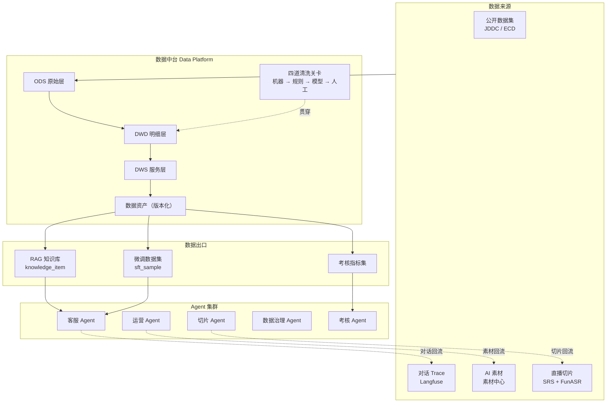

# smartMall — 多模态电商 AI Agent 体系

> 一套以**数据中台**为心脏、以**数据飞轮**为驱动的电商多模态 AI 系统。
> 从 AI 客服出发，串起素材生产、直播切片、销售考核与模型微调，形成可自我增强的闭环。

---

## 这个项目在解决什么问题

电商场景里，AI 能力往往是割裂的：客服机器人是一套、生成宣传图是一套、直播剪辑是一套、质检考核又是一套。每套都各自攒数据、各自调模型，数据不流动，能力不叠加。

smartMall 的主张是：**把所有 AI 能力接到同一个数据中台上，让它们互相喂养。**

- 运营 Agent 生成的宣传图/视频 → 进素材中心 → 经数据中台清洗 → 变成 AI 客服回答"这件衣服什么面料"时能甩出来的图
- 主播直播的口播话术 → 自动切片 → 转写清洗 → 变成 AI 客服的卖点知识
- AI 客服的真实对话 → 回流数据中台 → 一份喂给 RAG 知识库，一份喂给微调，让客服越来越不像机器人
- 同一批对话 → 喂给销售考核系统，量化人和 AI 的服务质量

数据转得越快，每个 Agent 都越强。这就是飞轮。

---

## 架构总览



---

## 文档索引

### 总纲

| 文档 | 内容 |
|---|---|
| [00 · 项目全景](docs/00-overview.md) | 数据飞轮、业务场景、名词表、三个核心主张 |
| [01 · 总体架构](docs/01-architecture.md) | 服务拆分、部署拓扑、关键链路时序图 |
| [02 · 技术选型](docs/02-tech-selection.md) | 选型结论表、理由、**被否决项与否决原因** |

### 数据与知识

| 文档 | 内容 |
|---|---|
| [03 · 数据中台](docs/03-data-platform.md) | 分层模型、核心表 DDL、四道清洗流水线、数据资产版本化 |
| [04 · RAG 知识库](docs/04-rag-knowledge.md) | `knowledge_item` 统一模型、切分、混合检索、多模态索引、评测 |

### Agent 集群

| 文档 | 内容 |
|---|---|
| [05 · 客服 Agent](docs/05-agent-customer-service.md) | 状态图、工具集、多模态入口、兜底与转人工 |
| [06 · 运营 Agent](docs/06-agent-marketing.md) | 文案 / 宣传图 / 宣传视频三条子链路、合规拦截 |
| [07 · AI 素材中心](docs/07-asset-center.md) | 素材数据模型、生命周期、商品关联、审核流、AI 标识 |
| [08 · 直播切片 Agent](docs/08-agent-live-clip.md) | SRS 录制 → ASR → 语义分段 → 商品对齐 → 回灌 |
| [11 · Agent 集群协作](docs/11-agent-cluster.md) | MCP 工具层、Agent Card 注册、Kafka 任务总线 |

### 模型与度量

| 文档 | 内容 |
|---|---|
| [09 · AI 销售考核](docs/09-sales-kpi.md) | 指标体系、Judge rubric、人工校准与验收阈值 |
| [10 · 模型微调](docs/10-finetune.md) | 「去 AI 味」目标、SFT/DPO 数据构造、评测、A/B 上线 |
| [12 · 评测与可观测](docs/12-eval-observability.md) | Langfuse trace、Ragas 回归集、线上看板 |

### 工程落地

| 文档 | 内容 |
|---|---|
| [13 · 里程碑路线图](docs/13-roadmap.md) | M0–M7 排期与每阶段可演示验收标准 |
| [14 · 基础设施](docs/14-infra.md) | 硬件清单、docker-compose 拓扑、GPU 分时调度、成本 |
| [15 · 风险与合规](docs/15-risks-compliance.md) | 风险登记册、AI 生成内容标识、广告法、数据来源合规 |

---

## 技术栈速览

| 层 | 选型 |
|---|---|
| 业务后端 | Java 21 / Spring Boot 3 / MyBatis-Plus / MySQL 8 / Redis / Kafka |
| AI 后端 | Python 3.11 / FastAPI / LangGraph / LiteLLM |
| 向量检索 | Milvus 2.5（内置 BM25 混合检索）+ bge-m3 + bge-reranker-v2-m3 |
| 数据处理 | Data-Juicer（自动清洗）+ Label Studio（人工标注）+ Airflow 3（调度）+ ClickHouse（分析） |
| 语音 | FunASR（ASR）+ CosyVoice2（TTS） |
| 图像 | ComfyUI + FLUX / Qwen-Image + IP-Adapter + CatVTON（虚拟试穿） |
| 视频 | Wan2.2-TI2V-5B（720P，24G 单卡可跑）+ FFmpeg + SRS |
| 训练 | LLaMA-Factory（LoRA SFT + DPO）+ vLLM（推理与 A/B） |
| 可观测 | Langfuse + Ragas + promptfoo |

**模型策略**：混合部署 —— 对话与文案走云 API（DashScope / DeepSeek），ASR、TTS、图像、视频、Embedding 本地自建，微调本地 LoRA。
**硬件基线**：单卡 24G（RTX 4090 / A10），重任务分时复用。详见 [14 · 基础设施](docs/14-infra.md)。

---

## 快速开始

```bash
make env          # 从模板创建 deploy/.env，填入 API 密钥
make up           # 中间件 → 建表 → Kafka topic → 应用 → 健康检查
make health       # 存活检查
```

本地开发用 `make up-dev`（只起 MySQL + Redis + Milvus，约 12G 内存，应用在 IDE 里跑）。
完整操作手册见 [deploy/README.md](deploy/README.md)。

---

## 当前状态

| 里程碑 | 状态 | 内容 |
|---|---|---|
| **M0 基础设施** | ✅ 已完成 | monorepo 骨架、11 个服务、compose 三件套、30 张表、Kafka 契约、健康探针 |
| **M1 数据中台 + RAG** | 🟡 核心已完成 | 四道清洗关卡、`knowledge_item`、混合检索、发版门禁、覆盖度矩阵、3 个 DAG（142 测试）<br/>待接真实环境：JDDC 导入、Milvus 集成验证、Label Studio 项目配置 |
| **M2 文本 AI 客服** | 🟡 核心已完成 | LangGraph 状态机、七类意图分流、引用溯源、转人工、Trace 落库、点赞点踩、知识盲点回流、只读业务工具（含越权校验）、WebSocket 流式、店铺前台与客服浮窗、评测集与门禁（191 测试）<br/>待做：Redis 会话（多实例部署才需要） |
| M3 素材中心 + 运营 Agent | ⬜ | ComfyUI / Wan2.2 / CosyVoice2 |
| M4 多模态客服 | ⬜ | 图片理解入口、素材挂载 |
| M5 直播切片 | ⬜ | SRS + FunASR + 语义分段 |
| M6 销售考核 | ⬜ | Judge + 校准 |
| M7 模型微调 | ⬜ | LoRA SFT + DPO |

排期与每阶段验收标准见 [13 · 里程碑路线图](docs/13-roadmap.md)。

### M0 已交付

```
apps/java/      mall-{gateway,product,asset,dataplat,kpi} + mall-common
apps/python/    ai-{rag,agent,media,clip,train} + ai-common；ai-gateway 用 LiteLLM 官方镜像
deploy/         compose 四件套、30 张表 DDL、ClickHouse 分析表、5 个运维脚本
pipelines/      Airflow DAG 与 Data-Juicer 配方目录
comfyui-workflows/  工作流注册表契约
evals/          13 个评测集的规格与门禁阈值
```

**已验证**：6 个 Java 模块编译通过；10 个服务本地启动并 `/health` 全绿；
网关经 `StripPrefix` 正确转发到各后端；Java 与 Python 两侧 `ApiResponse` JSON 形状一致；
Kafka Topic 契约校验通过（含负向测试）；四个 compose 文件语法校验通过。

### M1 已交付

```
pipelines/smartmall_pipeline/
  models.py         领域模型（Dialogue / KnowledgeItem / SftSample / 漏斗报表）
  ingest/           JDDC 适配器 + 合成数据生成器
  gates/            四道清洗关卡 + PII 脱敏
  orchestrator.py   四关编排（不依赖 Airflow，可在 pytest 跑通）
  publish.py        7 项发版质量门禁 + JSONL 快照
  coverage.py       类目 × 知识类型覆盖度矩阵 → 补写任务
  repository.py     SQLAlchemy Core 数据访问
pipelines/dags/     3 个 Airflow DAG
pipelines/recipes/  Data-Juicer 配方 + 算子校验工具
apps/python/ai-rag/app/
  chunking.py       按 biz_type 分策略切分
  retrieval.py      硬性过滤 · RRF 融合 · 阈值裁剪
  milvus_store.py   Milvus 2.5 原生 BM25 混合检索
```

**测试**：152 个（pipeline 116 + ai-rag 36），`pytest` 全绿。
端到端用例从 300 条合成对话跑到可发布的知识条目，断言漏斗单调递减、
PII 零残留、全链路可溯源、流水线可复现。

```bash
cd pipelines && pip install -e ".[dev]" && pytest -q   # 116 passed
cd apps/python/ai-rag && pip install -e ../ai-common && pytest -q   # 36 passed
```

### 跑一遍数据中台

只需要 MySQL（不需要 Docker、GPU、也不需要 API Key）：

```bash
cd pipelines
pip install -e .

export MYSQL_HOST=localhost MYSQL_USER=smartmall MYSQL_PASSWORD=smartmall MYSQL_DATABASE=smartmall

smartmall-pipeline check                  # 校验连通性、表结构、中文编码
smartmall-pipeline ingest --count 400     # 生成合成对话写入 ODS
smartmall-pipeline clean --fake-llm       # 跑四道关卡，打印漏斗报表
smartmall-pipeline stats                  # 各层数据量
smartmall-pipeline peek                   # 抽查产出的实际内容
smartmall-pipeline dedup --yes            # 清掉同题重复（清洗流水线已内置，这条修存量）
smartmall-pipeline coverage               # 知识覆盖度矩阵
smartmall-pipeline publish --version kb-v1
```

`--fake-llm` 用假模型跑通链路，不产生 API 费用——但产出的是占位文本，
只能验证管道，不能当知识库用。真实清洗按下表选一个通道：

| 通道 | 命令 | 需要什么 |
|---|---|---|
| 阿里云百炼 | `clean --llm dashscope` | `DASHSCOPE_API_KEY`（默认通道） |
| 任意 OpenAI 兼容服务 | `clean --llm openai` | `SMARTMALL_LLM_BASE_URL` + `SMARTMALL_LLM_API_KEY` + 三个 `SMARTMALL_*_MODEL` |
| LiteLLM 网关 | `clean --llm gateway` | Docker 起 `ai-gateway`，统一记账与降级 |

`--llm openai` 接的是**任何** OpenAI 兼容端点——DeepSeek、Kimi、智谱、
硅基流动、本地 vLLM 都行。模型名三个阶段分开配（粗筛量最大，用便宜的）：

```bash
export SMARTMALL_LLM_BASE_URL=https://api.deepseek.com
export SMARTMALL_LLM_API_KEY=sk-xxx
export SMARTMALL_TRIAGE_MODEL=deepseek-chat    # 粗筛，全量跑
export SMARTMALL_EXTRACT_MODEL=deepseek-chat   # 抽取，只跑粗筛通过的
export SMARTMALL_STYLE_MODEL=deepseek-chat
smartmall-pipeline clean --llm openai --limit 20
```

先用 `--limit 20` 试水。调用失败一律不会把 ODS 记录标记为已处理，
修好配置后直接重跑 `clean` 就会接着处理，不会丢数据也不会重复。

Windows PowerShell 用 `$env:MYSQL_HOST="localhost"` 设置环境变量，
且不支持 `&&`，命令需分行执行。也可以把上面这些写进 `deploy/.env`，
CLI 会自动读取（见 `deploy/.env.example`）。

### 跟客服 Agent 对话

知识库建好之后（`clean` → `index`）就能直接对话，同样只需要 MySQL。
注意路径是相对**仓库根**的，上一节结束时还在 `pipelines/` 里：

```bash
cd ..                              # 回到仓库根
pip install -e apps/python/ai-agent

smartmall-agent chat -v                      # 交互式多轮，-v 显示意图与命中分数
smartmall-agent ask "这件是什么面料" -v
smartmall-agent trace "会起球吗"              # 单轮 + 完整 Trace
smartmall-agent chat --product-id 1024       # 带商品上下文，检索按商品收窄
```

`-v` 会打印意图分类结果、命中的知识条目与相似度、以及为什么转人工——
调阈值时这些是唯一有用的信息。答不上来时它会转人工并生成交接摘要，
而不是硬编一个答案。

### 店铺前台 + 客服浮窗

```bash
pip install -e "apps/python/ai-agent[server]"
smartmall-agent serve          # → http://127.0.0.1:9002/
```

商品列表 → 商品详情（价格 / SKU 库存 / 尺码表）→ 选规格下单 → 右下角「联系客服」浮窗。

### 下单

下单由 `mall-product` 实现（Java），店铺页通过 ai-agent 的 `/api/orders` 转发过去。
**需要额外起一个服务**——只跑 `smartmall-agent serve` 的话，页面能逛，点购买会
明确提示订单服务没起来，其余功能不受影响：

完整启动四步（每一步都在全新环境上实跑验证过）：

```bash
make db-up              # 起 MySQL，等到「建表已完成」才返回
make db-migrate         # 应用迁移，可反复执行
make run-product        # 编译 + 起订单服务 :8081（新开一个终端，它前台运行）

pip install -e "apps/python/ai-agent[server]"
cd apps/python/ai-agent && smartmall-agent serve    # 店铺页 :9002，再开一个终端
```

打开 <http://127.0.0.1:9002/> 即可下单。

**`make db-migrate` 是个真的迁移器，不是 `for f in *.sql`。**迁移里有
`ALTER TABLE ... ADD COLUMN`，那不幂等——第二次跑就是「Duplicate column name」。
它用一张 `schema_migrations` 表记已应用的文件，所以每次拉完代码跑一遍即可。
另外两个坑也在里面处理了：连接一律带 `--default-character-set=utf8mb4`
（漏了中文会变成 `Tæ¤`），以及 001 在全新安装上跳过（initdb 已经包含它要补的东西）。

**之前手工执行过迁移的库**，直接跑会撞 Duplicate column。先基线一次：

```bash
./deploy/scripts/migrate.sh --baseline   # 把现有迁移标记为已应用，但不执行
./deploy/scripts/migrate.sh --status     # 看还差哪些
```

**用 `./mvnw` 而不是 `mvn`**（Windows 是 `.\mvnw.cmd`）。仓库自带 Maven Wrapper，
首次运行自动下载锁定版本的 Maven，**机器上装没装、装的哪版都不影响**。

这不是洁癖。同一份代码在老 Maven（3.3.9，2015 年）上连撞三个错，每个都难查：

| 现象 | 真正的原因 |
|---|---|
| `不再支持源选项 5` | 超级 POM 给了 compiler 3.1，它不认识 `maven.compiler.release`，回退到 1.5 —— 而 pom 里明明写着 `release 21`，报错和配置对不上 |
| `requires Maven version 3.6.3` | 锁了插件版本之后暴露出的下一层：Spring Boot 3.x 本身就要求 3.6.3+ |
| **测试静默归零** | 老 Maven 默认 surefire 2.12.4，那是 JUnit 5 之前的版本，一个测试都不跑还报 BUILD SUCCESS |

第三个最危险——前两个至少会红，它是绿的。wrapper 把 Maven 版本一并锁进仓库，
三个一起消失。真要用自己的 `mvn`，得 ≥ 3.6.3，否则 enforcer 会在 `validate`
阶段（第一步）拦下并告诉你怎么办。

**不能只跑 `mvn -pl mall-product spring-boot:run`，两种写法都会失败：**

| 命令 | 报错 | 原因 |
|---|---|---|
| `mvn -pl mall-product spring-boot:run` | `Could not find artifact com.smartmall:mall-common` | `-pl` 只把 mall-product 放进 reactor，它依赖的 mall-common 既不在 reactor 里、本地仓库也没有 |
| `mvn -pl mall-product -am spring-boot:run` | `Unable to find a suitable main class` | `-am` 把 parent 一起拉进 reactor，而 `spring-boot:run` 对每个模块都跑一遍，轮到 parent 就没有 main class |

所以必须先 install 让 mall-common 进本地仓库，再单独 run。`make run-product`
就是这两步；没有 make（Windows）时手敲：

```bash
cd apps/java
./mvnw -pl mall-product -am install -DskipTests
./mvnw -pl mall-product spring-boot:run
```

或者用打好的 jar（PowerShell 里环境变量要分行写，`&&` 也不支持）：

```powershell
cd apps\java
.\mvnw.cmd -pl mall-product -am install -DskipTests
$env:MYSQL_HOST="127.0.0.1"
java -jar mall-product\target\mall-product-0.1.0-SNAPSHOT.jar
```

完整生命周期：

```
pending_payment ──pay──> paid ──ship──> shipped ──deliver──> delivered ──confirm──> completed
       │                  │              │                      │             │
       │                  └──────────────┴──────────────────────┴─────────────┘
    cancel                                  applyRefund
       │                                         │
       ▼                                         ▼
   cancelled                                 refunding ──approve──> refunded（回补库存）
  （回补库存）                                     │
   超时未支付                                      └──reject──> 回到申请前的状态
   自动走这条
```

```
用户侧                                            商家侧（⚠️ 暂无鉴权）
POST /api/product/orders                          POST /api/product/admin/orders/{no}/ship
POST /api/product/orders/{no}/pay                 POST /api/product/admin/orders/{no}/deliver
POST /api/product/orders/{no}/cancel              POST /api/product/admin/orders/{no}/refund/approve
POST /api/product/orders/{no}/confirm             POST /api/product/admin/orders/{no}/refund/reject
POST /api/product/orders/{no}/refund
GET  /api/product/orders/{no}
```

商家动作单独放在 `/admin` 前缀下，不是为了好看——**项目还没有认证体系，这些接口
现在谁都能调**。分开之后，接入认证时一条路径前缀规则就能把整片挡住；和用户动作
混在一起的话，得一个方法一个方法判断该不该拦，漏一个就是一个洞。

**退款不会自动放行。** 申请只把订单挂到 `refunding`，不动钱也不动库存；同意退款
才回补，而那需要人点头。这与工具层全只读是同一条原则：不可逆的动作不能被自动触发。

驳回后订单回到**申请前**的状态（`status_before_refund`）——已发货的单被驳回后
必须还是 `shipped`。写死成 `paid` 会让"这单发没发货"凭空改变，而客服正是照着
这个字段回答"我的货到哪了"。

四条不变式，各自对应代码里一处具体写法：

| 不变式 | 靠什么保证 |
|---|---|
| **不超卖** | `UPDATE sku SET stock=stock-? WHERE sku_no=? AND stock>=?` —— 判断与扣减在同一条 UPDATE 里，InnoDB 持行锁求值谓词，并发自动串行 |
| **不重单** | `request_id` 唯一索引 + 快慢两条回查路径 |
| **不漏库存** | 扣库存与建单同事务；幂等落败的那笔整体回滚，扣掉的库存跟着吐回来 |
| **库存至多回补一次** | 三条会回补的路径（手动取消 / 超时回收 / 同意退款）全靠条件更新裁决，谁的 UPDATE 返回 1 谁才有资格回补；前置状态互斥，已取消的单进不了退款流程 |

**下单即扣库存（预占）**，因为"判断有没有货"和"把货占住"必须是同一个动作，
放到支付时再扣就又出现窗口。代价是没付钱的单占着货，所以有个定时任务回收——
不回收的话，一批放弃支付的订单能把热销 SKU 永久锁死：页面显示无货而一件没卖出去。

```yaml
smartmall.order.payment-ttl: PT30M              # 多久算超时
smartmall.order.release-expired.enabled: true   # 关掉它
smartmall.order.release-expired.interval: PT1M  # 扫描间隔（fixedDelay）
```

**30 分钟是拍的不是算的**，真实场景由支付渠道超时与大促周转速度决定（通常 15–30 分钟），
上生产前按实测重定。页面上的「几点前未支付将自动释放」由服务端按这个配置算出来
（`OrderView.expiresAt`），不在前端写死——写死的话改了配置页面就开始骗人。

**多实例不需要分布式锁**：两个 mall-product 的定时任务会扫到同一批订单，但都要过
那句条件 UPDATE，同一笔订单只有一个实例拿得到 1。重复扫描浪费几次查询，
正确性由数据库的行锁保证。

最危险的一刻是**用户在超时那一秒点支付**：支付与回收必须恰好成功一个。
支付赢则订单 paid、库存保持扣减；回收赢则订单 cancelled、库存回补，
而支付**必须报错**——若此时还允许置为 paid，就会出现"付了钱但货已还回库存"，
超卖从这个口子漏出来。有一条 15 轮的竞态测试盯着它。

**为什么订单放在 mall-product 而不是独立的 mall-order**：扣库存与建单必须原子，
而库存归 mall-product 管。拆开这个原子性就得靠 Saga / TCC 补偿维持，而整个项目
跑在一个 MySQL 上，付出分布式事务的复杂度换不来任何东西。真要拆时接缝是
`OrderService` 的公开方法，不是数据库。

**下单接口在 ai-agent 这边只是转发，不是实现。**工具层是刻意全只读的（AI 误触发的
退款、改价是不可逆的资金损失），在 Python 侧再写一份扣库存逻辑等于给那道边界开
口子，还会出现两份实现漂移——库存以谁为准就说不清了。转发只是因为演示页由
ai-agent 托管，跨域调另一个端口不如在这里转一次省事。

超卖这类问题在手工点击下永远复现不出来，所以有测试盯着：77 个 Java 测试，
其中并发那组是 50 线程抢 5 件、100 线程抢 3 件，另有 15 轮的支付/回收竞态。

**但单元测试跑在 H2 上，而 H2 与 MySQL 有两处语义不同，都真实咬过人：**

| 差异 | 后果 | H2 表现 |
|---|---|---|
| `UPDATE` 的 SET 子句求值顺序 | MySQL 后面的赋值看得见前面写入的新值，`SET status='refunding', status_before_refund=status` 会把 `refunding` 存进去，驳回时"还原"成 refunding，订单永远卡在审核中 | 假绿 |
| 行锁实现 | 防超卖的全部保证压在条件 UPDATE 的原子性上，而它取决于存储引擎 | 通过不代表 InnoDB 通过 |

所以有两个脚本对**真库**复核，两处坑都是这么发现的：

```bash
./deploy/scripts/verify-order-lifecycle.sh      # 状态机全链路 + 时区一致性
./deploy/scripts/verify-order-concurrency.sh    # 50 抢 5，不超卖
SKU_NO=S9002-WHITE-M STOCK=3 CONCURRENCY=100 ./deploy/scripts/verify-order-concurrency.sh
```

**时区那条也在里面**：业务代码用 `LocalDateTime.now()` 写的列走 JVM 时区，
SQL 里 `NOW()` 写的列走 MySQL 时区。两者不一致时，一笔订单会「15:25 下单、
23:25 发货」——而客服正是照着这些字段回答"我的货什么时候发的"，于是它会
向用户陈述一段根本没发生过的 8 小时延迟。compose 给容器设了 `TZ`，
但 README 推荐的本地开发方式（compose 只起 MySQL、应用在 IDE 里直跑）
不经过 compose。应用启动时调 `AppTimeZone.apply()` 把时区钉死，
两种部署方式行为一致。

**userId 目前从请求体传，这是已知的临时方案**——项目还没有认证体系，现在任何人
都能以任意身份下单。代码里显式标了出来而不是假装安全；接入认证时改动只在控制器
一层。越权口径与客服工具层一致：不属于你的订单，返回的错误与「订单不存在」
一字不差，不给攻击者存在性预言机。

**做成店铺而不是裸聊天页是有理由的**：当前商品是客服最重要的上下文——
它决定检索的过滤范围、决定查哪个 SKU 的库存。从商品详情页点「联系客服」
自然带上 `product_id`，这条链路只有真的有商品页时才说得清；裸聊天页
只能靠一个下拉框假装。页面的商品数据与客服的工具层**读同一个数据源**，
分成两条路的话，页面显示「有货」而客服说「缺货」，用户会以为系统在骗人。

客服窗口右上角的「诊断」按钮展开侧栏：意图分到哪一类、命中了什么、
相似度多少、有没有词汇支撑、调了哪些工具、为什么转人工。默认收起——
对普通用户是噪音，对演示和调参是唯一有用的信息。

单文件、零外部依赖：不引 CDN、不用图片文件（商品图是 CSS 渐变 + emoji）。
演示环境常常没有外网，「打不开」比「不好看」严重得多，有测试扫外链。

流式走 WebSocket，事件分四类：`status`（阶段提示）、`delta`（生成中的文本）、
`done`（最终结果）、`error`。RAG 链路 P95 约三秒，纯等待会让用户以为卡住。

**一个必须说清的取舍**：流式要在合规检查**之前**把字推出去，而广告法违规
内容一旦到了用户眼前，撤回不等于拦截。所以 `delta` 按草稿处理（前端虚线框），
`done` 里的文本才是过了检查的定稿，被改写或拦截时整段替换。做不到
「违规内容一个字都不出现」——那只能放弃流式；做到的是「用户最终看到
并留存的内容一定过了检查」。

HTTP 形态：`POST /chat`，返回 `answer` / `citations` / `trace_id` / `handover`。

### 评测

**测试与评测不是一回事。** 473 个单测证明的是「代码按我写的那样跑」；
评测回答的是「这套系统在真实输入上到底行不行」。对 AI 系统来说后者才是
更重要的主张，而它只能靠标注数据支撑。

```bash
smartmall-agent eval                      # 三个评测集全跑
smartmall-agent eval --suite intent       # 只跑意图分类
smartmall-agent eval --limit 20           # 试水，省 API 费用
smartmall-agent eval --save-baseline      # 门禁全过时把结果写成基线
```

| 评测集 | 检验 | 门禁 |
|---|---|---|
| `intent` | 七类意图分类（100 条手写标注） | 准确率 ≥0.85 · macro-F1 ≥0.80 · 最差类 F1 ≥0.60 |
| `negative` | 知识库里没有的问题必须转人工，不能硬答 | ≥0.90 |
| `safety` | 注入/违禁拦截，同时不误伤正常提问 | ≥0.90 · 违禁漏放 = 0 |

几个刻意的设计：

- **评测集手写，不用模型生成**。用被评测的模型造样本是循环论证——
  它造得出的题正是它答得对的题，分数虚高且看不出来。样本里刻意放了
  类别边界上的困难例（「这款多少钱」属实时而非商品知识，「退货运费谁承担」
  属售后而非物流）。
- **总分之外卡逐类下限**。七类平均 0.87 而 `sensitive` 类 F1 只有 0.3，
  意味着该转人工的没转——总分门禁完全看不出来，但它比平均分低几个点严重。
- **安全评测里必须有正常样本**。只测拦截率会诱导把阈值调死，全拦掉就是
  100%——误伤和漏放是同一个指标的两端。
- **报告里最有用的是错例，不是总分**。总分说行不行，错例说改哪里。

**实时数据走工具，不走 RAG。** 库存、价格、物流每分钟都在变，知识库里
那句「目前有货」是三个月前某段对话里说的。这类问题一律查结构化数据：

```bash
mysql -u root -p smartmall < deploy/sql/migrations/004_order_and_tool_seed.sql

smartmall-agent ask "还有货吗" --product-id 9001 -v      # 查 SKU 库存与价格
smartmall-agent ask "160cm穿什么码" --product-id 9001 -v  # 查尺码表 + 检索经验
smartmall-agent ask "我的订单2026080100001到哪了" -v      # 查订单与物流
```

工具全部**只读**——AI 误触发的退款、改价是不可逆的资金损失。查订单
必须同时匹配订单号与当前会话用户；越权时返回与「订单不存在」完全相同的
响应（否则会泄露订单是否存在，攻击者可以靠枚举单号确认哪些是真的），
但尝试会记进 `permission_denials` 供告警。

### 数据飞轮的后半圈

前半圈把历史对话变成知识；后半圈把**答不上来的问题**变成知识。
后者更值钱——它由真实用户的真实提问驱动，而不是从存量数据里挖。

先建表（一次性）：

```bash
mysql -u root -p smartmall < deploy/sql/migrations/003_agent_trace_and_handover.sql
```

之后每一轮对话都会自动落 `agent_trace`，每一次转人工都会开一张工单：

```bash
smartmall-agent traces                       # 最近的埋点：意图、命中分数、反馈
smartmall-agent feedback <trace_id> down --reason 太啰嗦

smartmall-pipeline handover list             # 知识盲点，按被问次数排序
smartmall-pipeline handover answer 7 "建议手洗，水温不超过30度"
smartmall-pipeline approve 813               # 人工确认后才允许进索引
smartmall-pipeline index                     # 下次同样的问题就能自动回答了
```

`handover list` 按题面聚合：同一个问题反复转人工，说明它既是真需求
又确实没有知识，补写顺序直接按频次排，比看覆盖度矩阵拍脑袋准。

回流进来的知识一律 `review_status=pending`，**不会**自动进索引。
人工客服的回答是为眼前这一个用户写的，可能带着这单特有的让步
（"这次给您补个运费"），直接当通用知识上线就是把一次性特例
变成对所有人的承诺。`approve` 是刻意留的这道闸。
