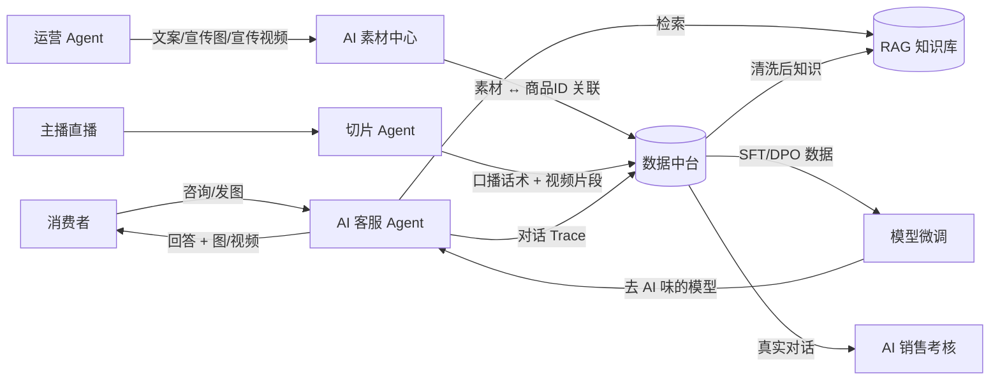
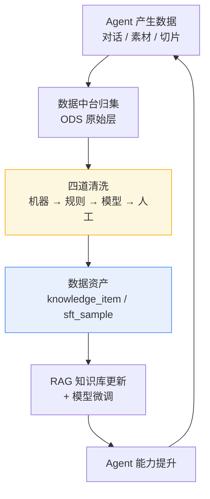
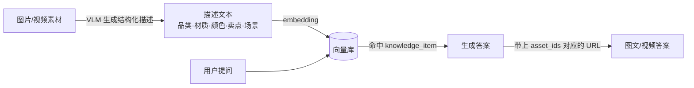

# 00 · 项目全景

> 本文回答三个问题：这个体系要解决什么、它凭什么能自我增强、以及有哪些容易被做错的地方。

---

## 1. 业务全景

smartMall 面向电商经营场景，围绕「售前咨询 → 内容种草 → 直播转化 → 服务质量 → 模型进化」这条完整链路构建 AI 能力。



### 五个业务角色，五个 Agent

| 角色 | 现实痛点 | 对应 Agent |
|---|---|---|
| 客服 | 咨询量大、话术不统一、新人上手慢、夜间无人 | 客服 Agent |
| 运营 | 商品文案批量写不动、拍图拍视频成本高、周期长 | 运营 Agent |
| 主播/短视频 | 直播三小时，人工剪切片要一整天 | 切片 Agent |
| 数据/知识运营 | 知识库靠人肉维护，很快过期、互相冲突 | 数据治理 Agent |
| 主管 | 客服质量靠抽检，覆盖率低、标准不一 | 考核 Agent |

---

## 2. 核心机制：数据飞轮

这个体系区别于「一堆 AI 工具的集合」的地方，在于**每个 Agent 既是消费者也是生产者**。



**飞轮的三个转速档位：**

| 档位 | 周期 | 内容 |
|---|---|---|
| 快档 | 实时 ~ 分钟 | 对话 Trace 入库、素材入库、用户点赞/点踩反馈入库 |
| 中档 | 天级 | 自动清洗 + 模型清洗 + 增量向量化，RAG 知识库滚动更新 |
| 慢档 | 周/月级 | 人工标注批次合入、数据集版本发布、模型重新微调与 A/B |

飞轮转起来的前提是**数据必须能流回去**。所以从第一天起，客服 Agent 的每一次调用都要留下结构化的 trace（问题、检索命中、最终答案、用户反馈、是否转人工），这不是"以后再加的监控"，而是**训练数据的采集管道**。

---

## 3. 三个核心主张

整个方案的技术取舍都从这三条推导而来。

### 主张一：数据中台是心脏，不是配角

所有内容最终收敛到**两个统一抽象**：

```
knowledge_item   ── RAG 的唯一数据源
   ├─ 来自清洗后的客服对话（QA 对）
   ├─ 来自 AI 素材的 VLM 结构化描述
   ├─ 来自直播切片的口播话术
   └─ 来自商品结构化属性、售后政策文档

sft_sample       ── 微调的唯一数据源
   ├─ 优质真人客服回复（正样本）
   ├─ 人工改写的 golden 回复（正样本）
   └─ 原始 API 模型输出（DPO 负样本）
```

**为什么这件事重要**：如果"素材进 RAG"、"切片进 RAG"、"对话进 RAG"是三套独立管道，那么权限、版本、审核、失效、去重就要各做三遍，而且三份数据在检索时会互相打架。归一到一张表后，它们是**同一条管道的三个入口**，共享同一套清洗、审核、版本与检索逻辑。

详见 [03 · 数据中台](03-data-platform.md) 与 [04 · RAG 知识库](04-rag-knowledge.md)。

### 主张二：多模态 RAG 走「VLM 转述 + 文本索引 + 素材回挂」

**不做**端到端的图文双塔检索（CLIP / ColPali 那一类），而是：



用户**发图提问**时同理：先用 VLM 把图理解成文本 query + 视觉属性，再走同一条检索链路。

**取舍理由**：

| | VLM 转述方案（选中） | 端到端多模态检索（否决） |
|---|---|---|
| 可解释性 | 描述文本人能读、能审、能改 | 向量黑盒，召回错了不知道为什么 |
| 人工介入 | 描述可进 Label Studio 人工修正 | 无法人工干预 |
| 显存 | 只在入库时跑一次 VLM | 需常驻双塔模型 |
| 检索链路 | 与文本知识共用一套混合检索 | 需要独立的多模态索引与融合排序 |
| 用户体感 | 完全一致（都能返回图/视频） | 完全一致 |

这是**有意的工程取舍**，不是能力缺失。`knowledge_item` 中保留 `image_embedding` 字段作为后续升级位，需要时可平滑加上向量召回做补充通道。

### 主张三：微调的目标是「去 AI 味」，不是灌知识

这一条最容易做错。常见误区是把商品知识、售后政策塞进训练数据去微调模型——结果是知识改一次要重训一次，还会产生幻觉且无法溯源。

**正确的分工：**

| | 归 RAG | 归微调 |
|---|---|---|
| 商品参数、库存、价格 | ✅ | ❌ |
| 售后政策、活动规则 | ✅ | ❌ |
| 卖点话术内容 | ✅ | ❌ |
| 语气、句长、口语化程度 | ❌ | ✅ |
| 表情/语气词使用习惯 | ❌ | ✅ |
| 催单节奏、安抚话术风格 | ❌ | ✅ |

一句话：**RAG 管"说什么"，微调管"怎么说"。**

所以微调方案是 LoRA SFT（学真人客服的说话方式）+ DPO（把"AI 腔"作为负例压下去），基座只用 7B/8B 量级——因为学风格不需要大模型。详见 [10 · 模型微调](10-finetune.md)。

---

## 4. 冷启动：数据从哪来

原始需求提到"网上真实的客服聊天数据"。直接爬取存在合规与可用性风险（用户隐私、平台服务协议、数据质量不可控）。本方案采用**三条腿**策略：

| 来源 | 阶段 | 说明 |
|---|---|---|
| ① 公开学术数据集 | 冷启动主力 | **JDDC**（100 万+ 多轮对话、2000 万句）、**JDDC 2.0**（24.6 万会话、300 万句、**50.7 万张图片**，天然多模态）、ECD 电商对话数据集。走学术授权申请，用途与授权范围写进合规登记册 |
| ② LLM 合成 + 人工校验 | 冷启动补充 | 按商品类目 × 问题类型矩阵批量生成候选 QA，人工校验后入库。用于覆盖公开数据集没有的自有商品 |
| ③ 自有系统真实对话回流 | 长期主力 | 系统上线后，Trace → 数据中台 → 清洗 → 知识/训练数据 |

**权重随阶段迁移**：M1 阶段 ①70% ②30%；M2 上线后 ③ 占比逐月提升；到 M7 微调时，③ 应成为 `sft_sample` 的主要来源（风格数据必须来自真实业务，合成数据学不出真人的语感）。

详见 [15 · 风险与合规](15-risks-compliance.md) 中的数据来源合规章节。

---

## 5. 名词表

| 术语 | 含义 |
|---|---|
| **数据中台** | 统一归集、清洗、治理、发布数据资产的平台。本项目中是所有 AI 能力的数据枢纽 |
| **knowledge_item** | 知识条目。RAG 知识库的唯一数据单元，可以是 QA 对、商品属性、口播话术、素材描述 |
| **sft_sample** | 微调样本。SFT 与 DPO 训练数据的统一形态 |
| **数据资产** | 经过完整清洗、审核、并打上版本号的可发布数据集（如 `kb-v3`、`sft-v2`） |
| **四道清洗关卡** | 机器清洗（算子）→ 规则清洗（业务规则）→ 模型清洗（LLM 判定与抽取）→ 人工清洗（标注平台） |
| **AI 素材中心** | 管理 AI 生成及人工上传的图片/视频/音频，负责与商品 ID 关联、版本管理、审核、AI 标识 |
| **直播切片** | 从直播录像中按语义切出的独立短视频片段，每段绑定商品与起止时间戳 |
| **Trace** | 一次 Agent 调用的完整执行记录：输入、检索命中、工具调用、输出、耗时、成本、反馈 |
| **LLM-as-a-Judge** | 用大模型按评分细则（rubric）给对话质量打分的方法 |
| **Golden Set** | 人工标注的黄金标准集，用于校准 Judge 与人工评分的一致性 |
| **AI 味** | 模型回复中过于工整、书面化、模板化、缺乏真人语感的特征 |
| **MCP** | Model Context Protocol，Agent 调用外部工具与数据的标准协议 |
| **A2A** | Agent2Agent Protocol，Agent 之间发现能力、委托任务的标准协议 |

---

## 6. 项目定位与边界

本项目定位为**作品集 / 毕设级完整体系**：

**做：**
- 端到端全链路跑通，每个阶段都有可演示的 Demo
- 架构按生产标准分层（服务拆分、接口契约、数据模型），保留扩展位
- 单机或单 GPU（24G）可完整部署

**不做（明确的范围外）：**
- 多租户与租户级数据隔离
- 高可用（多副本、故障转移、异地容灾）
- 灰度发布与流量染色
- 大规模并发压测与性能调优（提供容量估算，不做实测调优）
- 完整的企业级权限体系（只做基础 RBAC）

这些边界不影响架构完整性——服务边界和数据模型都按可扩展设计，后续补充这些能力不需要重构。

---

**下一篇** → [01 · 总体架构](01-architecture.md)
