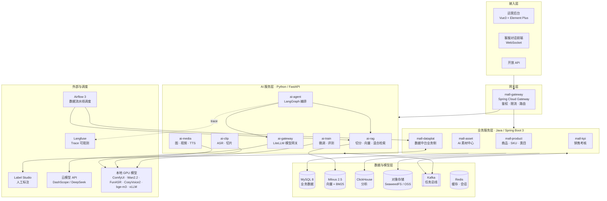
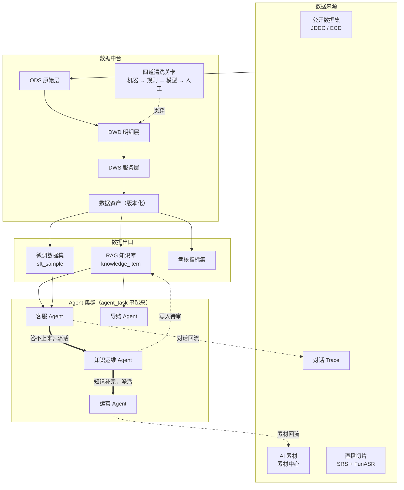
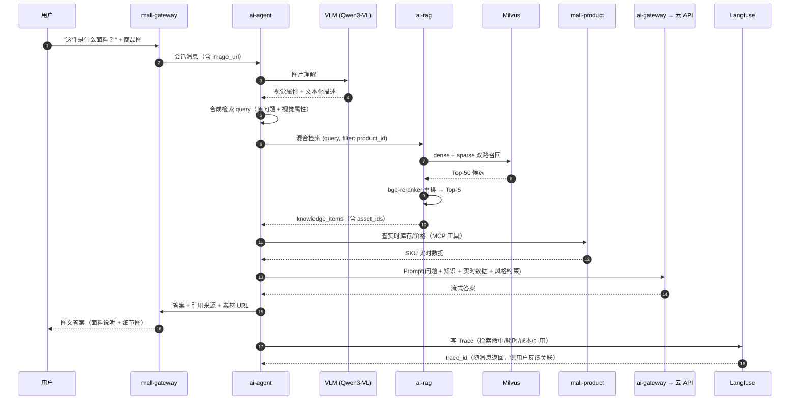
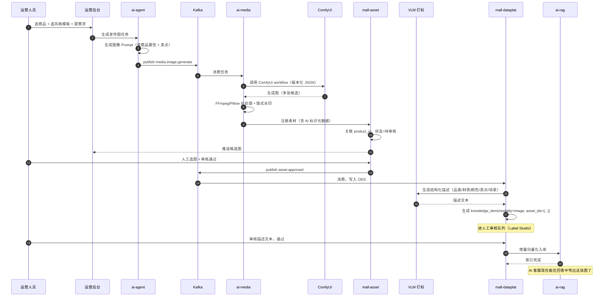
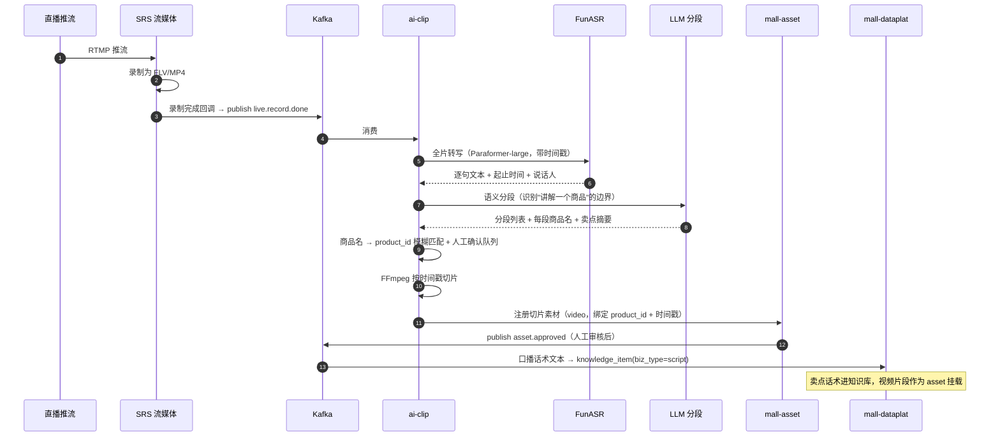
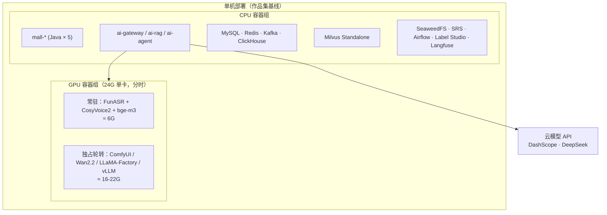

# 01 · 总体架构

---

## 1. 分层架构



### 1.x 数据飞轮全景

README 里那张架构图的可编辑版本。**两条粗箭头是「Agent 集群」与
「四个共用底座的 Agent」的区别**：客服答不上来自动给知识运维派一个补写任务，
补完了、且这个盲点属于某个商品，再自动给运营派一个更新文案的任务，
中间没有人点按钮。串起来的是一张 `agent_task` 表，判据在 `tasks/dispatch.py`——
那里最要紧的是**不派**的五种情况（自伤求助、用户主动要人工、议价投诉退款、
服务故障、内部异常）。



---

## 2. 服务清单与职责

### Java 侧 · `apps/java/`

技术栈：Java 21 / Spring Boot 3.3 / Spring Cloud Gateway / MyBatis-Plus / MySQL 8 / Redis / Kafka

| 服务 | 端口 | 核心职责 | 关键表 |
|---|---|---|---|
| `mall-gateway` | 8080 | 统一入口、JWT 鉴权、限流、路由到 Java/Python 服务 | — |
| `mall-product` | 8081 | 商品、SKU、类目、属性、库存、价格 | `product`, `sku`, `category`, `product_attr` |
| `mall-asset` | 8082 | AI 素材中心：素材元数据、商品关联、版本、审核流、AI 标识 | `asset`, `asset_product_rel`, `asset_version`, `asset_audit` |
| `mall-dataplat` | 8083 | 数据中台业务侧：数据源登记、清洗任务触发、标注任务下发、数据集版本发布 | `ds_source`, `ds_job`, `knowledge_item`, `sft_sample`, `dataset_version` |
| `mall-kpi` | 8084 | 销售考核：指标计算调度、评分存储、报表、申诉流程 | `kpi_metric`, `kpi_score`, `kpi_appeal`, `kpi_golden_set` |

**为什么这几块归 Java**：都是强事务、强一致性、有审核流与状态机的业务域（素材审核、数据集发布、考核申诉），Spring 生态在事务、权限、工作流上的成熟度明显优于 Python。

### Python 侧 · `apps/python/`

技术栈：Python 3.11 / FastAPI / LangGraph / LiteLLM / PyTorch

| 服务 | 端口 | 核心职责 |
|---|---|---|
| `ai-gateway` | 9000 | LiteLLM 统一模型网关：多模型路由、成本核算、限流、失败降级、统一 OpenAI 兼容协议 |
| `ai-rag` | 9001 | 文档切分、embedding、rerank、混合检索（向量 + BM25）、检索评测 |
| `ai-agent` | 9002 | LangGraph 编排：客服 Agent、运营 Agent、考核 Agent 的状态机与工具调用 |
| `ai-media` | 9003 | ComfyUI 客户端、Wan2.2 视频生成、CosyVoice2 语音合成、FFmpeg 后处理 |
| `ai-clip` | 9004 | FunASR 转写、说话人分离、语义分段、商品对齐、FFmpeg 切片 |
| `ai-train` | 9005 | LLaMA-Factory 训练任务封装、评测集执行、模型注册与 vLLM 上线 |

**为什么这几块归 Python**：全部依赖 Python 独占的 AI 生态（transformers、vLLM、FunASR、ComfyUI、LLaMA-Factory），跨语言调用会引入不必要的复杂度。

### 前端 · `apps/web/`

Vue 3 + TypeScript + Element Plus + Pinia。单个运营后台包含：商品管理、素材中心、数据中台工作台、知识库管理、考核看板、Agent 调试台。客服对话前端独立页面（WebSocket 流式）。

---

## 3. 仓库结构

```
smartMall/
├── apps/
│   ├── java/
│   │   ├── mall-gateway/
│   │   ├── mall-product/
│   │   ├── mall-asset/
│   │   ├── mall-dataplat/
│   │   ├── mall-kpi/
│   │   └── mall-common/          # 公共依赖：DTO、异常、工具、Kafka 消息定义
│   ├── python/
│   │   ├── ai-gateway/
│   │   ├── ai-rag/
│   │   ├── ai-agent/
│   │   ├── ai-media/
│   │   ├── ai-clip/
│   │   ├── ai-train/
│   │   └── ai-common/            # 公共库：schema、Kafka 客户端、Langfuse 埋点
│   └── web/
├── pipelines/                     # Airflow DAG + Data-Juicer 配方
│   ├── dags/
│   └── recipes/
├── comfyui-workflows/             # 版本化的 ComfyUI 工作流 JSON
├── deploy/
│   ├── docker-compose.base.yml    # 中间件
│   ├── docker-compose.app.yml     # 应用服务
│   ├── docker-compose.gpu.yml     # GPU 服务
│   └── sql/                       # 建表脚本
├── datasets/                      # 数据集配置与元数据（不存实际数据）
├── evals/                         # 评测集与评测脚本
└── docs/                          # 本文档集
```

---

## 4. 关键链路时序图

### 4.1 AI 客服回答一个带图的问题



**要点**：
- 图片理解与知识检索是**串行**的——必须先把图转成文本属性，才能做检索过滤（比如识别出是"针织衫"才能收窄检索范围）
- 实时数据（库存、价格）**绝不进 RAG**，必须走 MCP 工具实时查询，否则必然过期
- Trace 是同步写入的关键路径的一部分，`trace_id` 返回给前端，用户点赞/点踩时带回来，形成反馈闭环

### 4.2 运营 Agent 生成宣传图并回灌知识库



**要点**：素材从生成到能被客服使用，中间有**两道人工闸门**——选图审核（美观与合规）和描述审核（准确性）。这是有意设计：AI 生成的描述如果说错了面料，客服就会跟着说错。

### 4.3 直播切片回灌链路



---

## 5. 服务间通信

| 通信方式 | 场景 | 技术 |
|---|---|---|
| 同步 REST | 前端 → 网关 → 服务；服务间实时查询（如 Agent 查商品） | HTTP/JSON，OpenAPI 3 契约 |
| 异步消息 | 长耗时任务（生成图/视频、切片、清洗、训练） | Kafka |
| 流式 | 客服对话流式输出 | WebSocket（前端）/ SSE（服务间） |
| 工具调用 | Agent 调用业务能力 | MCP（见 [11 · Agent 集群协作](11-agent-cluster.md)） |

### Kafka Topic 设计

| Topic | 生产者 | 消费者 | 说明 |
|---|---|---|---|
| `media.image.generate` | ai-agent | ai-media | 图像生成任务 |
| `media.video.generate` | ai-agent | ai-media | 视频生成任务（**GPU 独占**，单分区串行） |
| `media.tts.generate` | ai-agent | ai-media | 口播合成任务 |
| `live.record.done` | SRS 回调 | ai-clip | 直播录制完成 |
| `clip.done` | ai-clip | mall-asset | 切片完成，注册素材 |
| `asset.approved` | mall-asset | mall-dataplat | 素材审核通过，进数据中台 |
| `data.clean.request` | mall-dataplat / Airflow | ai-rag, 数据治理 Agent | 清洗任务 |
| `kb.index.request` | mall-dataplat | ai-rag | 增量向量化 |
| `trace.collected` | ai-agent | mall-dataplat | 对话 Trace 归集 |
| `kpi.score.request` | mall-kpi | ai-agent | 考核评分任务 |
| `train.job.request` | mall-dataplat | ai-train | 微调任务 |

**关键约束**：`media.video.generate` 与 `train.job.request` 必须配置**单分区 + 单消费者**，因为它们独占 GPU 显存，并行会 OOM。详见 [14 · 基础设施](14-infra.md) 的 GPU 分时调度章节。

---

## 6. 部署拓扑



资源估算与 docker-compose 拆分见 [14 · 基础设施](14-infra.md)。

---

## 7. 架构原则

以下原则用于在具体实现遇到分歧时做裁决：

1. **实时数据不进 RAG。** 库存、价格、订单状态、物流一律走工具实时查询。知识库只放相对稳定的知识。
2. **所有进 RAG 的内容必须过人工闸门。** AI 生成的描述、AI 抽取的 QA、AI 分段的话术，都要有审核状态字段，未审核不进索引。
3. **所有 Agent 输出必须可溯源。** 客服答案要带引用的 `knowledge_item.id`；考核评分要带原话证据。
4. **Trace 是数据管道，不是日志。** 从第一天起按训练数据的标准来设计 Trace 的字段结构。
5. **GPU 重任务串行化。** 通过 Kafka 单分区强制串行，宁可慢，不要 OOM。
6. **数据资产必须有版本。** 知识库和训练集都发版本号，模型评测结果与数据版本绑定，否则无法归因。

---

**上一篇** ← [00 · 项目全景](00-overview.md) ｜ **下一篇** → [02 · 技术选型](02-tech-selection.md)
