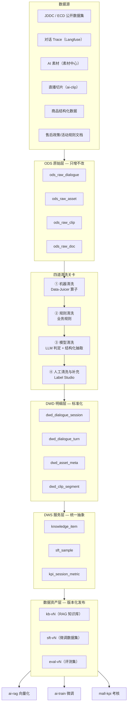
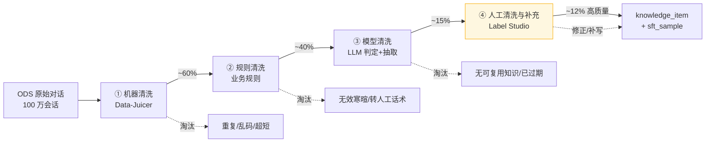
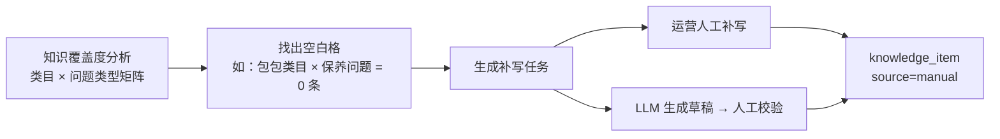
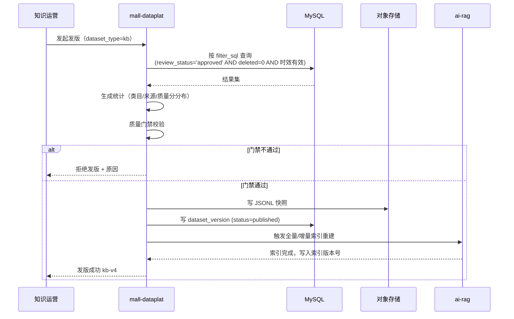

# 03 · 数据中台

> 数据中台是整个体系的心脏。所有 Agent 要么是它的生产者，要么是它的消费者。
> 本文定义分层模型、核心表结构、四道清洗关卡和数据资产版本化机制。

---

## 1. 定位与边界

**它做什么**
- 归集：把所有来源的数据（公开数据集、对话 Trace、AI 素材、直播切片）收进来
- 治理：四道清洗关卡，从原始数据产出可用的知识与训练样本
- 发布：把治理后的数据打成**带版本的数据资产**，供 RAG 知识库与模型微调消费

**它不做什么**
- 不做在线服务的实时查询（那是业务库的事）
- 不存实际的图片/视频二进制（那在对象存储，中台只存元数据与引用）
- 不做通用 BI 报表（只做与 AI 数据链路相关的分析）

---

## 2. 分层模型



### 各层职责

| 层 | 职责 | 存储 | 是否可改 |
|---|---|---|---|
| **ODS** | 原样保存，不做任何加工。保证任何加工出错都能重跑 | MySQL（元数据）+ 对象存储（大文本/文件） | ❌ 只增不改 |
| **DWD** | 标准化：统一 schema、统一编码、脱敏、拆解到最小粒度（一轮对话一条记录） | MySQL | ⚠️ 只通过重跑流水线修改 |
| **DWS** | 业务抽象：产出 `knowledge_item`、`sft_sample`、考核指标宽表 | MySQL + ClickHouse（指标） | ✅ 可人工修订 |
| **数据资产** | 打快照、发版本、可回滚。模型评测结果与数据版本绑定 | MySQL 版本表 + 对象存储快照文件 | ❌ 发版后不可变 |

---

## 3. 核心表结构

### 3.1 `knowledge_item` — RAG 的唯一数据源

**这是整个体系最重要的一张表。** 清洗后的对话 QA、素材描述、直播口播话术、商品属性、售后政策，全部归一到这张表。

```sql
CREATE TABLE knowledge_item (
    id                BIGINT       PRIMARY KEY AUTO_INCREMENT,
    biz_type          VARCHAR(32)  NOT NULL COMMENT 'qa|spec|script|policy|faq',
    modality          VARCHAR(16)  NOT NULL DEFAULT 'text' COMMENT 'text|image|video',

    -- 内容
    title             VARCHAR(512)          COMMENT '问题 / 标题',
    content           TEXT         NOT NULL COMMENT '答案 / 正文',
    summary           VARCHAR(1024)         COMMENT '摘要，用于长文本的粗排',

    -- 关联
    asset_ids         JSON                  COMMENT '关联素材 ID 数组，回答时挂载图/视频',
    product_ids       JSON                  COMMENT '关联商品 ID 数组，检索时做过滤',
    category_id       BIGINT                COMMENT '类目 ID，用于类目级检索收窄',
    tags              JSON                  COMMENT '标签：尺码|物流|退换货|材质|搭配 …',

    -- 溯源
    source            VARCHAR(32)  NOT NULL COMMENT 'dataset|manual|agent|live|trace|doc',
    source_ref        VARCHAR(256)          COMMENT '溯源 ID：ods 记录 ID / trace_id / clip_id',

    -- 质量与审核
    quality_score     DECIMAL(4,3)          COMMENT '模型清洗给出的质量分 0-1',
    confidence        DECIMAL(4,3)          COMMENT '模型抽取置信度，低于阈值进人工队列',
    review_status     VARCHAR(16)  NOT NULL DEFAULT 'pending'
                                            COMMENT 'pending|approved|rejected|revised',
    reviewer_id       BIGINT,
    reviewed_at       DATETIME,

    -- 时效
    valid_from        DATETIME     NOT NULL DEFAULT CURRENT_TIMESTAMP,
    valid_to          DATETIME              COMMENT 'NULL=永久有效；活动规则类必填',

    -- 版本与索引
    version           INT          NOT NULL DEFAULT 1,
    embedding_status  VARCHAR(16)  NOT NULL DEFAULT 'pending'
                                            COMMENT 'pending|indexed|stale|failed',
    indexed_at        DATETIME,

    created_at        DATETIME     NOT NULL DEFAULT CURRENT_TIMESTAMP,
    updated_at        DATETIME     NOT NULL DEFAULT CURRENT_TIMESTAMP ON UPDATE CURRENT_TIMESTAMP,
    deleted           TINYINT      NOT NULL DEFAULT 0,

    INDEX idx_review_embed (review_status, embedding_status),
    INDEX idx_category (category_id),
    INDEX idx_biz_modality (biz_type, modality),
    INDEX idx_valid (valid_from, valid_to)
) COMMENT='知识条目：RAG 知识库的唯一数据源';
```

**设计要点**

| 字段 | 为什么必须有 |
|---|---|
| `modality` + `asset_ids` | 让"图片视频进 RAG"成为可能：文本索引 `content`（VLM 生成的描述），回答时挂 `asset_ids` 对应的 URL |
| `product_ids` / `category_id` | 检索时的元数据过滤。用户在问 A 商品，不能召回 B 商品的知识 |
| `source` + `source_ref` | 出问题时能查到原始数据。客服说错话时必须能追到是哪条知识、哪次清洗引入的 |
| `review_status` | **未审核不进索引**。这是架构原则第 2 条的落地字段 |
| `valid_to` | 活动规则、促销政策有明确失效时间。检索时过滤 `valid_to > NOW()`，避免客服播报过期活动 |
| `embedding_status` | 内容修改后置为 `stale`，由定时任务重新向量化。没有这个字段，知识改了但索引没更新，是最隐蔽的 bug |
| `confidence` | 主动学习的依据：低置信度样本优先推给人工 |

### 3.2 `sft_sample` — 微调的唯一数据源

```sql
CREATE TABLE sft_sample (
    id              BIGINT       PRIMARY KEY AUTO_INCREMENT,
    sample_type     VARCHAR(16)  NOT NULL COMMENT 'sft|dpo',

    -- SFT：messages 为完整对话；DPO：messages 为上下文
    messages        JSON         NOT NULL COMMENT '[{role, content}] 对话上下文',
    chosen          TEXT                  COMMENT 'DPO 正例（真人客服/人工改写）',
    rejected        TEXT                  COMMENT 'DPO 负例（原始 API 模型输出，"AI 味"样本）',

    -- 风格标注（微调的核心监督信号）
    style_tags      JSON                  COMMENT '["口语化","短句","带表情","热情"]',
    scene_tag       VARCHAR(32)           COMMENT '售前咨询|尺码推荐|催单|售后安抚|议价',

    -- 质量
    quality_score   DECIMAL(4,3),
    is_golden       TINYINT      NOT NULL DEFAULT 0 COMMENT '人工精修的黄金样本',

    source          VARCHAR(32)  NOT NULL COMMENT 'dataset|trace|manual_rewrite',
    source_ref      VARCHAR(256),
    review_status   VARCHAR(16)  NOT NULL DEFAULT 'pending',

    created_at      DATETIME     NOT NULL DEFAULT CURRENT_TIMESTAMP,
    deleted         TINYINT      NOT NULL DEFAULT 0,

    INDEX idx_type_status (sample_type, review_status),
    INDEX idx_scene (scene_tag)
) COMMENT='微调样本：SFT 与 DPO 训练数据的统一形态';
```

**关键设计**：`rejected` 字段专门存**原始 API 模型的输出**。构造方式是——同一个用户问题，让未微调的模型回答一遍（AI 味重），把真人客服的真实回复作为 `chosen`。这样构造的 DPO 数据，训练目标恰好就是"去 AI 味"。详见 [10 · 模型微调](10-finetune.md)。

### 3.3 ODS 层

```sql
CREATE TABLE ods_raw_dialogue (
    id            BIGINT      PRIMARY KEY AUTO_INCREMENT,
    source_type   VARCHAR(32) NOT NULL COMMENT 'jddc|ecd|trace|manual_import',
    batch_id      VARCHAR(64) NOT NULL COMMENT '导入批次，便于按批重跑/回滚',
    external_id   VARCHAR(128)         COMMENT '原始系统的会话 ID',
    raw_payload   LONGTEXT    NOT NULL COMMENT '原样保存的 JSON，不做任何加工',
    payload_hash  CHAR(64)    NOT NULL COMMENT 'SHA256，用于幂等导入',
    ingested_at   DATETIME    NOT NULL DEFAULT CURRENT_TIMESTAMP,
    UNIQUE KEY uk_hash (payload_hash),
    INDEX idx_batch (batch_id)
) COMMENT='原始对话，只增不改';
```

`ods_raw_asset` / `ods_raw_clip` / `ods_raw_doc` 结构类似，差异在 `raw_payload` 的内容与是否有对象存储引用字段（`oss_key`）。

### 3.4 DWD 层

```sql
CREATE TABLE dwd_dialogue_session (
    id                BIGINT      PRIMARY KEY AUTO_INCREMENT,
    ods_id            BIGINT      NOT NULL,
    session_no        VARCHAR(64) NOT NULL,
    channel           VARCHAR(32)          COMMENT 'jddc|web|app|live',
    agent_type        VARCHAR(16)          COMMENT 'human|ai|mixed',
    agent_id          BIGINT               COMMENT '人工客服 ID，考核用',
    product_ids       JSON,
    turn_count        INT,
    started_at        DATETIME,
    ended_at          DATETIME,
    has_image         TINYINT     NOT NULL DEFAULT 0,
    transferred_human TINYINT     NOT NULL DEFAULT 0 COMMENT '是否转人工',
    order_created     TINYINT     NOT NULL DEFAULT 0 COMMENT '是否成单，考核转化率用',
    UNIQUE KEY uk_session (session_no),
    INDEX idx_agent (agent_id, started_at)
) COMMENT='标准化会话';

CREATE TABLE dwd_dialogue_turn (
    id           BIGINT      PRIMARY KEY AUTO_INCREMENT,
    session_id   BIGINT      NOT NULL,
    turn_index   INT         NOT NULL,
    role         VARCHAR(16) NOT NULL COMMENT 'user|agent|system',
    content      TEXT        NOT NULL COMMENT '已脱敏',
    raw_content  TEXT                 COMMENT '脱敏前，加密存储，仅审计可见',
    image_urls   JSON,
    intent       VARCHAR(64)          COMMENT '模型标注的意图',
    sentiment    VARCHAR(16)          COMMENT 'positive|neutral|negative',
    reply_cost_ms INT                 COMMENT '响应耗时，考核时效用',
    said_at      DATETIME    NOT NULL,
    INDEX idx_session (session_id, turn_index)
) COMMENT='标准化对话轮次';

CREATE TABLE dwd_clip_segment (
    id            BIGINT      PRIMARY KEY AUTO_INCREMENT,
    ods_id        BIGINT      NOT NULL,
    live_id       BIGINT      NOT NULL,
    seq           INT         NOT NULL,
    start_ms      INT         NOT NULL,
    end_ms        INT         NOT NULL,
    transcript    TEXT        NOT NULL COMMENT 'ASR 转写全文',
    speaker       VARCHAR(32)          COMMENT '主播|助播',
    product_id    BIGINT               COMMENT '对齐的商品，NULL 表示待人工确认',
    match_conf    DECIMAL(4,3)         COMMENT '商品匹配置信度',
    selling_points JSON                COMMENT 'LLM 抽取的卖点列表',
    asset_id      BIGINT               COMMENT '切好的视频素材 ID',
    INDEX idx_live (live_id, seq),
    INDEX idx_product (product_id)
) COMMENT='直播切片段';
```

### 3.5 数据资产版本表

```sql
CREATE TABLE dataset_version (
    id             BIGINT      PRIMARY KEY AUTO_INCREMENT,
    dataset_type   VARCHAR(16) NOT NULL COMMENT 'kb|sft|dpo|eval',
    version        VARCHAR(32) NOT NULL COMMENT 'kb-v3 / sft-v2',
    item_count     INT         NOT NULL,
    filter_sql     TEXT                 COMMENT '生成该版本的筛选条件，用于复现',
    snapshot_key   VARCHAR(256)         COMMENT '对象存储快照文件路径（JSONL）',
    stats          JSON                 COMMENT '统计信息：类目分布/来源分布/质量分分布',
    status         VARCHAR(16) NOT NULL DEFAULT 'draft'
                                        COMMENT 'draft|published|deprecated|rollback',
    published_by   BIGINT,
    published_at   DATETIME,
    note           VARCHAR(512),
    created_at     DATETIME    NOT NULL DEFAULT CURRENT_TIMESTAMP,
    UNIQUE KEY uk_type_version (dataset_type, version)
) COMMENT='数据资产版本';
```

**为什么必须版本化**：模型评测得分是 `模型 × 数据版本` 的函数。没有版本，"这次微调效果变好了"这句话无法归因——到底是超参调对了，还是数据变多了？发版本 + 评测结果绑版本，才能做因果归因，也才能在效果变差时回滚。

---

## 4. 四道清洗关卡

用户原始需求中的"机器清洗、人工清洗、人工补充数据"，展开为四道关卡。**每一关都会淘汰一部分数据，最终留下的才进知识库。**



> 百分比为经验估计，实际比例在 M1 阶段跑通后校准。核心是理解**漏斗形状**：进来 100 万，出去 10 万级，且质量逐级提升。

### 关卡 ① 机器清洗（Data-Juicer）

纯规则、无模型、可大批量并行。

| 算子 | 作用 | 参数示例 |
|---|---|---|
| `document_deduplicator` (MinHash) | 近重复会话去重 | `jaccard_threshold=0.85` |
| `text_length_filter` | 过滤过短/过长 | `min_len=10, max_len=8000` |
| `language_id_score_filter` | 保留中文 | `lang=zh, min_score=0.8` |
| `alphanumeric_filter` | 过滤乱码 | 字符占比阈值 |
| `special_characters_filter` | 过滤表情轰炸、符号刷屏 | |
| **PII 脱敏**（自定义算子） | 手机号/身份证/地址/订单号/银行卡 → 占位符 | `<PHONE>` `<ORDER_NO>` |
| `flagged_words_filter` | 敏感词、竞品词、外链过滤 | 自定义词表 |

**配方文件**：`pipelines/recipes/dialogue_clean_v1.yaml`，纳入 Git 版本管理。配方变更 = 数据资产变更，必须发新版本。

**PII 脱敏是硬性要求**，不只是数据质量问题——是合规问题。原文加密存 `dwd_dialogue_turn.raw_content`，仅审计角色可解密查看。

### 关卡 ② 规则清洗（业务规则）

电商对话特有的噪声，通用算子处理不了。

| 规则 | 说明 |
|---|---|
| 剥离系统话术 | "正在为您转接人工"、"客服小妹正在忙"、机器人欢迎语 |
| 剥离无效寒暄 | 纯"在吗""你好""嗯嗯""好的"的轮次 |
| 参数占位化 | 具体订单号 → `<ORDER_NO>`，具体金额 → `<AMOUNT>`，具体日期 → `<DATE>`。**这一步决定知识能否泛化**——"您的订单 20250801123 明天到"没有复用价值，"您的订单 `<ORDER_NO>` 预计 `<DATE>` 送达"才是话术模板 |
| 会话完整性校验 | 只有用户提问没有客服回答的会话丢弃 |
| 角色纠正 | 部分数据集角色标注错乱，按发言特征纠正 |
| 时间戳修复 | 缺失/乱序的时间戳修复或标记 |

实现为 Data-Juicer 自定义算子，接在关卡 ① 的同一条流水线上。

### 关卡 ③ 模型清洗（LLM 判定 + 结构化抽取）

**这一关是从"干净的对话"到"可用的知识"的关键转换。** 前两关只是把脏数据洗掉，这一关是**做提炼**。

对每个会话，让 LLM 做三件事：

**1. 判定（打分，决定是否值得留）**

```
输入：一段清洗后的多轮对话
输出 JSON：
{
  "has_reusable_knowledge": true/false,   // 是否包含可复用知识
  "generalizable": 0-1,                   // 能否泛化到其他用户（不只对这一单有效）
  "is_outdated": true/false,              // 是否明显过期（提到已下线活动等）
  "knowledge_type": "spec|logistics|aftersale|sizing|promotion|other",
  "quality_score": 0-1,
  "confidence": 0-1
}
```

**2. 抽取（把多轮对话转成 QA 对）**

一段 20 轮的会话里可能藏着 3 个独立知识点，要拆成 3 条 `knowledge_item`：

```
输入：多轮对话
输出：[
  {"question": "这件针织衫会起球吗？", "answer": "……", "tags": ["材质","养护"], "confidence": 0.91},
  {"question": "160cm 50kg 穿什么码？", "answer": "……", "tags": ["尺码"], "confidence": 0.87},
  {"question": "发什么快递？", "answer": "……", "tags": ["物流"], "confidence": 0.95}
]
```

**3. 风格标注（供微调用）**

标注真人客服回复的风格特征：句长、口语化程度、是否用表情、语气类型、场景标签。这些标注写进 `sft_sample.style_tags`。

**成本控制**：模型清洗是四关中唯一按量付费的环节。100 万会话全量跑 API 成本不可接受。策略：
- 先按关卡 ①② 过滤到 ~40 万
- 用 `qwen-turbo` 做**粗筛**（只判定 `has_reusable_knowledge`），淘汰大部分
- 剩余 ~15 万用 `qwen-plus` 做完整抽取
- 批量调用 + 并发控制，走 `ai-gateway` 统一记账

### 关卡 ④ 人工清洗与补充（Label Studio）

**核心思路：人工不看全部，只看模型拿不准的。** 否则人工是不可能完成的任务。

**推送策略（主动学习）**

| 优先级 | 推送条件 | 人工动作 |
|---|---|---|
| P0 | `confidence < 0.6` | 确认/修正/丢弃 |
| P0 | 抽取出的答案含"可能/大概/应该"等不确定表述 | 改写为确定表述或丢弃 |
| P1 | 高频问题（同类问题出现 > 50 次）的代表样本 | 精修为 golden 答案 |
| P1 | 客服答案与商品结构化属性冲突 | 裁决以哪个为准 |
| P2 | 随机抽样 5%（质量监控基线） | 打质量分 |

**人工补充数据**（用户明确要求的"人工补充"）

这是与"清洗"并列的一条独立流程——有些知识对话里**根本没有**，必须人工补写：



覆盖度矩阵是一张 `类目 × 问题类型` 的热力图，在运营后台可视化，空白与低密度格子自动生成补写任务。这也是**知识运营**的日常工作界面。

**Label Studio 集成方式**
- 通过 ML Backend 把关卡 ③ 的输出作为**预标注**推给人工，人工只需确认或改
- 标注完成回调写回 `knowledge_item`，`review_status='approved'`，`embedding_status='pending'`
- 定时任务扫描 `pending` 的条目，触发 `kb.index.request`，增量向量化

---

## 5. 数据资产发布流程



**质量门禁**（不通过不许发版）：

| 检查项 | 阈值 |
|---|---|
| 已审核条目占比 | ≥ 95% |
| 平均质量分 | ≥ 0.7 |
| 单一来源占比 | ≤ 70%（防止全是合成数据） |
| 类目覆盖数 | ≥ 上一版本 |
| 与上一版本的条目数变化 | 波动 > 30% 需人工确认 |
| 重复条目率 | ≤ 2% |

**回滚**：`dataset_version` 保留全部历史快照，回滚 = 用旧快照重建索引。因为 ODS 只增不改，任何版本都可以从原始数据完整重跑复现。

---

## 6. 调度编排（Airflow DAG）

```
pipelines/dags/
├── dag_ingest_public_dataset.py    # 一次性：JDDC/ECD 导入 ODS
├── dag_ingest_trace.py             # 每小时：Langfuse Trace → ODS
├── dag_clean_dialogue.py           # 每日：ODS → 四道关卡 → DWD → DWS
├── dag_asset_to_knowledge.py       # 事件驱动：素材审核通过 → VLM 打标 → knowledge_item
├── dag_clip_to_knowledge.py        # 事件驱动：切片完成 → 话术抽取 → knowledge_item
├── dag_kb_incremental_index.py     # 每 30 分钟：pending/stale → 向量化
├── dag_kb_staleness_check.py       # 每日：检测过期知识、冲突知识
├── dag_coverage_analysis.py        # 每周：知识覆盖度矩阵 → 补写任务
└── dag_kpi_daily.py                # 每日：会话指标计算 → ClickHouse
```

**`dag_kb_staleness_check` 值得单独说明**——知识库最大的隐患不是"没有知识"，而是"有过期的错知识"。这个 DAG 每天检查：
- `valid_to` 已过期但仍是 `approved` 的条目 → 自动下线
- 同一 `product_id` 下语义相似但答案冲突的条目 → 推人工裁决
- 关联的 `product_id` 已下架 → 标记失效
- 关联的 `asset_id` 已删除 → 修复或下线

---

## 7. ClickHouse 的用途

只用于**分析型查询**，不做主存储：

| 表 | 用途 |
|---|---|
| `ch_session_metric` | 会话级指标宽表，供考核系统聚合查询 |
| `ch_trace_event` | Trace 明细，分析检索命中率、耗时分布、成本 |
| `ch_kb_hit` | 知识条目被检索命中的统计，识别"从未被命中的知识"（可下线）与"高频命中知识"（应精修） |

`ch_kb_hit` 是知识库运营的核心数据——它告诉你哪些知识是真正有用的。**从未被命中的知识条目占比若超过 40%，说明知识库的构建方向偏离了真实用户需求。**

---

## 8. 验收标准（M1 阶段）

- [ ] JDDC 数据集完整导入 ODS，导入幂等（重复导入不产生重复数据）
- [ ] 四道关卡流水线可一键跑通，各关卡的淘汰量有统计报表
- [ ] `knowledge_item` 产出 ≥ 5000 条，`review_status='approved'` 占比 ≥ 95%
- [ ] Label Studio 可正常接收预标注任务，标注结果可回写
- [ ] 知识覆盖度矩阵可在后台可视化，能生成补写任务
- [ ] 可发布 `kb-v1` 数据资产版本，质量门禁生效
- [ ] 任意一条 `knowledge_item` 可通过 `source_ref` 追溯到 ODS 原始记录

---

**上一篇** ← [02 · 技术选型](02-tech-selection.md) ｜ **下一篇** → [04 · RAG 知识库](04-rag-knowledge.md)
