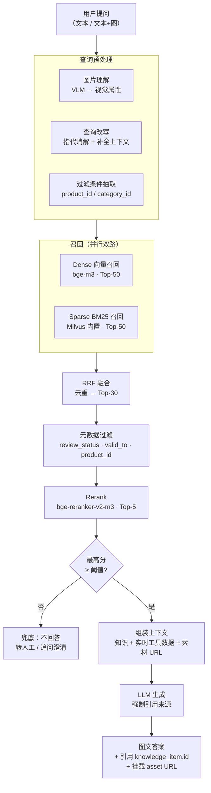
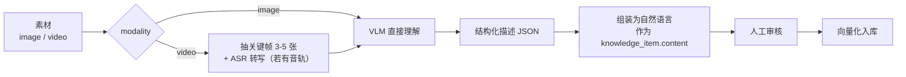
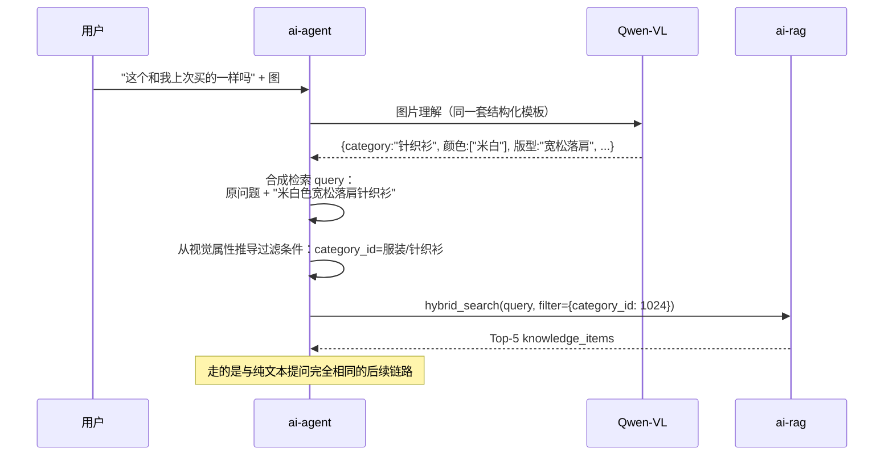
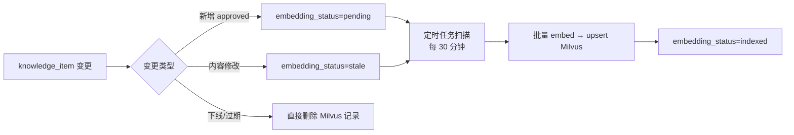

# 04 · RAG 知识库

> 本文定义知识库的索引结构、切分策略、混合检索链路、多模态处理方式与评测方法。
> 核心主张：**多模态走「VLM 转述 + 文本索引 + 素材回挂」，不做端到端多模态检索。**

---

## 1. 整体检索链路



---

## 2. 索引结构（Milvus Collection）

```python
# Collection: kb_chunk
fields = [
    FieldSchema("chunk_id",      DataType.INT64,         is_primary=True, auto_id=True),
    FieldSchema("item_id",       DataType.INT64),          # 关联 knowledge_item.id
    FieldSchema("chunk_seq",     DataType.INT16),          # 同一条知识切出的第几块
    FieldSchema("text",          DataType.VARCHAR, max_length=4096),   # 用于 BM25 与展示
    FieldSchema("dense_vec",     DataType.FLOAT_VECTOR,  dim=1024),    # bge-m3
    FieldSchema("sparse_vec",    DataType.SPARSE_FLOAT_VECTOR),        # Milvus 2.5 内置 BM25

    # 标量过滤字段
    FieldSchema("biz_type",      DataType.VARCHAR, max_length=32),
    FieldSchema("modality",      DataType.VARCHAR, max_length=16),
    FieldSchema("category_id",   DataType.INT64),
    FieldSchema("product_ids",   DataType.ARRAY, element_type=DataType.INT64, max_capacity=32),
    FieldSchema("review_status", DataType.VARCHAR, max_length=16),
    FieldSchema("valid_to_ts",   DataType.INT64),          # Unix 时间戳，0 表示永久有效
    FieldSchema("quality_score", DataType.FLOAT),
    FieldSchema("kb_version",    DataType.VARCHAR, max_length=32),      # 数据资产版本号

    # 升级预留位（当前不参与检索）
    FieldSchema("image_vec",     DataType.FLOAT_VECTOR,  dim=768),
]
```

**索引配置**

| 字段 | 索引类型 | 度量 | 说明 |
|---|---|---|---|
| `dense_vec` | `HNSW` (M=16, efConstruction=200) | `IP`（bge-m3 已归一化） | 十万级数据量下 HNSW 优于 IVF |
| `sparse_vec` | `SPARSE_INVERTED_INDEX` | `BM25` | Milvus 2.5 内置，省掉 ES |
| 标量字段 | 自动 | — | `category_id`、`product_ids`、`valid_to_ts` 建标量索引以加速过滤 |

**`kb_version` 字段的用途**：支持多版本索引并存。发布 `kb-v4` 时先写入新版本数据，切换检索的 `kb_version` 过滤条件完成上线，出问题切回旧版本即可回滚——**无需重建索引**。

---

## 3. 切分策略

**不同 `biz_type` 用不同切分逻辑**，一刀切的固定长度切分在这个场景是错的。

| biz_type | 内容形态 | 切分策略 |
|---|---|---|
| `qa` | 问答对（清洗后的对话） | **不切分**。一条 QA 就是一个语义单元，切开会破坏问答对应关系 |
| `spec` | 商品结构化属性 | **不切分**。按属性组装成自然语言句子（"材质：100% 羊毛；克重：320g"）作为一条 |
| `script` | 直播口播话术 | 按语义段落切，单段 200–400 字，段间重叠 50 字 |
| `policy` | 售后政策、活动规则文档 | 按标题层级递归切分（Markdown heading / 条款编号），单块 ≤ 500 字，保留标题路径作为前缀 |
| `image` / `video` | VLM 生成的描述 | **不切分**。描述本身控制在 300 字内 |

**关键原则：能不切就不切。** 电商知识的天然单元是"一个问题一个答案"，机械切分只会制造噪声。只有政策文档这类长文本才需要切分。

**切分实现**：复用 LangChain 的 `RecursiveCharacterTextSplitter`（仅政策文档用）与 `MarkdownHeaderTextSplitter`，不引入 LangChain 的其他抽象。

---

## 4. 多模态处理（核心设计）

### 4.1 素材入库：VLM 转述

图片/视频不直接做向量索引，而是先转成**结构化描述文本**。



**VLM 输出的结构化描述模板**（服装/箱包类目）：

```json
{
  "category": "针织衫",
  "主体描述": "米白色圆领长袖针织衫，正面平铺展示",
  "材质纹理": "细密罗纹针织，表面有轻微起绒感",
  "颜色": ["米白", "燕麦色"],
  "版型": "宽松落肩",
  "细节": ["袖口螺纹收口", "下摆开叉", "无明显走线瑕疵"],
  "适用场景": ["秋冬日常", "通勤", "校园"],
  "搭配建议": "可搭配直筒牛仔裤或半身长裙",
  "画面类型": "白底平铺图"
}
```

**组装成检索文本**：

```
米白色圆领长袖针织衫。细密罗纹针织，表面有轻微起绒感，宽松落肩版型。
细节包括袖口螺纹收口、下摆开叉。适合秋冬日常、通勤、校园场景穿着，
可搭配直筒牛仔裤或半身长裙。此图为白底平铺展示图。
```

这段文本进 `knowledge_item.content`，做 embedding；原图的 `asset_id` 存在 `asset_ids` 字段。

**为什么必须人工审核这一步**：VLM 可能把"羊毛"看成"棉"。描述错了，客服就会跟着说错，且这个错误会被当作"知识库里的权威答案"输出给用户。审核界面把原图与生成描述并排展示，运营只需扫一眼确认。

### 4.2 检索命中后：素材回挂

```python
# 伪代码：组装答案上下文
def build_context(hits: list[KnowledgeItem]) -> Context:
    knowledge_texts = []
    attachments = []
    for hit in hits:
        knowledge_texts.append(f"[知识#{hit.id}] {hit.content}")
        if hit.asset_ids:
            for aid in hit.asset_ids:
                asset = asset_client.get(aid)          # 调 mall-asset
                if asset.status == "online":
                    attachments.append({
                        "type": asset.modality,        # image | video
                        "url": asset.cdn_url,
                        "from_knowledge": hit.id,
                    })
    return Context(knowledge=knowledge_texts, attachments=attachments)
```

LLM 只看文本知识生成答案，**素材由程序挂载**，不让模型决定挂哪张图——模型会瞎编 URL。答案返回结构：

```json
{
  "answer": "这件是 100% 羊毛的，细密罗纹针织……",
  "citations": [{"item_id": 10234, "biz_type": "spec"}, {"item_id": 10891, "biz_type": "image"}],
  "attachments": [
    {"type": "image", "url": "https://cdn/…/detail_1.jpg", "from_knowledge": 10891},
    {"type": "video", "url": "https://cdn/…/clip_88.mp4", "from_knowledge": 11002,
     "start_ms": 0, "duration_ms": 12000}
  ]
}
```

### 4.3 用户发图提问



**关键点**：视觉属性有两个用途——① 拼进检索 query 提升召回相关性；② 转成**元数据过滤条件**收窄检索范围。第二点比第一点更重要，因为过滤是确定性的，比向量相似度更可靠。

---

## 5. 混合检索

### 5.1 双路召回 + RRF 融合

```python
def hybrid_search(query: str, filters: dict, top_k: int = 5):
    expr = build_filter_expr(filters)   # review_status=='approved' && (valid_to_ts==0 || valid_to_ts>now) && ...

    # 双路并行召回
    dense_hits  = milvus.search(anns_field="dense_vec",  data=[embed(query)], limit=50, expr=expr)
    sparse_hits = milvus.search(anns_field="sparse_vec", data=[query],        limit=50, expr=expr)

    # RRF 融合：score = Σ 1/(k + rank)，k=60
    fused = reciprocal_rank_fusion(dense_hits, sparse_hits, k=60)[:30]

    # 重排
    pairs  = [(query, h.text) for h in fused]
    scores = reranker.compute_score(pairs)
    ranked = sorted(zip(fused, scores), key=lambda x: -x[1])

    # 阈值裁剪
    return [h for h, s in ranked[:top_k] if s >= RERANK_THRESHOLD]
```

**为什么必须要 BM25 这一路**：电商场景大量查询包含**精确关键词**——商品型号（"A1234"）、专有名词（"莱赛尔"）、活动名（"双十一满减"）。纯向量检索对这类精确匹配的召回率明显偏低，BM25 是必需的补充。

**为什么用 RRF 而不是加权分数融合**：dense 的余弦相似度与 BM25 分数量纲完全不同，做归一化再加权需要针对数据集调参且不稳定。RRF 只用排名不用分数，无需调参，鲁棒性好。

### 5.2 过滤条件（必须项）

```sql
review_status == "approved"                    -- 未审核的知识绝不进入检索结果
AND (valid_to_ts == 0 OR valid_to_ts > NOW())  -- 过期知识自动排除
AND kb_version == "{current_version}"          -- 版本隔离
-- 可选（由查询上下文决定）
AND ARRAY_CONTAINS(product_ids, {pid})
AND category_id == {cid}
```

前三条是**硬性过滤，任何查询都必须带上**。封装在 `build_filter_expr()` 中，不允许调用方绕过。

### 5.3 阈值与兜底

| 场景 | 判据 | 动作 |
|---|---|---|
| 检索命中良好 | rerank 最高分 ≥ 0.5 | 正常生成答案 |
| 检索命中不足 | 0.3 ≤ 最高分 < 0.5 | 生成答案但**降低确定性表述**，并提示"如需确认可转人工" |
| 检索无命中 | 最高分 < 0.3 | **不生成答案**。走追问澄清或转人工 |
| 问题涉及实时数据 | 意图识别为库存/价格/物流 | 跳过知识检索，直接走 MCP 工具 |

**"检索不到就不回答"是硬规则。** 电商客服说错话的代价是真实的退货、投诉与差评，宁可转人工也不要幻觉。阈值具体数值在 M2 阶段用评测集标定。

---

## 6. 查询改写

多轮对话中，用户的追问往往不完整：

```
用户：这件针织衫什么材质？
客服：100% 羊毛。
用户：会起球吗？          ← "会起球吗" 直接检索，召回质量极差
```

**改写策略**：用小模型（qwen-turbo）把当前问题结合最近 3 轮上下文改写成独立完整的查询：

```
"会起球吗" + 上下文 → "100% 羊毛针织衫会起球吗？如何避免起球？"
```

**触发条件**（不是每轮都改写，改写有成本也有风险）：
- 当前问题长度 < 10 字
- 或包含指代词（这个、那个、它、上面说的）
- 或首次检索的 rerank 最高分 < 0.4（改写后重试一次）

---

## 7. 生成阶段的约束

### Prompt 结构

```
[系统角色]
你是 {店铺名} 的客服。只根据【知识】回答，不要编造。

[风格约束]           ← 微调上线前用 Prompt 约束，上线后由模型权重承担
- 口语化，像真人打字，句子短
- 不要用"您好，很高兴为您服务"这类模板开场
- 不要分点罗列，除非用户明确要求
- 单条回复不超过 80 字，需要长回答时拆成多条

[知识]
[知识#10234] 材质：100% 羊毛，克重 320g
[知识#10891] 米白色圆领长袖针织衫，细密罗纹针织……

[实时数据]           ← 来自 MCP 工具，非 RAG
当前库存：M 码 12 件，L 码 0 件
当前价格：¥299（原价 ¥399，活动至 2026-08-10）

[对话历史]
…

[约束]
1. 答案中每个事实必须来自【知识】或【实时数据】
2. 在答案末尾用 [#id] 标注引用来源
3. 【知识】中没有的信息，回答"这个我帮您确认一下"并转人工
4. 不使用绝对化用语（最好/第一/顶级/百分百）
```

### 引用强制

模型输出的 `[#10234]` 标记由后处理提取为 `citations` 字段，前端可点击查看原始知识条目。**没有引用标记的事实性陈述会被标记为可疑**，进入 Trace 的告警字段，供后续分析幻觉率。

---

## 8. 增量索引



**`stale` 状态是必需的**：知识内容改了但向量没更新，是最隐蔽的 bug——检索还能命中（旧向量），但返回的 `content` 是新的，两者不匹配。用 `stale` 状态显式标记，定时任务重新计算。

**批量策略**：单次最多处理 500 条，bge-m3 batch inference，避免长时间占用 GPU 影响在线检索。

---

## 9. 评测

### 9.1 评测集构造

| 评测集 | 规模 | 构造方式 | 用途 |
|---|---|---|---|
| `eval-retrieval` | 300 条 | 人工标注 query → 正确的 `item_id` 列表 | 召回率、MRR、NDCG |
| `eval-answer` | 200 条 | 人工标注 query → golden 答案 | 忠实度、答案相关性 |
| `eval-negative` | 100 条 | 知识库中**没有**答案的问题 | 检验兜底率（应拒答） |
| `eval-multimodal` | 100 条 | 带图提问 → 期望返回的素材 | 多模态链路检验 |

`eval-negative` 是最容易被忽略但最重要的一个——它检验的是"模型知不知道自己不知道"。电商场景下，幻觉的代价高于漏答。

### 9.2 指标与门禁

| 指标 | 工具 | 门禁 |
|---|---|---|
| Recall@5 | 自建脚本 | ≥ 0.85 |
| MRR@10 | 自建脚本 | ≥ 0.75 |
| Faithfulness（忠实度） | Ragas | ≥ 0.90 |
| Answer Relevancy | Ragas | ≥ 0.85 |
| Context Precision | Ragas | ≥ 0.80 |
| 拒答准确率（负样本集） | 自建脚本 | ≥ 0.90 |
| P95 端到端延迟 | Langfuse | ≤ 3s |

**回归执行时机**：
- 知识库发新版本时（`kb-vN` 发布后自动触发）
- 检索参数变更时（切分策略、融合权重、阈值）
- 模型切换时（embedding 模型、生成模型、微调模型上线）

评测结果写入 `eval_result` 表，与 `kb_version` + `model_version` 双绑定。**任何一次效果变化都能归因到具体的数据版本或模型版本。**

---

## 10. 容量估算

| 项 | 估算 |
|---|---|
| `knowledge_item` 条数（M1 末） | ~1 万 |
| `knowledge_item` 条数（M7 末） | ~5 万 |
| chunk 数（约 1.3 倍） | ~6.5 万 |
| dense 向量存储（1024 维 float32） | 6.5 万 × 4KB ≈ 260 MB |
| Milvus 内存占用（HNSW 索引） | ~1.5 GB |
| bge-m3 全量向量化耗时（GPU） | ~5 万条 / 15 分钟 |

这个量级 Milvus Standalone 单容器完全够用，也说明 **pgvector 在本项目的数据规模下同样可行**——选 Milvus 主要是为了混合检索的完整性。

---

## 11. 验收标准（M2 阶段）

- [ ] 混合检索（dense + BM25 + RRF + rerank）链路跑通，可通过 API 调试
- [ ] 硬性过滤条件（审核状态、时效、版本）无法被绕过
- [ ] 多模态知识可正常召回，答案能正确挂载图片/视频 URL
- [ ] 用户发图提问可走通完整链路
- [ ] 检索无命中时正确拒答，不产生幻觉
- [ ] 四个评测集就位，指标全部达到门禁阈值
- [ ] 增量索引任务正常运行，`stale` 条目能在 30 分钟内更新
- [ ] `kb_version` 切换可实现秒级回滚

---

**上一篇** ← [03 · 数据中台](03-data-platform.md) ｜ **下一篇** → [05 · 客服 Agent](05-agent-customer-service.md)
