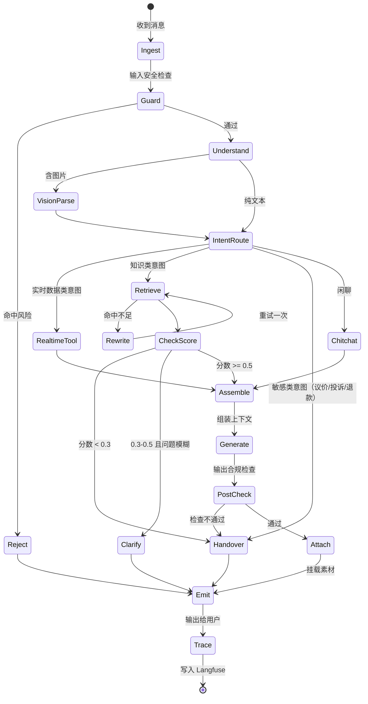
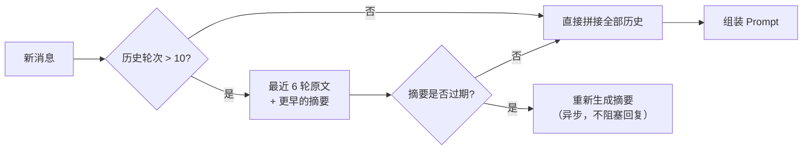
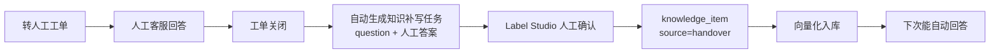
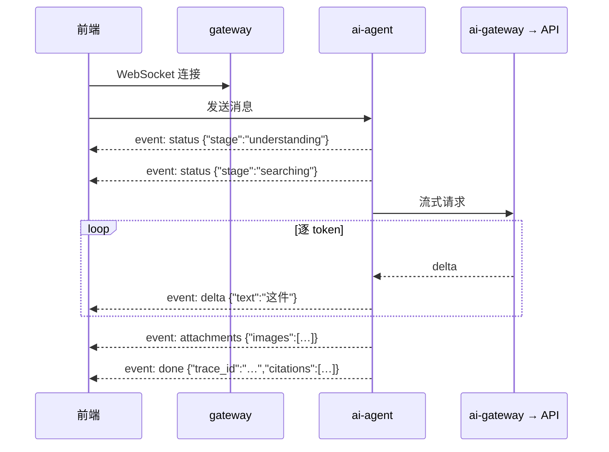

# 05 · 客服 Agent

> 整个体系的门面，也是数据飞轮的主要入口——它每一次对话都在为下一次迭代生产训练数据。

---

## 1. 能力边界

| 能力 | 支持 | 说明 |
|---|---|---|
| 文本问答 | ✅ | 基于 RAG 知识库 |
| 图片理解 | ✅ | 用户发图 → VLM 理解 → 转文本检索 |
| 图片回答 | ✅ | 答案挂载商品细节图、场景图 |
| 视频回答 | ✅ | 答案挂载直播切片、宣传视频 |
| 实时数据查询 | ✅ | 库存、价格、订单、物流（MCP 工具） |
| 多轮上下文 | ✅ | 保留最近 10 轮，长会话做摘要压缩 |
| 主动推荐 | ✅ | 基于当前商品的搭配/替代推荐 |
| 转人工 | ✅ | 主动触发 + 用户请求 |
| 下单/支付/退款操作 | ❌ | **不做写操作**，只引导用户到操作入口 |
| 议价/改价 | ❌ | 涉及资金，一律转人工 |

**为什么不做写操作**：AI 误触发的退款、改价是不可逆的资金损失。读操作出错最多是说错话，写操作出错是真金白银。这条边界不建议放宽。

---

## 2. LangGraph 状态机



### 节点职责

| 节点 | 职责 | 实现要点 |
|---|---|---|
| `Ingest` | 消息接入、会话状态加载 | 从 Redis 读会话上下文，超过 10 轮触发摘要压缩 |
| `Guard` | 输入安全检查 | 敏感词、prompt 注入、恶意刷屏 |
| `VisionParse` | 图片理解 | qwen-vl-max，输出结构化视觉属性（与素材打标同一套模板） |
| `IntentRoute` | 意图分类 | 小模型分类，7 类意图，决定后续分支 |
| `Retrieve` | 知识检索 | 调 `ai-rag` 混合检索 |
| `Rewrite` | 查询改写 | 仅在首次命中不足时触发，最多重试一次 |
| `RealtimeTool` | 实时数据查询 | MCP 工具调用 `mall-product` / `mall-order` |
| `Clarify` | 追问澄清 | 生成一个具体的澄清问题，不要泛泛地说"请详细描述" |
| `Assemble` | 上下文组装 | 知识 + 实时数据 + 历史 + 风格约束 |
| `Generate` | 答案生成 | 流式输出，强制引用标记 |
| `PostCheck` | 输出合规检查 | 广告法绝对化用语、承诺性表述、无引用的事实陈述 |
| `Attach` | 素材挂载 | 程序挂载，不由模型决定 |
| `Handover` | 转人工 | 生成会话摘要给人工客服，避免用户重复描述 |
| `Trace` | 埋点 | 写 Langfuse，返回 `trace_id` |

### 意图分类

| 意图 | 示例 | 路由 |
|---|---|---|
| `product_knowledge` | "什么材质""会起球吗""怎么洗" | → Retrieve |
| `sizing` | "160cm 穿什么码" | → Retrieve（尺码知识 + 商品尺码表工具） |
| `realtime_stock_price` | "还有货吗""多少钱""有活动吗" | → RealtimeTool |
| `order_logistics` | "我的快递到哪了""什么时候发货" | → RealtimeTool |
| `aftersale` | "怎么退货""能换码吗" | → Retrieve（政策知识） |
| `sensitive` | "便宜点""我要投诉""退钱" | → Handover |
| `chitchat` | "在吗""谢谢" | → Chitchat（轻量回复，不检索） |

**`chitchat` 单独分流的意义**：约 30% 的消息是纯寒暄，走完整 RAG 链路是纯粹的成本浪费（一次检索 + 一次大模型调用）。分流后用最小模型直接回，成本降一个数量级。

---

## 3. MCP 工具集

Agent 通过 MCP 协议调用业务能力，工具定义集中在 `apps/python/ai-agent/mcp_servers/`。

| 工具 | 后端服务 | 参数 | 返回 |
|---|---|---|---|
| `get_product_detail` | mall-product | `product_id` | 商品基础信息、属性、主图 |
| `get_sku_stock_price` | mall-product | `product_id`, `spec?` | 各 SKU 的实时库存与价格 |
| `get_size_chart` | mall-product | `product_id` | 尺码表 |
| `get_order_status` | mall-order | `order_no`, `user_id` | 订单状态、物流节点 |
| `search_knowledge` | ai-rag | `query`, `filters` | Top-K knowledge_items |
| `search_asset` | mall-asset | `product_id`, `modality`, `scene?` | 素材列表 |
| `recommend_products` | mall-product | `product_id`, `type: similar\|match` | 相似款 / 搭配款 |
| `create_handover` | 工单系统 | `session_id`, `summary`, `reason` | 转人工工单号 |

**权限约束**：所有工具**只读**，唯一的写操作是 `create_handover`（创建转人工工单）。MCP Server 层做强制校验，不依赖 prompt 约束。

**`get_order_status` 的越权防护**：必须同时校验 `order_no` 与当前会话的 `user_id` 匹配，防止用户通过说出别人的订单号查询他人订单。这类越权在 AI 客服里是真实存在的攻击面。

---

## 4. 会话上下文管理



**存储**：Redis，key = `session:{session_id}`，TTL 24 小时。
**结构**：

```json
{
  "session_id": "…",
  "user_id": 10086,
  "current_product_id": 2048,
  "turns": [{"role": "user", "content": "…", "ts": …}],
  "summary": "用户咨询米白色针织衫，已确认材质为羊毛，关注起球问题",
  "summary_until_turn": 8,
  "vision_context": {"category": "针织衫", "颜色": ["米白"]},
  "handover_count": 0
}
```

**`current_product_id` 是最重要的上下文**——它决定了检索的过滤范围。用户从商品页进入会话时带入，中途切换商品要能识别并更新。

**`vision_context` 缓存**：用户发过的图的理解结果要缓存，后续追问（"这个多少钱"）能复用，不必重复调用 VLM。

---

## 5. 输出合规检查（PostCheck）

生成后、返回前的强制检查，任一项不通过则拦截。

| 检查项 | 规则 | 处置 |
|---|---|---|
| 绝对化用语 | 词表匹配：最好/第一/顶级/唯一/百分百/绝对/永久 | 重新生成（最多 1 次），仍不过则转人工 |
| 医疗功效表述 | 治疗/根治/疗效/药用 | 拦截，转人工 |
| 承诺性表述 | 保证/一定/必然 + 时效或效果 | 拦截，改写为"通常/一般" |
| 无引用事实陈述 | 含数字/参数但无 `[#id]` 标记 | 标记可疑，写入 Trace 告警（不拦截，用于事后分析幻觉率） |
| 编造的 URL | 答案中出现非白名单域名的链接 | 移除链接 |
| 超长回复 | 单条 > 200 字 | 拆成多条发送 |

**为什么无引用检查不拦截**：拦截会导致大量误伤（很多正常回复不需要引用），改为记录+告警，用于统计幻觉率趋势。若某周幻觉率突增，说明知识库或 Prompt 出了问题。

---

## 6. 转人工

### 触发条件

| 类型 | 条件 |
|---|---|
| 主动触发 | 检索分数 < 0.3；PostCheck 拦截 2 次；意图为 `sensitive`；连续 3 轮用户表达不满（情绪识别） |
| 用户请求 | 用户说"转人工""找客服""人呢" |
| 兜底 | Agent 内部异常、工具调用连续失败 |

### 交接内容

转人工时生成结构化摘要给人工客服，**避免用户重复描述**（这是 AI 客服体验最大的抱怨点）：

```json
{
  "handover_reason": "知识库无相关内容",
  "summary": "用户咨询商品 #2048（米白针织衫）能否机洗。知识库中无该商品的洗涤说明。",
  "user_intent": "product_knowledge",
  "current_product_id": 2048,
  "conversation_digest": "用户已确认材质为羊毛，关心洗涤方式",
  "user_sentiment": "neutral",
  "unanswered_question": "这件能机洗吗？",
  "suggested_action": "确认洗涤方式后，建议补充该商品的洗涤说明到知识库"
}
```

**`suggested_action` 字段是飞轮的一环**——每一次转人工都暴露了一个知识盲点。人工回答后，该问答自动进入知识补写队列（`source=handover`），下次同样的问题 AI 就能答了。

### 转人工数据回流



---

## 7. Trace 埋点

**Trace 不是日志，是训练数据的采集管道。** 字段设计要按训练数据的标准来。

```json
{
  "trace_id": "…",
  "session_id": "…",
  "user_id": 10086,
  "timestamp": "2026-08-04T10:23:11Z",

  "input": {
    "text": "会起球吗",
    "images": ["oss://…"],
    "rewritten_query": "100% 羊毛针织衫会起球吗"
  },

  "intent": "product_knowledge",
  "vision_attrs": {"category": "针织衫", "颜色": ["米白"]},

  "retrieval": {
    "kb_version": "kb-v3",
    "dense_hits": [{"item_id": 10234, "score": 0.82}],
    "sparse_hits": [{"item_id": 10891, "score": 12.4}],
    "final_hits": [{"item_id": 10234, "rerank_score": 0.71}],
    "max_score": 0.71,
    "hit_count": 3
  },

  "tools_called": [{"name": "get_sku_stock_price", "latency_ms": 45}],

  "output": {
    "answer": "…",
    "citations": [10234],
    "attachments": [{"type": "image", "url": "…"}],
    "postcheck_flags": []
  },

  "model": {"name": "qwen-plus", "prompt_tokens": 1840, "completion_tokens": 92, "cost_cny": 0.0031},
  "latency": {"total_ms": 2340, "vision_ms": 680, "retrieval_ms": 210, "generation_ms": 1400},

  "feedback": {"thumb": null, "handover": false, "user_replied_after": true},
  "outcome": {"order_created": false}
}
```

### 各字段的下游用途

| 字段 | 用途 |
|---|---|
| `retrieval.final_hits` | 统计知识命中分布 → 识别从未命中的无用知识 |
| `retrieval.max_score` + `feedback.thumb` | 标定检索阈值 |
| `output.postcheck_flags` | 幻觉率趋势监控 |
| `feedback.thumb` | **DPO 偏好信号**——点踩的回复作为负例 |
| `feedback.handover` | 知识盲点识别 |
| `outcome.order_created` | 考核系统的转化率指标 |
| `input` + `output` 全量 | `sft_sample` 的原料 |
| `model.cost_cny` | 成本监控与模型选型依据 |

**`feedback.thumb` 的采集设计**：前端在每条 AI 回复下放不显眼的 👍👎，`trace_id` 随消息返回。点踩时弹出可选原因（答非所问/信息错误/态度生硬/太啰嗦），"态度生硬""太啰嗦"这两个原因**直接对应微调的风格目标**，价值极高。

---

## 8. 流式输出



**中间状态提示很重要**：RAG 链路（VLM + 检索 + 生成）P95 约 3 秒，纯等待会让用户以为卡住。显示"正在理解图片…""正在查找资料…"能显著改善体感。

---

## 9. 上线前的降级预案

| 故障 | 降级策略 |
|---|---|
| Milvus 不可用 | 跳过检索，只用商品结构化数据回答，并提示"详细信息请咨询人工" |
| 云 LLM API 超时 | LiteLLM 自动 fallback 到备用模型（qwen-plus → deepseek-chat） |
| VLM 不可用 | 图片消息直接转人工，不阻塞文本对话 |
| `mall-product` 不可用 | 实时数据类问题转人工 |
| 全链路异常 | 返回固定话术 + 自动转人工 |

**原则：任何故障的最终兜底都是转人工，绝不返回错误堆栈或空白。**

---

## 10. 验收标准（M2 / M4 阶段）

**M2（文本客服）**
- [ ] LangGraph 状态机全部节点跑通，可在调试台可视化查看执行路径
- [ ] 7 类意图分类准确率 ≥ 0.85
- [ ] 8 个 MCP 工具全部可调用，越权校验生效
- [ ] 多轮上下文正确维持，摘要压缩生效
- [ ] PostCheck 拦截规则生效，绝对化用语零漏出
- [ ] 转人工链路完整，交接摘要可读
- [ ] Trace 全字段落库，`trace_id` 正确返回前端
- [ ] 点赞/点踩反馈可正常回写

**M4（多模态客服）**
- [ ] 用户发图 → VLM 理解 → 检索 → 回答链路跑通
- [ ] 答案能正确挂载图片与视频，URL 可访问
- [ ] `vision_context` 缓存生效，追问不重复调 VLM
- [ ] 多模态评测集指标达标

---

**上一篇** ← [04 · RAG 知识库](04-rag-knowledge.md) ｜ **下一篇** → [06 · 运营 Agent](06-agent-marketing.md)
