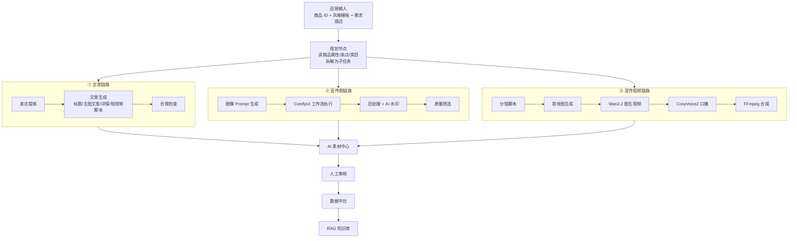
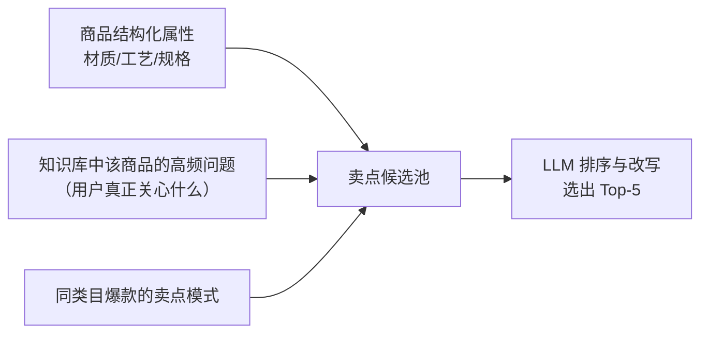
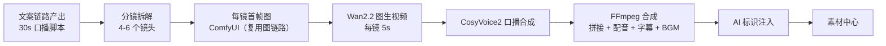
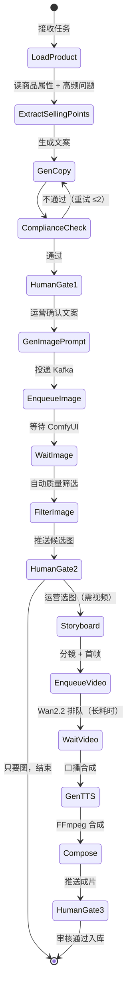
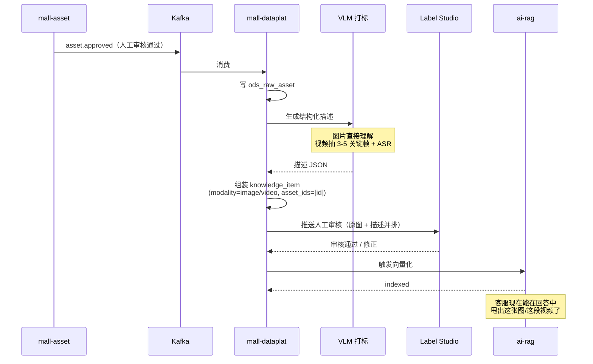

# 06 · 运营 Agent

> 负责商品内容的批量生产：文案、宣传图、宣传视频。
> 产出全部进入 AI 素材中心，经数据中台回灌 RAG 知识库，让 AI 客服获得图文视频能力。

---

## 1. 三条子链路



**三条链路的依赖关系**：文案 → 图 → 视频 是**递进**的。视频的分镜脚本来自文案，视频的首帧来自图。所以规划节点要按依赖顺序调度，而不是三路并行。

---

## 2. 链路一：商品文案

### 2.1 输入与输出

**输入**：商品结构化属性（类目、材质、规格、价格）+ 已有卖点 + 目标人群 + 风格模板

**输出**（一次生成多种形态）：

| 产物 | 规格 | 用途 |
|---|---|---|
| 商品标题 | ≤ 30 字，含核心关键词 | 搜索优化 |
| 主图文案 | ≤ 12 字 × 3 条 | 主图角标 |
| 卖点短句 | ≤ 15 字 × 5 条 | 详情页卖点区 |
| 详情长文案 | 300–500 字 | 商品详情 |
| 短视频口播脚本 | 30s / 60s 两版 | 视频链路输入 |
| 直播话术要点 | 5–8 条 | 主播提词 |

**一次生成多形态的理由**：同一批卖点素材，分开调用会导致各形态之间的卖点表述不一致（标题说"羊毛"，详情说"混纺"）。一次生成，模型在同一上下文里保持一致。

### 2.2 卖点提炼

文案质量的上限由卖点质量决定。卖点有三个来源，按优先级：



**第二个来源是本项目的独特优势**——因为有数据中台，能知道用户对这个商品**实际问得最多的是什么**（从 `ch_kb_hit` 和 Trace 统计）。用户反复问"会不会起球"，那"抗起球"就该是主打卖点，而不是运营拍脑袋想的"高级感"。

这是数据飞轮在运营侧的体现：**客服数据反哺文案生产**。

### 2.3 合规检查

与客服 Agent 的 PostCheck 共用同一套规则引擎（`ai-common/compliance/`）：

| 检查项 | 处置 |
|---|---|
| 绝对化用语（最/第一/顶级/唯一/国家级） | 重新生成 |
| 虚假宣传（无依据的功效、成分含量） | 拦截，要求人工提供依据 |
| 医疗/保健功效表述 | 拦截 |
| 与商品结构化属性冲突（文案说羊毛，属性是聚酯纤维） | 拦截，标红冲突点 |
| 竞品品牌名 | 拦截 |

**属性冲突检查是硬需求**——模型编造材质是最常见也最危险的错误，会直接构成虚假宣传。规则是：文案中出现的所有材质、规格、数值，必须能在商品结构化属性中找到对应，否则拦截。

---

## 3. 链路二：宣传图

### 3.1 ComfyUI 工作流管理

**核心原则：工作流必须版本化。** 「能生成图」和「能稳定批量生产图」的差距全在这里。

```
comfyui-workflows/
├── product_white_bg_v2.json        # 白底商品图
├── model_scene_v3.json             # 模特场景图
├── flatlay_scene_v1.json           # 平铺场景图
├── detail_macro_v1.json            # 细节特写
├── poster_promo_v2.json            # 促销海报（含文字渲染）
├── vton_catvton_v1.json            # 虚拟试穿
└── manifest.yaml                   # 工作流注册表
```

`manifest.yaml` 定义每个工作流的元信息与可注入参数：

```yaml
workflows:
  - id: model_scene
    version: v3
    file: model_scene_v3.json
    description: 模特上身场景图，适用服装类目
    applicable_categories: [服装, 外套, 针织衫]
    base_model: qwen-image
    params:                       # 可从外部注入的节点参数
      positive_prompt:  { node: "6",  field: "text" }
      negative_prompt:  { node: "7",  field: "text" }
      seed:             { node: "3",  field: "seed" }
      ref_image:        { node: "12", field: "image" }   # IP-Adapter 参考图
      steps:            { node: "3",  field: "steps", default: 28 }
    vram_gb: 16
    avg_seconds: 25
```

`ai-media` 服务读 manifest，把参数注入 JSON 后调 ComfyUI 的 `/prompt` API。**这样工作流的迭代（换模型、加节点）不需要改代码。**

### 3.2 关键控制技术

| 需求 | 技术 | 说明 |
|---|---|---|
| 商品主体一致性 | **IP-Adapter** | 用商品实拍图作参考，保证生成图里还是这个包/这件衣服，不是模型瞎编的相似款 |
| 构图控制 | **ControlNet**（Canny / Depth） | 保持商品在画面中的位置与比例 |
| 服装上身效果 | **CatVTON** | 虚拟试穿，~899M 参数，1024×768 显存 <8G |
| 图上文字 | **Qwen-Image** | 中文文字渲染能力强，促销海报必需 |
| 批量一致风格 | 固定 seed + 固定 LoRA | 同一批商品图风格统一 |

**IP-Adapter 是电商场景的关键**。纯 text-to-image 生成的商品是"想象中的商品"，与实际售卖的商品不是同一个东西——这在电商属于虚假宣传。必须用真实商品图作为视觉锚点。

### 3.3 质量筛选

单次生成 4 张候选，自动筛选后推给人工：

| 筛选项 | 方法 | 淘汰条件 |
|---|---|---|
| 主体相似度 | CLIP 图像相似度（生成图 vs 商品实拍图） | < 0.75 |
| 美学分 | 美学评分模型 | 低于批次均值 |
| 缺陷检测 | VLM 检查（多手指、扭曲文字、明显穿帮） | 检出缺陷 |
| 文字正确性 | OCR 比对（海报类） | 文字与预期不符 |

**主体相似度阈值是防虚假宣传的技术闸门**，不是可选项。

### 3.4 AI 生成标识

⚠️ **法规要求**：《人工智能生成合成内容标识办法》要求 AI 生成内容添加标识。

| 标识类型 | 实现 |
|---|---|
| **隐式标识** | 写入图片元数据（EXIF / XMP）：生成模型、生成时间、服务提供者信息 |
| **显式标识** | 画面角落添加"AI 生成"角标（可配置位置与透明度） |
| **数字水印** | 在像素层嵌入不可见水印，用于溯源 |

这三项在 `ai-media` 的后处理环节统一注入，**`asset` 表的 `ai_generated`、`ai_label_applied` 字段为必填**，未打标的素材不允许通过审核。详见 [15 · 风险与合规](15-risks-compliance.md)。

---

## 4. 链路三：宣传视频

### 4.1 生成流程



### 4.2 为什么用图生视频而不是文生视频

| | 图生视频（选中） | 文生视频（否决） |
|---|---|---|
| 商品主体一致性 | 首帧就是真实商品图，主体准确 | 模型想象的商品，与实物不符 |
| 可控性 | 首帧可用 ComfyUI 精确控制 | 只能靠 prompt 描述，不可控 |
| 合规风险 | 低 | **高**——展示的不是实际商品 |
| 生成成本 | 需先生成首帧，两步 | 一步 |

电商场景**必须用图生视频**。这不是效果偏好问题，是合规问题。

### 4.3 Wan2.2 参数与耗时

| 项 | 值 |
|---|---|
| 模型 | Wan2.2-TI2V-5B |
| 分辨率 | 720P @ 24fps |
| 单镜时长 | 5 秒 |
| 显存占用 | ~22 GB |
| 生成耗时 | 约 2 分 42 秒 / 5 秒视频（RTX 4090） |
| 一条 30s 视频（6 镜） | 约 16 分钟（不含首帧生成与合成） |

**这个耗时决定了视频生成必须是异步任务**，且必须独占 GPU 排队（见 [14 · 基础设施](14-infra.md)）。运营提交任务后离开，完成后通知。

### 4.4 口播合成

- **音色**：用 CosyVoice2 零样本克隆主播音色（3–10 秒参考音频即可），保持品牌声音一致性
- **语速控制**：口播时长必须匹配视频时长。策略是先合成音频测实际时长，若超出则自动精简脚本文字后重新合成（最多 2 轮）
- ⚠️ **音色克隆的授权**：克隆真人主播音色前必须取得书面授权，这属于人格权范畴

> 若对口播时长有精确卡点要求（比如卡 BGM 节拍），CosyVoice2 的时长控制不如 IndexTTS2 精确，此时可切换后端。`ai-media` 的 TTS 接口设计为可插拔。

---

## 5. LangGraph 编排



**三道人工闸门（HumanGate）是刻意设计的**，LangGraph 的 checkpoint 机制让流程可以在闸门处挂起等待，运营确认后从断点继续。

**为什么不做全自动**：
1. AI 生成的商品图/视频直接对外发布，出错就是虚假宣传，法律责任在商家
2. 素材要回灌知识库，错误的素材描述会污染客服的答案
3. 长耗时任务（视频 16 分钟）在中间环节出错就全废了，前置闸门能提前止损

---

## 6. 素材回灌知识库

生成的素材要变成 AI 客服能用的知识，需要经过：



**描述审核界面的设计要点**：左边显示原图，右边显示生成的描述，运营扫一眼就能判断对错。批量审核时支持键盘快捷键（Y 通过 / N 打回 / E 编辑）。这个界面的效率直接决定素材回灌的吞吐量。

---

## 7. 成本与产能估算

单卡 24G，按每天可用 GPU 时间 16 小时估算：

| 产物 | 单件耗时 | 日产能（独占时） |
|---|---|---|
| 文案（一套多形态） | ~20s（API） | 不占 GPU，可并发，≥1000 件 |
| 宣传图（4 张候选） | ~100s | ~570 组 |
| 虚拟试穿图 | ~40s | ~1400 张 |
| 30s 宣传视频 | ~20 min（含首帧与合成） | ~48 条 |

**实际排产建议**：图与视频不能同时跑（显存冲突）。典型日程为——白天跑图（响应运营即时需求），夜间跑视频（批量长任务）。

**API 成本**（文案与 VLM 打标）：按日产 500 件商品文案 + 500 张素材打标估算，`qwen-plus` 约 ¥15–25/天，可忽略。

---

## 8. 验收标准（M3 阶段）

- [ ] 文案链路：一次生成 6 种形态，卖点来源包含知识库高频问题
- [ ] 合规检查生效：绝对化用语、属性冲突零漏出
- [ ] ComfyUI 工作流通过 manifest 参数化调用，至少 4 个工作流可用
- [ ] IP-Adapter 生效，生成图与实拍图 CLIP 相似度 ≥ 0.75
- [ ] AI 标识三件套（元数据 / 角标 / 水印）全部注入，未打标素材无法通过审核
- [ ] 视频链路端到端跑通，可产出一条带口播与字幕的 30s 成片
- [ ] 三道人工闸门可正常挂起与恢复（LangGraph checkpoint）
- [ ] 素材审核通过后可自动回灌为 `knowledge_item`，并在客服答案中被挂载

---

**上一篇** ← [05 · 客服 Agent](05-agent-customer-service.md) ｜ **下一篇** → [07 · AI 素材中心](07-asset-center.md)
