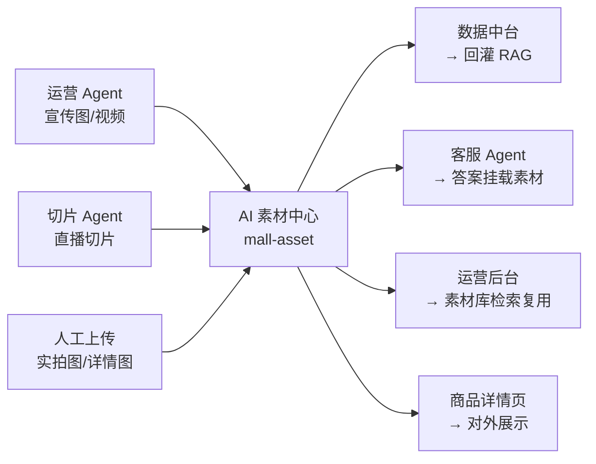
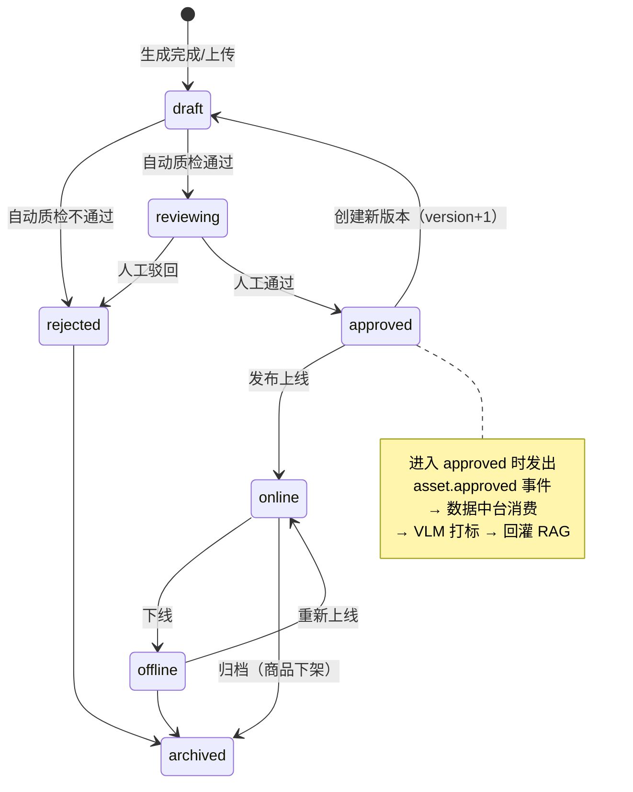

# 07 · AI 素材中心

> 管理所有 AI 生成与人工上传的图片、视频、音频。
> 它是运营 Agent 与切片 Agent 的产物出口，也是数据中台的输入源之一，还是客服 Agent 挂载素材时的查询目标。

---

## 1. 定位



**核心职责**
1. 素材元数据管理与对象存储托管
2. **素材 ↔ 商品 ID 的多对多关联**（这是全链路打通的关键）
3. 版本管理与生命周期状态机
4. 审核流（人工闸门）
5. AI 生成标识的强制校验
6. 素材检索（按商品、类目、场景、模态）

---

## 2. 数据模型

### 2.1 `asset` 主表

```sql
CREATE TABLE asset (
    id                BIGINT       PRIMARY KEY AUTO_INCREMENT,
    asset_no          VARCHAR(64)  NOT NULL COMMENT '业务编号，对外暴露',
    modality          VARCHAR(16)  NOT NULL COMMENT 'image|video|audio',
    scene             VARCHAR(32)  COMMENT 'white_bg|model|flatlay|detail|poster|clip|ad_video',

    -- 存储
    oss_key           VARCHAR(512) NOT NULL COMMENT '对象存储路径',
    cdn_url           VARCHAR(512) COMMENT 'CDN 访问地址',
    thumb_url         VARCHAR(512) COMMENT '缩略图/封面帧',
    file_size         BIGINT,
    mime_type         VARCHAR(64),
    width             INT,
    height            INT,
    duration_ms       INT          COMMENT '视频/音频时长',
    file_hash         CHAR(64)     NOT NULL COMMENT 'SHA256，去重与溯源',

    -- 来源
    source            VARCHAR(32)  NOT NULL COMMENT 'ai_generate|live_clip|manual_upload',
    gen_task_id       VARCHAR(64)  COMMENT '生成任务 ID',
    gen_workflow      VARCHAR(64)  COMMENT 'ComfyUI 工作流 ID + 版本，如 model_scene@v3',
    gen_model         VARCHAR(64)  COMMENT '生成模型，如 wan2.2-ti2v-5b',
    gen_params        JSON         COMMENT '完整生成参数（prompt/seed/steps），用于复现',
    ref_asset_ids     JSON         COMMENT '参考素材（IP-Adapter 输入图、视频首帧）',

    -- AI 标识（法规要求，必填）
    ai_generated      TINYINT      NOT NULL DEFAULT 0,
    ai_label_applied  TINYINT      NOT NULL DEFAULT 0 COMMENT '显式角标是否已注入',
    ai_meta_applied   TINYINT      NOT NULL DEFAULT 0 COMMENT '隐式元数据是否已写入',
    ai_watermark      TINYINT      NOT NULL DEFAULT 0 COMMENT '数字水印是否已嵌入',

    -- 生命周期
    status            VARCHAR(16)  NOT NULL DEFAULT 'draft'
                                   COMMENT 'draft|reviewing|approved|online|offline|rejected|archived',
    version           INT          NOT NULL DEFAULT 1,
    parent_asset_id   BIGINT       COMMENT '版本链：指向上一版本',

    -- 标注（供 RAG 使用）
    vlm_description   TEXT         COMMENT 'VLM 生成的结构化描述（组装后的自然语言）',
    vlm_attrs         JSON         COMMENT 'VLM 生成的结构化属性 JSON',
    desc_review_status VARCHAR(16) NOT NULL DEFAULT 'pending'
                                   COMMENT '描述审核状态，独立于素材审核',
    tags              JSON,

    -- 质量
    aesthetic_score   DECIMAL(4,3),
    subject_similarity DECIMAL(4,3) COMMENT '与商品实拍图的 CLIP 相似度',

    created_by        BIGINT,
    created_at        DATETIME     NOT NULL DEFAULT CURRENT_TIMESTAMP,
    updated_at        DATETIME     NOT NULL DEFAULT CURRENT_TIMESTAMP ON UPDATE CURRENT_TIMESTAMP,
    deleted           TINYINT      NOT NULL DEFAULT 0,

    UNIQUE KEY uk_asset_no (asset_no),
    INDEX idx_hash (file_hash),
    INDEX idx_status (status, modality),
    INDEX idx_scene (scene, status),
    INDEX idx_gen_task (gen_task_id)
) COMMENT='AI 素材主表';
```

### 2.2 `asset_product_rel` 素材-商品关联

**多对多**：一个素材可用于多个商品（如通用尺码表图），一个商品有多个素材。

```sql
CREATE TABLE asset_product_rel (
    id           BIGINT      PRIMARY KEY AUTO_INCREMENT,
    asset_id     BIGINT      NOT NULL,
    product_id   BIGINT      NOT NULL,
    sku_id       BIGINT      COMMENT '精确到 SKU（如某个颜色的图）',
    rel_type     VARCHAR(32) NOT NULL COMMENT 'main|detail|scene|clip|size_chart|ad',
    sort_order   INT         NOT NULL DEFAULT 0,
    is_primary   TINYINT     NOT NULL DEFAULT 0 COMMENT '是否该类型下的首选素材',
    bind_source  VARCHAR(16) NOT NULL COMMENT 'auto|manual COMMENT 自动匹配还是人工绑定',
    bind_conf    DECIMAL(4,3) COMMENT '自动匹配的置信度',
    created_at   DATETIME    NOT NULL DEFAULT CURRENT_TIMESTAMP,
    UNIQUE KEY uk_asset_product_type (asset_id, product_id, rel_type),
    INDEX idx_product (product_id, rel_type, sort_order)
) COMMENT='素材与商品的关联关系';
```

**`bind_source` + `bind_conf` 的作用**：直播切片的商品关联是 AI 自动匹配的（从口播内容识别商品名 → 模糊匹配 `product_id`），可能匹配错。低置信度的自动绑定要进人工确认队列，绝不能直接生效——把 A 商品的切片挂到 B 商品上，客服就会给用户看错误的商品视频。

### 2.3 `asset_clip_meta` 切片专属元数据

```sql
CREATE TABLE asset_clip_meta (
    asset_id       BIGINT      PRIMARY KEY,
    live_id        BIGINT      NOT NULL,
    live_title     VARCHAR(256),
    anchor_id      BIGINT      COMMENT '主播 ID',
    start_ms       INT         NOT NULL COMMENT '在原直播中的起始位置',
    end_ms         INT         NOT NULL,
    transcript     TEXT        COMMENT 'ASR 转写文本',
    selling_points JSON        COMMENT 'LLM 抽取的卖点',
    subtitle_key   VARCHAR(512) COMMENT 'SRT 字幕文件路径',
    INDEX idx_live (live_id, start_ms)
) COMMENT='直播切片素材的专属元数据';
```

### 2.4 `asset_audit` 审核记录

```sql
CREATE TABLE asset_audit (
    id           BIGINT      PRIMARY KEY AUTO_INCREMENT,
    asset_id     BIGINT      NOT NULL,
    audit_type   VARCHAR(16) NOT NULL COMMENT 'content|description',
    action       VARCHAR(16) NOT NULL COMMENT 'approve|reject|revise',
    reason       VARCHAR(512),
    before_value TEXT        COMMENT '修改前（描述审核时记录）',
    after_value  TEXT,
    auditor_id   BIGINT      NOT NULL,
    audited_at   DATETIME    NOT NULL DEFAULT CURRENT_TIMESTAMP,
    INDEX idx_asset (asset_id, audited_at)
) COMMENT='素材审核流水';
```

---

## 3. 生命周期状态机



### 状态流转的强制校验

| 流转 | 前置条件 |
|---|---|
| `draft → reviewing` | `ai_generated=1` 时，必须 `ai_label_applied=1 AND ai_meta_applied=1 AND ai_watermark=1` |
| `draft → reviewing` | 图片类必须 `subject_similarity ≥ 0.75`（与商品实拍图） |
| `reviewing → approved` | 必须有 `asset_product_rel` 记录（素材必须归属某个商品） |
| `approved → online` | `desc_review_status='approved'`（描述已审核） |
| 任意 → `online` | 素材可访问性校验（CDN URL 返回 200） |

**AI 标识的校验放在状态机而不是业务代码里**，任何路径创建的素材都绕不过去。这是合规硬要求，见 [15 · 风险与合规](15-risks-compliance.md)。

---

## 4. 两道独立的审核

素材有**两个独立的审核维度**，不能合并：

| 审核 | 审核对象 | 关注点 | 审核人 | 状态字段 |
|---|---|---|---|---|
| **内容审核** | 素材本身 | 美观、合规、主体正确、无穿帮 | 运营 | `status` |
| **描述审核** | VLM 生成的描述文本 | 描述是否准确（材质、颜色、细节说对了吗） | 知识运营 | `desc_review_status` |

**为什么必须分开**：一张图可能很好看（内容审核通过），但 VLM 把"羊毛"描述成"棉"（描述审核不通过）。前者决定能否对外展示，后者决定能否进知识库。混在一起会导致——为了修一个描述错误而把一张好图整体驳回。

### 描述审核界面

```
┌─────────────────────────────┬──────────────────────────────────┐
│                             │ 类目：针织衫                      │
│                             │ 主体：米白色圆领长袖针织衫         │
│         [ 原图 ]            │ 材质：细密罗纹针织 ← 可编辑        │
│                             │ 颜色：米白、燕麦色                │
│                             │ 版型：宽松落肩                    │
│                             │ 场景：秋冬日常、通勤              │
│                             │                                  │
│                             │ [Y] 通过  [N] 打回  [E] 编辑      │
└─────────────────────────────┴──────────────────────────────────┘
              商品结构化属性对照：材质=100% 羊毛  ⚠️ 与描述不一致
```

**右下角的属性对照是关键**——系统自动比对 VLM 描述与商品结构化属性，冲突处标红。这让审核从"仔细看图判断"变成"看有没有标红"，效率提升一个量级。

---

## 5. 素材检索

供客服 Agent 与运营后台使用。

```
GET /api/asset/search
  ?product_id=2048
  &modality=image
  &scene=detail
  &status=online
  &limit=5
```

**客服 Agent 的调用方式**：不直接调这个接口选素材，而是通过 RAG 命中 `knowledge_item` 后，用其 `asset_ids` 批量取素材详情（`GET /api/asset/batch?ids=...`）。

**为什么不让 Agent 直接搜素材**：素材检索是关键词/标签匹配，语义能力弱。走 RAG 路径，检索的是"知识"（描述文本），素材是知识的附属产物，语义匹配质量高得多。

**运营后台的素材库**：支持按商品、类目、场景、模态、生成模型、时间范围筛选，支持以图搜图（用 CLIP 图像向量，这里做端到端图像检索是合适的——因为这是人工在找图，不是给模型用）。

---

## 6. 存储组织

```
oss://smartmall-assets/
├── image/
│   ├── ai/{yyyy}/{MM}/{dd}/{asset_no}.webp
│   └── manual/{yyyy}/{MM}/{dd}/{asset_no}.jpg
├── video/
│   ├── ai/{yyyy}/{MM}/{dd}/{asset_no}.mp4
│   └── clip/{live_id}/{asset_no}.mp4
├── audio/
│   └── tts/{yyyy}/{MM}/{asset_no}.wav
├── thumb/
│   └── {asset_no}.webp
└── subtitle/
    └── {asset_no}.srt
```

**格式规范**
- 图片统一转 WebP（体积小 25–35%），保留原图在 `original/` 下
- 视频统一 H.264 + AAC，720P，便于全端播放
- 缩略图统一 400px 宽

**去重**：入库前算 SHA256，`file_hash` 命中已有记录时不重复存储，只新增 `asset_product_rel` 关联。直播切片场景下重复率不低（同一段话在多场直播里重复讲）。

---

## 7. 版本管理

素材修改不覆盖，而是创建新版本：

```
asset#1001 (v1, status=archived) ← parent
    └── asset#1042 (v2, status=online)
```

**为什么需要版本链**：
1. 已发布到商品详情页的素材 URL 不能失效
2. 知识库中的 `knowledge_item.asset_ids` 指向的是具体版本，回滚知识库版本时素材要能对应
3. 追责需要——素材出问题时要能查到当时用的是哪一版

**清理策略**：`archived` 状态且超过 90 天且无任何 `knowledge_item` 引用的素材，对象存储文件转低频存储；超过 1 年物理删除（元数据保留）。

---

## 8. 与其他模块的接口契约

| 调用方 | 接口 | 用途 |
|---|---|---|
| `ai-media` | `POST /api/asset/register` | 生成完成后注册素材 |
| `ai-clip` | `POST /api/asset/register` + `POST /api/asset/{id}/clip-meta` | 注册切片 |
| `mall-dataplat` | 消费 Kafka `asset.approved` | 触发 VLM 打标与回灌 |
| `mall-dataplat` | `PUT /api/asset/{id}/description` | 回写 VLM 描述 |
| `ai-agent` | `GET /api/asset/batch?ids=` | 客服答案挂载素材 |
| 运营后台 | `GET /api/asset/search` | 素材库浏览 |
| 商品详情 | `GET /api/asset/by-product/{pid}` | 展示商品素材 |

### `POST /api/asset/register` 请求体

```json
{
  "modality": "image",
  "scene": "model",
  "oss_key": "image/ai/2026/08/04/AS20260804001.webp",
  "file_hash": "…",
  "width": 1024, "height": 1536,
  "source": "ai_generate",
  "gen_task_id": "task-8891",
  "gen_workflow": "model_scene@v3",
  "gen_model": "qwen-image",
  "gen_params": {"prompt": "…", "seed": 42, "steps": 28},
  "ref_asset_ids": [1001],
  "ai_generated": true,
  "ai_label_applied": true,
  "ai_meta_applied": true,
  "ai_watermark": true,
  "subject_similarity": 0.83,
  "aesthetic_score": 0.71,
  "products": [{"product_id": 2048, "rel_type": "scene", "bind_source": "manual"}]
}
```

**`gen_params` 必须完整记录**——这是"能复现"的前提。三个月后运营说"上次那批图风格很好，再来一批"，没有完整参数就复现不了。

---

## 9. 验收标准（M3 阶段）

- [ ] 素材可从 `ai-media` / `ai-clip` 注册入库，去重生效
- [ ] 素材-商品多对多关联可建立，低置信度自动绑定进人工确认队列
- [ ] 生命周期状态机全部流转可用，前置校验生效
- [ ] AI 标识三字段未全为 1 时，无法流转到 `reviewing`
- [ ] 内容审核与描述审核两条独立流程可用
- [ ] 描述审核界面能自动标红与商品属性的冲突
- [ ] `asset.approved` 事件能被数据中台正确消费
- [ ] 客服 Agent 可通过 `asset_ids` 批量取到可访问的素材 URL
- [ ] 版本链可追溯，`gen_params` 完整可复现

---

**上一篇** ← [06 · 运营 Agent](06-agent-marketing.md) ｜ **下一篇** → [08 · 直播切片 Agent](08-agent-live-clip.md)
