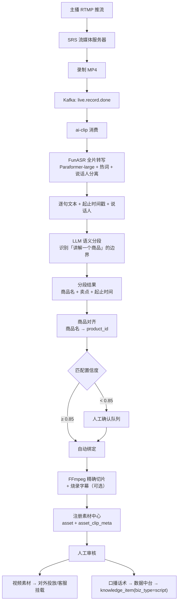
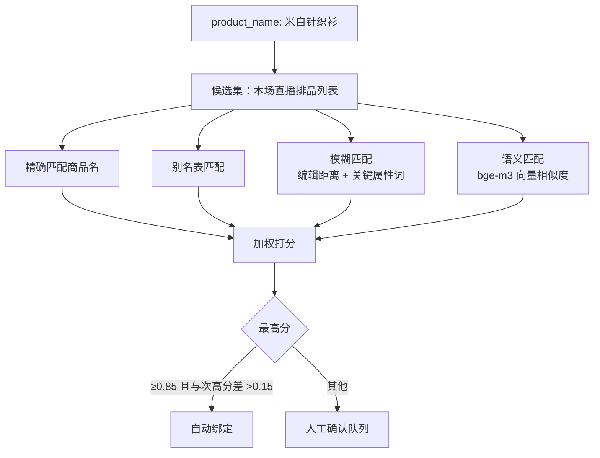
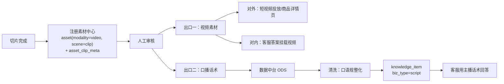

# 08 · 直播切片 Agent

> 把 3 小时直播录像自动切成一段段带商品标签的短视频，同时把主播的口播话术提炼成知识，回灌 RAG。
> **切片的产物有两份价值：视频素材（对外投放）+ 口播话术（对内做知识）。** 后者往往被忽略，但对本项目更重要。

---

## 1. 完整链路



---

## 2. 直播流接入（SRS）

**SRS 配置要点**

```nginx
vhost live.smartmall {
    dvr {
        enabled      on;
        dvr_plan     session;          # 一场直播录一个文件
        dvr_path     /data/live/[app]/[stream]/[timestamp].mp4;
        dvr_duration 0;                # 不切分，完整录制
    }
    http_hooks {
        enabled         on;
        on_publish      http://mall-gateway:8080/api/live/on-publish;
        on_unpublish    http://mall-gateway:8080/api/live/on-unpublish;
        on_dvr          http://mall-gateway:8080/api/live/on-dvr;   # 录制完成回调
    }
}
```

`on_dvr` 回调触发 Kafka `live.record.done` 事件，携带录像文件路径、直播场次 ID、主播 ID、开播时间。

**为什么用完整录制而不是实时切片**：
- 语义分段需要看上下文才能判断商品讲解的边界，流式处理会切错
- 直播中主播经常"讲到一半被弹幕打断，回头再补充"，只有全片才能正确归并
- 实时性对切片场景不是刚需（切片是给回放和二次传播用的）

---

## 3. ASR 转写（FunASR）

### 配置

| 项 | 配置 |
|---|---|
| 模型 | `paraformer-zh`（Paraformer-large） |
| VAD | `fsmn-vad`（长音频必需，否则显存爆） |
| 标点 | `ct-punc` |
| 说话人分离 | `cam++`（区分主播/助播/场控） |
| 时间戳 | 开启（Paraformer 原生支持，切片精度的基础） |
| 热词 | 商品名 + 品牌名 + 类目词（动态注入） |

### 热词注入（决定商品识别准确率）

```python
def build_hotwords(live_id: int) -> list[str]:
    """开播前从直播排品表取当场要讲的商品，作为热词"""
    products = live_client.get_scheduled_products(live_id)
    words = []
    for p in products:
        words.append(p.short_name)      # 商品简称
        words.append(p.brand)
        words.extend(p.alias or [])     # 主播的口语化叫法："那个米白色的"
    return dedupe(words)
```

**这一步的价值极大**。没有热词时，"这件牛油果绿的针织衫"里的"牛油果绿"很可能被识别成"牛油果绿"以外的东西；有热词后识别准确率显著提升，而商品名识别错了，后面的商品对齐就全错了。

**alias 的来源**：从历史切片的人工纠正记录中积累。主播管某个包叫"小方砖"，这个别名第一次要人工纠正，之后自动进热词表。

### 输出结构

```json
[
  {"start_ms": 125300, "end_ms": 128900, "speaker": "spk0",
   "text": "接下来看这件米白色的针织衫"},
  {"start_ms": 128900, "end_ms": 134200, "speaker": "spk0",
   "text": "它是百分之百羊毛的，克重有三百二"},
  ...
]
```

---

## 4. 语义分段（核心难点）

**问题**：一场 3 小时直播有约 3000 句话，要切成 20–40 个"讲一个商品"的片段。

### 为什么不能用简单规则

| 简单方案 | 失败原因 |
|---|---|
| 固定时长切（每 3 分钟一段） | 会把一个商品的讲解拦腰截断 |
| 静音检测切 | 直播几乎没有静音（主播一直在说） |
| 关键词切（"接下来看""下一款"） | 主播不一定说这些词，且会误切（"接下来看这个细节"） |

### 采用的方案：滑窗 + LLM 判定


**LLM 判定 Prompt**

```
以下是直播转写片段，每行格式：[序号] [时间] 文本

任务：找出「主播开始讲解一个新商品」的位置。

判断依据：
- 明确的转场信号（"接下来""下一款""我们来看"）
- 商品指代发生变化（从讲包变成讲鞋）
- 价格/规格话术重新开始（重新报价、重新讲材质）

注意：
- 主播回头补充上一个商品的信息，不算新商品
- 讲解商品的某个细节（"我们看看内衬"），不算新商品
- 与观众互动、答疑、抽奖，归入当前商品段

输出 JSON：
[{"boundary_index": 34, "product_name": "米白针织衫",
  "confidence": 0.92, "reason": "明确转场+商品指代变化"}]
```

**为什么用滑窗+重叠**：单次给 LLM 3000 句会超长且判断质量下降；滑窗保证每次输入可控，重叠区域的投票能消除窗口边界处的误判。

### 卖点抽取

分段完成后，对每段再跑一次 LLM，抽取结构化信息：

```json
{
  "product_name": "米白针织衫",
  "selling_points": ["100% 羊毛", "克重 320g", "抗起球处理", "宽松落肩版型"],
  "price_mentioned": "299",
  "promotion": "前 100 件送同款围巾",
  "script_highlights": [
    "这个克重你摸一下就知道，三百二的克重秋冬穿一件就够",
    "羊毛最怕起球，我们这个做了抗起球处理，洗五次都不起球"
  ],
  "objection_handling": [
    {"objection": "羊毛会不会扎", "response": "这个是细羊毛，不扎皮肤，敏感肌也能穿"}
  ]
}
```

**`objection_handling`（异议处理）字段价值最高**——主播现场应对观众质疑的话术，是最真实、最有效的销售话术。这些直接进知识库后，AI 客服遇到同样的质疑就能用主播验证过的说法回应。

---

## 5. 商品对齐

把 LLM 识别出的 `product_name`（口语化）匹配到 `product_id`。



**限定在"本场直播排品列表"内匹配**是关键优化——候选集从全店几万商品收窄到本场 20–30 个，匹配准确率大幅提升。排品列表来自直播排期系统，若没有则退化为按类目筛选。

**人工确认界面**：展示切片视频 + 转写文本 + Top-3 候选商品（带图），运营点选即可。确认结果同时更新别名表（`product.alias`），下次自动匹配。

---

## 6. 视频切片（FFmpeg）

```bash
# 关键帧对齐 + 精确切片，不重编码（快）
ffmpeg -ss {start} -i input.mp4 -to {duration} -c copy -avoid_negative_ts 1 out.mp4

# 需要烧录字幕时必须重编码
ffmpeg -ss {start} -i input.mp4 -to {duration} \
  -vf "subtitles=clip.srt:force_style='FontName=Source Han Sans,FontSize=18'" \
  -c:v libx264 -preset fast -crf 23 -c:a aac out.mp4
```

**切片边界的两个处理**
1. **前后各留 1 秒缓冲**——避免切掉半句话
2. **对齐到关键帧**——`-c copy` 模式下切点必须在关键帧，否则开头会花屏。用 `ffprobe` 找最近的关键帧位置

**产物**：MP4 视频 + SRT 字幕文件 + 封面帧（取片段第 3 秒）

---

## 7. 双出口：素材 + 知识

这是本文最重要的一节。切片的产物走**两条完全不同的路**：



### 出口二的清洗细节

主播的口语不能直接进知识库，需要**口语规整化**：

| 原始口播 | 规整后 |
|---|---|
| "这个克重你摸一下就知道，三百二的克重秋冬穿一件就够" | "克重 320g，秋冬单穿即可保暖" |
| "家人们这个价格真的绝了，只有今天" | ❌ 丢弃（限时话术，有时效性且无知识价值） |
| "羊毛最怕起球，我们这个做了抗起球处理，洗五次都不起球" | "该商品经过抗起球处理，官方测试洗涤 5 次无明显起球" |

**规整化规则**
- 去除呼语（家人们、宝宝们、姐妹们）
- 去除时效性促销话术（`valid_to` 无法确定的一律丢弃）
- 数字口语转标准写法（三百二 → 320g）
- 主观夸张转客观表述（"绝了" → 删除）
- **保留异议处理话术的口语感**——这类话术的价值恰恰在于口语化的说服力，只做轻度规整

⚠️ **`script` 类知识必须设置 `valid_to`**：主播讲的价格、活动都会变。规整化时若识别出价格/活动信息，要么丢弃，要么设置较短的有效期（如 7 天）。这是防止客服播报过期活动的关键防线。

### `knowledge_item` 示例

```json
{
  "biz_type": "script",
  "modality": "video",
  "title": "羊毛针织衫会不会扎皮肤？",
  "content": "这个是细羊毛，不扎皮肤，敏感肌也能穿。主播现场试穿演示了贴身穿着效果。",
  "asset_ids": [8821],
  "product_ids": [2048],
  "tags": ["材质", "舒适度", "异议处理"],
  "source": "live",
  "source_ref": "clip:8821",
  "valid_to": null
}
```

客服回答"这个羊毛扎不扎"时，命中这条知识，答案里挂上 `asset_ids=[8821]` 对应的切片视频——**用户直接看到主播现场演示**。这个体验是纯文本客服做不到的。

---

## 8. 与 FunClip 的关系

FunClip 是阿里达摩院开源的自动剪辑工具（v2.1.0，2026-07 首个版本化发布），基于 FunASR，支持文本关键词切片、说话人切片、LLM 智能切片，带 Gradio 交互界面。

**本项目的定位：借鉴其能力，不直接部署为服务。**

| 方面 | 说明 |
|---|---|
| **借鉴** | LLM 切片的提示词设计、时间戳与字幕对齐逻辑、热词机制 |
| **不用** | 它是单机 Gradio 工具，无法接入 Kafka 任务流、无法与商品库关联、无法写素材中心 |
| **额外用途** | 其 Gradio 界面**直接部署为人工兜底工具**——自动切片效果差的场次，运营用 FunClip 手工调整时间轴，导出后再走注册流程 |

这是"用开源项目"的一种务实方式：核心链路自研（因为业务耦合深），把开源工具放在人工兜底位置。

---

## 9. 性能与资源

单场 3 小时直播的处理耗时（单卡 24G）：

| 环节 | 耗时 | 资源 |
|---|---|---|
| ASR 全片转写 | ~12 分钟 | GPU ~2G（可与其他常驻模型共存） |
| LLM 语义分段（30 个滑窗） | ~4 分钟 | API 调用，无 GPU |
| 卖点抽取（30 段） | ~3 分钟 | API 调用 |
| 商品对齐 | < 1 分钟 | CPU |
| FFmpeg 切片（30 段，`-c copy`） | ~3 分钟 | CPU |
| **合计** | **~23 分钟** | |

**API 成本**：单场约 ¥3–5（分段与抽取的 token 消耗）。

处理是**异步**的，直播结束后自动开始，运营次日上班时切片已就绪待审核。

---

## 10. 验收标准（M5 阶段）

- [ ] SRS 可接收 RTMP 推流并完整录制，`on_dvr` 回调正确触发
- [ ] FunASR 转写带准确时间戳，热词注入生效（商品名识别准确率 ≥ 0.9）
- [ ] 说话人分离可区分主播与助播
- [ ] 语义分段可正确识别商品切换边界，人工评估准确率 ≥ 0.8
- [ ] 卖点与异议处理话术可正确抽取
- [ ] 商品对齐自动匹配率 ≥ 0.7，低置信度进人工队列
- [ ] 人工确认后别名自动进入热词表
- [ ] FFmpeg 切片无花屏，边界不截断句子
- [ ] 切片注册到素材中心，`asset_clip_meta` 完整
- [ ] 口播话术经规整化后进入 `knowledge_item(biz_type=script)`
- [ ] 促销类话术正确设置 `valid_to` 或被丢弃
- [ ] 客服回答中能挂载切片视频并可播放

---

**上一篇** ← [07 · AI 素材中心](07-asset-center.md) ｜ **下一篇** → [09 · AI 销售考核](09-sales-kpi.md)
