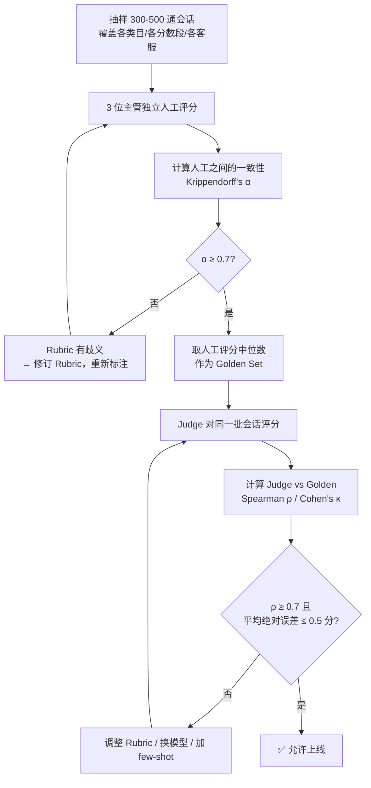
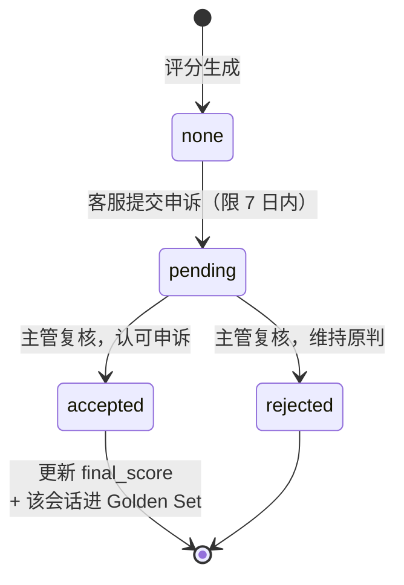
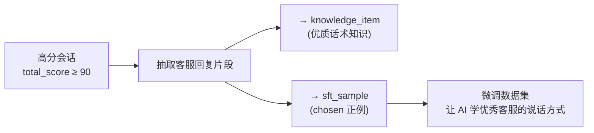
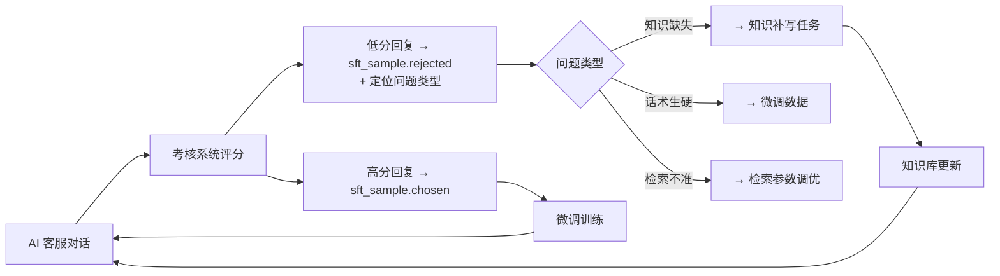

# 09 · AI 销售考核系统

> 用数据中台的真实对话数据，量化客服（人工 + AI）的服务与销售质量。
> **这个系统的成败不在于能不能打分，而在于打的分人认不认。** 因此校准环节的权重高于实现环节。

---

## 1. 定位与原则

**做什么**：对每一通会话自动评分，产出客服个人、团队、时间维度的考核报表，识别优秀话术与问题会话。

**三条设计原则**

| 原则 | 含义 | 违反的后果 |
|---|---|---|
| **可解释** | 每一项扣分都要给出原话证据 | 客服不服，考核形同虚设 |
| **可申诉** | 客服可对评分提出异议，人工复核 | 沦为"AI 说了算"的暴政，团队抵触 |
| **先校准后上线** | Judge 与人工评分一致性达标才允许生效 | 评分不准，误伤优秀员工 |

**一句话**：这是一个**辅助管理工具**，不是自动裁决系统。它的价值在于把主管从"随机抽检 2% 的会话"提升到"全量覆盖 + 精准定位问题会话"。

---

## 2. 指标体系

分三类：**确定性指标**（规则计算）、**判断性指标**（LLM Judge）、**结果性指标**（业务数据）。

### 2.1 确定性指标（规则计算，无需模型）

| 指标 | 计算方式 | 权重 |
|---|---|---|
| 首次响应时长 | 用户首条消息 → 客服首条回复的秒数 | 8% |
| 平均响应时长 | 所有轮次响应时长的均值 | 7% |
| 超时未回次数 | 响应 > 180s 的轮次数 | 5% |
| 会话时长 | 会话总时长 | — （不计分，仅参考） |
| 主动跟进率 | 用户沉默 > 5 分钟后客服主动跟进的比例 | 5% |
| 违禁词命中 | 绝对化用语、承诺性表述、医疗功效词 | **一票否决项** |

**权重小计 25%**

### 2.2 判断性指标（LLM-as-a-Judge）

| 指标 | 评估内容 | 权重 |
|---|---|---|
| 问题解决度 | 用户的问题是否被真正解答（而非敷衍） | 15% |
| 需求挖掘 | 是否主动了解用户场景、身高体重、使用需求 | 10% |
| 推荐合理性 | 推荐的商品/搭配是否契合用户表达的需求 | 10% |
| 情绪安抚 | 用户表达不满时的处理是否恰当 | 8% |
| 专业度 | 商品知识表述是否准确、有底气 | 7% |
| 话术亲和力 | 是否自然、有温度（非模板化） | 5% |

**权重小计 55%**

### 2.3 结果性指标（业务数据）

| 指标 | 数据来源 | 权重 |
|---|---|---|
| 咨询-下单转化率 | `dwd_dialogue_session.order_created` | 12% |
| 客单价贡献 | 关联订单金额 | 5% |
| 转人工率（仅 AI 客服） | `transferred_human` | 3% |

**权重小计 20%**

> 权重可在运营后台配置，不同岗位（售前/售后）用不同权重模板。上表是售前客服的默认模板。

### 2.4 一票否决项

以下情况直接判定为不合格会话，不参与加权计算：

- 违禁词命中（绝对化用语、虚假承诺、医疗功效）
- 辱骂或明显不当言辞
- 泄露其他用户信息
- 承诺超出权限的补偿

---

## 3. LLM-as-a-Judge 设计

### 3.1 Rubric（评分细则）

每个判断性指标都有明确的分档描述。以「问题解决度」为例：

```
【问题解决度】5 分制

5 分 — 完全解决
  用户提出的每个问题都得到了直接、准确、具体的回答；
  用户在得到回答后没有重复追问同一问题。

4 分 — 基本解决
  主要问题得到解答，个别次要问题未覆盖；
  或回答正确但不够具体（如"一般三到五天到"而非查询实际物流）。

3 分 — 部分解决
  回答了问题但明显回避了关键点；
  或用户追问了 2 次以上才得到答案。

2 分 — 未解决但有尝试
  回答答非所问，或反复让用户"稍等""帮您查一下"后无下文。

1 分 — 未解决且态度消极
  直接说"不知道""看详情页"而不做任何解答。

【输出要求】
必须引用会话中的原话作为证据，格式：
{"score": 4, "evidence": ["用户：这个能水洗吗", "客服：可以的哦"],
 "reason": "回答正确但未说明水温和注意事项，不够具体"}
```

**Rubric 的写法直接决定评分稳定性**。关键是：
- 每档必须有**可观察的行为描述**，不能写"回答得好/一般/差"
- 必须强制输出**原话证据**——这既是可解释性的要求，也能显著降低 Judge 的随意打分

### 3.2 Judge 调用设计

```python
def judge_session(session: Session) -> JudgeResult:
    # 1. 会话预处理：太长的会话做摘要压缩，保留关键轮次
    transcript = format_transcript(session, max_turns=40)

    # 2. 一次调用评所有判断性指标（而不是每个指标调一次）
    prompt = build_judge_prompt(
        transcript=transcript,
        rubrics=RUBRICS,              # 6 个指标的完整 rubric
        product_context=get_products(session),
    )
    result = llm.call(model="qwen-max", prompt=prompt,
                      temperature=0,   # 必须为 0，保证可复现
                      response_format="json")
    return parse(result)
```

**三个关键决策**

| 决策 | 理由 |
|---|---|
| `temperature=0` | 同一会话重复评分必须得到相同结果，否则申诉时无法复现 |
| 一次调用评 6 个指标 | 成本降低 6 倍；且模型在同一上下文中评分更一致 |
| 用 `qwen-max` 而非 `qwen-plus` | 判断任务对模型能力敏感，这里省钱会直接损害准确性 |

### 3.3 位置偏差与长度偏差的处理

LLM Judge 存在已知偏差：

| 偏差 | 表现 | 缓解措施 |
|---|---|---|
| 长度偏差 | 倾向给长回复更高分 | Rubric 中明确"简洁准确优于冗长"；校准时专门检查长短会话的分数分布 |
| 位置偏差 | 对话开头的内容权重更高 | 长会话做分段评分后加权，而非只看开头 |
| 自我偏好 | 倾向给 AI 生成的回复更高分 | **考核 AI 客服时必须特别注意**——用不同厂商的模型做交叉验证 |

**自我偏好是本项目的特殊风险**：用 qwen 做 Judge 去评 qwen 生成的客服回复，会系统性偏高。缓解方案是——AI 客服的会话用 `deepseek-reasoner` 做 Judge，人工客服的会话用 `qwen-max`，并在校准阶段验证两个 Judge 的分数可比性。

---

## 4. 校准：这个系统能不能用的分水岭

**没有校准的 Judge 就是随机数生成器。** 校准流程是本系统的必要前置步骤。



### 校准阈值

| 检查 | 阈值 | 不达标的处理 |
|---|---|---|
| 人工标注者之间一致性（Krippendorff's α） | ≥ 0.7 | **先修 Rubric**——人都评不一致，说明标准本身有歧义，不是模型的问题 |
| Judge vs Golden Set（Spearman ρ） | ≥ 0.7 | 调整 Rubric、增加 few-shot 示例、换更强的模型 |
| 平均绝对误差（5 分制） | ≤ 0.5 分 | 同上 |
| 极端错判率（差 ≥ 2 分） | ≤ 5% | 分析错判样本，针对性补充 Rubric 说明 |

**先测人工一致性再测模型一致性**，顺序不能颠倒。这是很多质检系统跳过的一步，结果是把 Rubric 的歧义算在模型头上，怎么调都调不好。

### 持续校准

上线不是终点：
- 每月抽检 50 通会话人工复评，监控 ρ 是否漂移
- 所有申诉成功的会话自动进入 Golden Set，作为 Rubric 迭代的输入
- Rubric 或模型变更时必须重新跑完整校准

### 数据表

```sql
CREATE TABLE kpi_golden_set (
    id            BIGINT      PRIMARY KEY AUTO_INCREMENT,
    session_id    BIGINT      NOT NULL,
    metric_code   VARCHAR(32) NOT NULL,
    human_scores  JSON        NOT NULL COMMENT '[{reviewer_id, score}] 多人独立评分',
    golden_score  DECIMAL(3,1) NOT NULL COMMENT '中位数',
    judge_score   DECIMAL(3,1),
    judge_model   VARCHAR(64),
    abs_error     DECIMAL(3,1) GENERATED ALWAYS AS (ABS(golden_score - judge_score)) STORED,
    batch_no      VARCHAR(32) NOT NULL COMMENT '校准批次',
    created_at    DATETIME    NOT NULL DEFAULT CURRENT_TIMESTAMP,
    INDEX idx_batch (batch_no, metric_code)
) COMMENT='考核校准黄金集';
```

---

## 5. 评分存储与计算

```sql
CREATE TABLE kpi_score (
    id             BIGINT      PRIMARY KEY AUTO_INCREMENT,
    session_id     BIGINT      NOT NULL,
    agent_id       BIGINT      NOT NULL COMMENT '客服 ID；AI 客服用负数 ID 区分',
    agent_type     VARCHAR(16) NOT NULL COMMENT 'human|ai',
    score_date     DATE        NOT NULL,

    total_score    DECIMAL(5,2) NOT NULL,
    metric_scores  JSON        NOT NULL COMMENT '{"resolve":4,"mining":3,...}',
    evidences      JSON        NOT NULL COMMENT '{"resolve":[{原话证据}],...}',
    veto_flags     JSON        COMMENT '一票否决项命中列表',

    judge_model    VARCHAR(64) NOT NULL,
    rubric_version VARCHAR(32) NOT NULL COMMENT 'Rubric 版本，变更后分数不可跨版本比较',
    calib_batch    VARCHAR(32) COMMENT '当时生效的校准批次',

    appeal_status  VARCHAR(16) NOT NULL DEFAULT 'none'
                               COMMENT 'none|pending|accepted|rejected',
    final_score    DECIMAL(5,2) COMMENT '申诉后的最终分，NULL 表示以 total_score 为准',

    created_at     DATETIME    NOT NULL DEFAULT CURRENT_TIMESTAMP,
    UNIQUE KEY uk_session_rubric (session_id, rubric_version),
    INDEX idx_agent_date (agent_id, score_date)
) COMMENT='会话评分';
```

**`rubric_version` 是必须的**：Rubric 改了之后，新旧分数不可直接比较。报表在跨 Rubric 版本的时间段做趋势对比时必须给出警示，否则会得出"这个月大家都退步了"的错误结论（实际是标准变严了）。

### 计算调度

```
dag_kpi_daily（每日凌晨执行）
  ├── 拉取昨日 dwd_dialogue_session（已完结会话）
  ├── 计算确定性指标（SQL 聚合）
  ├── 批量调用 Judge（并发 10，走 ai-gateway 记账）
  ├── 关联结果性指标（订单数据）
  ├── 加权计算总分 → kpi_score
  └── 汇总写 ClickHouse → 报表查询
```

**成本估算**：日均 1000 通会话，`qwen-max` 单次约 3000 token，日成本约 ¥25–40。这是本项目 API 成本的主要构成之一，可通过"只评分抽样 + 全量评低分会话"降低。

---

## 6. 申诉流程



**申诉界面必须展示**：
- 原始会话全文
- 每个指标的得分 + **Judge 引用的原话证据**
- 对应 Rubric 的分档描述
- 客服填写申诉理由

**申诉成功的会话自动进入 Golden Set** —— 这是 Rubric 持续改进的核心机制。如果某个指标申诉成功率超过 20%，说明该指标的 Rubric 有问题，触发修订流程。

---

## 7. 报表与应用

### 7.1 报表维度

| 报表 | 用途 |
|---|---|
| 客服个人日报/周报 | 个人得分趋势、各指标雷达图、待改进项 |
| 团队排行榜 | 横向对比（**慎用**，见下文） |
| 问题会话清单 | 低分会话 Top-N，主管重点复盘 |
| 优秀话术库 | 高分会话中的原话片段，可一键加入知识库 |
| AI vs 人工对比 | AI 客服与人工客服的分数分布对比 |
| 指标健康度 | Judge 分数分布、申诉率、校准漂移监控 |

### 7.2 优秀话术回流（飞轮的一环）



**这是考核系统对整个体系最大的贡献**——它自动识别出"哪些回复是好的"，这个信号直接就是微调的监督信号。没有考核系统，`sft_sample` 的正例只能靠人工挑选。

对应地，**低分会话的 AI 回复进入 DPO 的 `rejected`**。详见 [10 · 模型微调](10-finetune.md)。

### 7.3 关于排行榜的警告

⚠️ 团队排行榜容易导致：
- 客服为刷分而拉长对话（"需求挖掘"指标可被凑话术刷高）
- 挑简单的会话接，回避难缠客户
- 对 Judge 的对抗性优化（学会说 Judge 爱听的话）

**缓解措施**
- 排行榜只在团队内部使用，不与薪酬直接强绑定
- 监控异常模式（会话时长突然普遍拉长、某些话术模板突然高频出现）
- 定期轮换 Rubric 的表述方式（防止针对性优化）
- 结果性指标（转化率）占 20% 权重，形成对刷分的天然制衡

**建议的使用方式**：把这个系统当作"发现问题会话的雷达"和"沉淀优秀话术的矿机"，而不是"排名和奖惩的依据"。前者创造价值，后者制造对抗。

---

## 8. AI 客服的自我考核

AI 客服同样被这套系统评分（`agent_type='ai'`），这产生了一个闭环：



**低分归因是关键**：AI 客服得分低有三种完全不同的原因，处置方式也完全不同。Judge 输出时要额外标注归因：

```json
{
  "score": 2,
  "root_cause": "knowledge_gap",   // knowledge_gap | style_issue | retrieval_error | tool_error
  "evidence": ["用户：这件能机洗吗", "客服：这个我帮您确认一下"],
  "suggestion": "知识库缺少该商品的洗涤说明"
}
```

`root_cause` 直接驱动不同的改进动作，这让考核系统从"评价工具"变成"改进任务的生成器"。

---

## 9. 验收标准（M6 阶段）

- [ ] 三类指标（确定性/判断性/结果性）全部可计算
- [ ] Rubric 文档完整，每个指标每档有可观察的行为描述
- [ ] Judge 强制输出原话证据，无证据的评分被拒绝
- [ ] **校准完成**：人工一致性 α ≥ 0.7，Judge vs Golden ρ ≥ 0.7，MAE ≤ 0.5
- [ ] 交叉验证生效（AI 会话用不同厂商模型评分）
- [ ] 一票否决项识别准确，无漏检
- [ ] 申诉流程可用，申诉成功的会话自动进 Golden Set
- [ ] 六类报表可查，`rubric_version` 跨版本对比有警示
- [ ] 高分话术可一键回流知识库与 `sft_sample`
- [ ] AI 客服低分会话有 `root_cause` 归因，能生成对应改进任务

---

**上一篇** ← [08 · 直播切片 Agent](08-agent-live-clip.md) ｜ **下一篇** → [10 · 模型微调](10-finetune.md)
