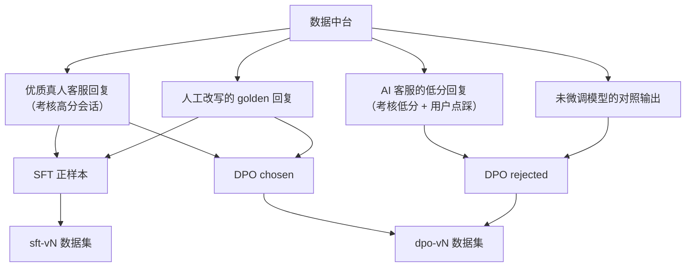
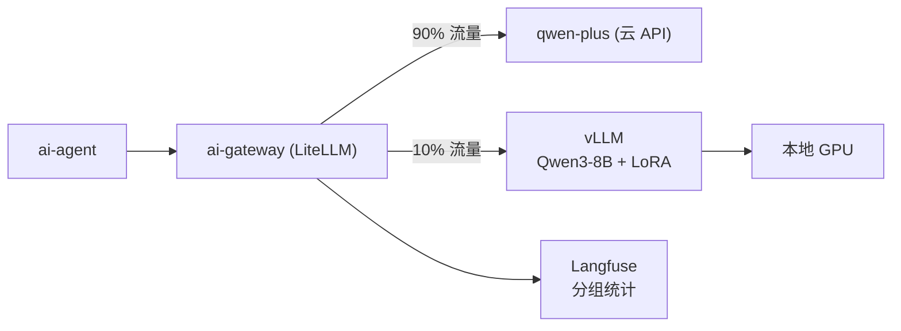
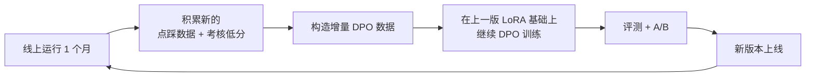

# 10 · 模型微调：去除 AI 味

> **微调的目标是让 AI 客服说话像真人，不是让它知道更多。**
> 知识永远归 RAG，风格才归微调。这个分工搞错了，整个微调环节就是白做。

---

## 1. 问题定义：什么是「AI 味」

先把要解决的问题说清楚，否则无法评估是否解决了。

### 典型的 AI 味特征

| 特征 | AI 的说法 | 真人客服的说法 |
|---|---|---|
| 模板化开场 | "您好，很高兴为您服务！请问有什么可以帮您？" | "在的亲～" |
| 过度礼貌 | "非常感谢您的咨询，我们会尽快为您处理" | "好的我帮你看下" |
| 书面语 | "该商品采用 100% 羊毛材质，具有良好的保暖性能" | "这个是纯羊毛的，很暖和" |
| 强行分点 | "关于您的问题，我为您分三点说明：1）… 2）… 3）…" | 直接说，一次说一点 |
| 句子过长 | 一句话 60 字，从头交代到尾 | 拆成 3 条短消息发 |
| 情绪平板 | 任何情况下都一样的语气 | 用户抱怨时会说"哎呀真是不好意思" |
| 万能结尾 | "还有什么可以帮您的吗？" | 不说，或"还有别的问题随时问我哈" |
| 不会用表情 | 纯文字 | "好的～" "嗯嗯" 适度用波浪号和语气词 |

### 可量化的代理指标

| 指标 | AI 典型值 | 真人典型值 | 目标 |
|---|---|---|---|
| 单条消息平均字数 | 55–80 | 15–30 | 降到 25±8 |
| 单轮回复的消息条数 | 1 | 1.6 | 提升到 1.5+ |
| 语气词/表情使用率 | < 5% | 35% | 提升到 25%+ |
| 分点罗列出现率 | 22% | 3% | 降到 5% 以下 |
| 模板化开场/结尾率 | 78% | 8% | 降到 10% 以下 |
| 句式多样性（unique 3-gram 比） | 0.42 | 0.71 | 提升到 0.65+ |

**这些指标可以从 `dwd_dialogue_turn` 直接统计**，是评估微调效果最客观的手段——不用等人工盲评，训练完跑一遍统计就知道有没有效果。

---

## 2. 为什么必须是微调，Prompt 解决不了

在动手微调前，先确认 Prompt 工程真的到顶了。

| 方案 | 效果 | 问题 |
|---|---|---|
| Prompt 约束风格 | 前 3 轮有效 | **长对话中风格会漂回默认**，模型的 RLHF 倾向压不住 |
| Few-shot 示例 | 有一定效果 | 占用大量上下文（20 个示例约 2000 token），成本上升且挤占知识空间 |
| 输出后处理改写 | 可控 | 多一次模型调用，延迟翻倍；改写会损失原意 |
| **LoRA 微调** | **稳定持久** | 需要训练数据与 GPU，但风格固化在权重里，不占上下文 |

**结论**：Prompt 作为 M2 阶段的过渡方案（够用），M7 阶段用微调彻底解决。微调后 System Prompt 中的风格约束段落可以删掉，**省下的上下文空间给知识**——这是微调的一个额外收益。

---

## 3. 数据构造

### 3.1 数据来源与配比



| 数据集 | 规模目标 | 来源配比 |
|---|---|---|
| SFT | 8000–15000 条 | 真人优质回复 70% + 人工改写 30% |
| DPO | 3000–5000 对 | chosen 全部来自真人/人工改写；rejected 中 AI 低分回复 60% + 对照输出 40% |

**规模不需要很大**。学风格不是学知识，几千条高质量样本足够。**数据质量的边际收益远高于数量** —— 1 万条精选样本优于 10 万条混杂样本。

### 3.2 SFT 样本构造

```json
{
  "sample_type": "sft",
  "messages": [
    {"role": "system", "content": "你是某服装店的客服。"},
    {"role": "user", "content": "这件针织衫会起球吗"},
    {"role": "assistant", "content": "不会哦～我们做了抗起球处理的\n洗的时候翻过来洗就更好啦"}
  ],
  "style_tags": ["口语化", "短句", "带语气词", "多条消息"],
  "scene_tag": "售前咨询",
  "quality_score": 0.92,
  "is_golden": 1,
  "source": "trace",
  "source_ref": "session:88213"
}
```

**关键处理**

| 处理 | 说明 |
|---|---|
| 多条消息合并 | 真人客服连发 3 条消息，合并为一个 assistant turn，用 `\n` 分隔。这样模型能学会"分多条说" |
| 知识剥离 | System prompt 中**不放具体商品知识**——训练时不要让模型记住"这件是羊毛的"，否则会产生知识幻觉。训练目标只有风格 |
| 上下文长度 | 保留最近 4 轮，太长会稀释风格信号 |
| PII 已脱敏 | 复用数据中台关卡 ① 的脱敏结果 |

⚠️ **知识剥离是最容易做错的地方**。如果 SFT 数据里包含大量"这件是 100% 羊毛"这类具体商品信息，模型会把这些当成通用知识记住，导致回答其他商品时也说"100% 羊毛"。做法是：把具体商品参数替换为占位符，或在 system prompt 中显式给出当次的知识片段（模拟 RAG 注入的形态）。

### 3.3 DPO 样本构造

DPO 是去 AI 味的**主力手段**，因为它直接告诉模型"这样说不好，那样说更好"。

```json
{
  "sample_type": "dpo",
  "messages": [
    {"role": "user", "content": "这件针织衫会起球吗"}
  ],
  "chosen":   "不会哦～我们做了抗起球处理的\n洗的时候翻过来洗就更好啦",
  "rejected": "您好！关于您咨询的起球问题，我为您说明如下：本商品采用了专业的抗起球工艺处理，在正常穿着和洗涤条件下不易起球。建议您洗涤时选择反面洗涤，水温不超过30度。还有什么可以帮您的吗？",
  "style_tags": ["口语化", "短句"],
  "scene_tag": "售前咨询"
}
```

**`rejected` 的两种构造方式**

| 方式 | 做法 | 占比 |
|---|---|---|
| **对照生成**（主力） | 拿真实用户问题，让未微调的基座模型回答一遍。同一个问题，真人的回答是 `chosen`，模型的回答是 `rejected` | 40% |
| **线上负反馈** | 用户点踩且原因是"态度生硬"/"太啰嗦"的 AI 回复，或考核系统「话术亲和力」低分的回复 | 60% |

**对照生成是巧妙的地方**：它天然构造出了"同一个问题的真人版 vs AI 版"，两者的差异恰好就是 AI 味本身。这批数据几乎是白得的——只需要跑一遍推理。

### 3.4 数据清洗与去偏

微调数据要额外过一轮检查：

| 检查 | 处理 |
|---|---|
| chosen 与 rejected 差异过小 | 丢弃（学不到东西） |
| chosen 本身质量差（真人客服也回得不好） | 按考核分数过滤，只取高分 |
| 场景分布失衡 | 按 `scene_tag` 分层采样，保证售前/售后/催单等场景均衡 |
| 单一客服风格过度集中 | 限制单个 `agent_id` 的样本占比 ≤ 15%，避免学成某一个人 |
| 含具体商品知识 | 参数化或丢弃 |

**「单一客服风格过度集中」的检查很重要**：如果 60% 的正样本来自同一位金牌客服，微调出来的模型就是这个人的复制品，包括他的口头禅。要的是"真人客服的共性语感"，不是"某个人的模仿秀"。

---

## 4. 训练方案

### 4.1 基座模型选择

| 候选 | 参数量 | 显存（QLoRA） | 结论 |
|---|---|---|---|
| **Qwen3-8B** | 8B | ~20 GB | ✅ **选中**——中文强、24G 卡可训、推理部署成本可控 |
| Qwen3-4B | 4B | ~12 GB | 备选——显存更宽裕，效果略降，若 24G 卡训练吃力可降级 |
| Qwen3-14B | 14B | ~30 GB | ❌ 24G 卡训不动 |

**为什么不用更大的模型**：风格学习不需要大模型。8B 足以学会说话方式，而知识依然由 RAG 提供。用 14B/32B 是把成本花在了不需要的地方。

### 4.2 训练配置（LLaMA-Factory）

**阶段一：SFT**

```yaml
# train_sft.yaml
model_name_or_path: Qwen/Qwen3-8B
stage: sft
finetuning_type: lora
lora_target: all
lora_rank: 16
lora_alpha: 32
lora_dropout: 0.05

dataset: smartmall_sft_v1
template: qwen
cutoff_len: 2048
max_samples: 15000

per_device_train_batch_size: 2
gradient_accumulation_steps: 8      # 等效 batch 16
learning_rate: 1.0e-4
num_train_epochs: 3
lr_scheduler_type: cosine
warmup_ratio: 0.05
bf16: true
quantization_bit: 4                  # QLoRA，24G 卡必需
gradient_checkpointing: true

val_size: 0.05
eval_strategy: steps
eval_steps: 100
save_steps: 200
```

**阶段二：DPO**（在 SFT 的 LoRA 基础上继续训练）

```yaml
# train_dpo.yaml
model_name_or_path: Qwen/Qwen3-8B
adapter_name_or_path: saves/qwen3-8b-sft-v1    # 接续 SFT 产物
stage: dpo
finetuning_type: lora
pref_beta: 0.1                       # DPO 温度，越小越激进
pref_loss: sigmoid

dataset: smartmall_dpo_v1
learning_rate: 5.0e-6                # 必须远小于 SFT
num_train_epochs: 1                  # DPO 极易过拟合，1 epoch 通常足够
per_device_train_batch_size: 1
gradient_accumulation_steps: 16
quantization_bit: 4
```

**超参要点**

| 参数 | 值 | 理由 |
|---|---|---|
| `lora_rank: 16` | 偏小 | 学风格不需要大容量。rank 太大反而会记住训练数据里的具体知识 |
| DPO `learning_rate: 5e-6` | 极小 | DPO 学习率大会导致模型崩坏（输出退化成重复或空白） |
| DPO `epochs: 1` | 只跑一轮 | DPO 过拟合的表现是"过度追求短回复"，最后什么都不说 |
| `pref_beta: 0.1` | 标准值 | 若发现模型偏离基座太多（开始胡言乱语），调大到 0.3 |

### 4.3 训练资源与耗时

| 阶段 | 数据量 | 耗时（RTX 4090 24G） |
|---|---|---|
| SFT | 12000 条 × 3 epoch | ~4 小时 |
| DPO | 4000 对 × 1 epoch | ~1.5 小时 |
| **合计** | | **~6 小时** |

⚠️ **训练时必须卸载所有常驻 GPU 模型**（FunASR / CosyVoice2 / bge-m3），QLoRA 需要约 20G。安排在夜间执行，见 [14 · 基础设施](14-infra.md)。

**若使用 ms-swift**：本项目选 LLaMA-Factory 是因为文本微调场景够用且文档最全。若后续要微调 VLM（让模型直接理解商品图），应切换到 ms-swift——它在大规模多模态数据处理上明显更强。

---

## 5. 评测

**微调最大的风险是「风格变好了，但能力变差了」。** 评测必须同时覆盖两面。

### 5.1 评测集

| 评测集 | 规模 | 检验什么 |
|---|---|---|
| `eval-style` | 200 条 | 风格是否像真人（主指标） |
| `eval-rag-faithfulness` | 200 条 | **RAG 忠实度是否下降**（防退化） |
| `eval-instruction` | 100 条 | 指令跟随能力是否保持（如"用一句话回答"） |
| `eval-safety` | 100 条 | 合规能力是否保持（不说绝对化用语） |
| `eval-hallucination` | 100 条 | 知识库无答案时是否仍能正确拒答 |

**后四个是防退化评测集，一个都不能少。** 微调是有代价的操作，容易顾此失彼。

### 5.2 评测方法

**风格评测（三重验证）**

| 方法 | 说明 | 权重 |
|---|---|---|
| **自动指标** | 第 1 节的 6 个可量化指标（字数、消息条数、语气词率等）直接统计 | 快速迭代用 |
| **人工盲评** | 真人客服回复 vs 微调前 vs 微调后，三份打乱，让 5 位评估者选"哪个最像真人客服" | **最终裁决** |
| **LLM 盲评** | 用 Judge 模型做同样的三选一（成本低，可大批量） | 与人工盲评做一致性验证 |

**盲评的关键设计**：必须把**真人客服的真实回复**作为第三个选项混进去。指标不是"微调后比微调前好"，而是**"微调后的回复被误认为真人的比例"**。目标：≥ 40%（即接近真人的一半以上认可度）。

### 5.3 上线门禁

| 检查 | 阈值 | 性质 |
|---|---|---|
| 人工盲评「像真人」率 | ≥ 40% | 主指标 |
| 平均消息字数 | 25 ± 8 | 主指标 |
| 模板化开场率 | ≤ 10% | 主指标 |
| RAG 忠实度（Ragas Faithfulness） | **不低于微调前 0.02** | 🔴 防退化红线 |
| 拒答准确率 | **不低于微调前 0.03** | 🔴 防退化红线 |
| 指令跟随准确率 | ≥ 0.85 | 防退化 |
| 违禁词漏出率 | 0 | 🔴 一票否决 |

**红线项不达标一律不上线**，无论风格指标多好看。一个说话很像真人但会编造商品参数的客服，比一个有 AI 味但严谨的客服危害大得多。

---

## 6. 部署与 A/B

### 6.1 部署



vLLM 支持 LoRA 热加载，多个 LoRA 版本可共用一个基座：

```bash
vllm serve Qwen/Qwen3-8B \
  --enable-lora \
  --lora-modules style-v1=/models/lora/sft-dpo-v1 \
                 style-v2=/models/lora/sft-dpo-v2 \
  --max-lora-rank 16 \
  --quantization awq \
  --gpu-memory-utilization 0.45
```

**流量切分在 `ai-gateway` 层完成**，`ai-agent` 的业务代码零改动——只是换了个 model 名字。这是选 LiteLLM 的核心收益。

### 6.2 A/B 实验设计

| 项 | 设置 |
|---|---|
| 分流单位 | **按用户**（不是按会话）——同一用户在一次会话中不能切换模型，否则风格前后不一致 |
| 初始比例 | 微调模型 10% |
| 观察周期 | 至少 7 天（覆盖工作日与周末的用户构成差异） |
| 样本量 | 每组至少 2000 通会话 |

### 6.3 A/B 指标

| 指标 | 数据来源 | 期望 |
|---|---|---|
| 用户点赞率 | Trace `feedback.thumb` | ⬆️ 提升 |
| 转人工率 | Trace `feedback.handover` | ⬇️ 下降或持平 |
| 考核「话术亲和力」得分 | `kpi_score` | ⬆️ 显著提升 |
| 考核「问题解决度」得分 | `kpi_score` | ➡️ **不下降**（红线） |
| 咨询-下单转化率 | 订单关联 | ⬆️ 或持平 |
| 单次对话成本 | Trace `model.cost_cny` | ⬇️ 本地模型成本更低 |
| P95 延迟 | Trace | 需关注——本地 8B 可能慢于云 API |

**「问题解决度不下降」是放量的前置条件**。转化率是最终指标但噪声大，需要足够样本量才有统计显著性。

### 6.4 放量策略

```
10% → 观察 7 天 → 各项达标 → 30% → 观察 7 天 → 50% → 观察 14 天 → 100%
                  ↓ 任一红线不达标
                  回滚到 0%，分析原因
```

**回滚成本几乎为零**——改 `ai-gateway` 的路由配置即可，秒级生效。这是为什么把模型切换放在网关层的价值所在。

---

## 7. 迭代节奏

微调不是一次性的：



**月度迭代**，每次只做增量 DPO（不重跑 SFT），耗时约 1.5 小时。数据源全部来自数据中台的自动积累，人工成本极低。

**版本管理**

```sql
CREATE TABLE model_version (
    id             BIGINT      PRIMARY KEY AUTO_INCREMENT,
    model_name     VARCHAR(64) NOT NULL COMMENT 'smartmall-cs-style',
    version        VARCHAR(32) NOT NULL COMMENT 'v1 / v2',
    base_model     VARCHAR(64) NOT NULL COMMENT 'Qwen/Qwen3-8B',
    train_stage    VARCHAR(16) NOT NULL COMMENT 'sft|dpo',
    parent_version VARCHAR(32) COMMENT '接续训练的上一版本',
    sft_dataset    VARCHAR(32) COMMENT '训练用的数据资产版本 sft-v2',
    dpo_dataset    VARCHAR(32),
    hyperparams    JSON,
    eval_result    JSON        COMMENT '各评测集得分',
    lora_path      VARCHAR(256),
    status         VARCHAR(16) NOT NULL DEFAULT 'training'
                               COMMENT 'training|evaluating|staged|online|rollback',
    traffic_ratio  DECIMAL(4,3) DEFAULT 0,
    created_at     DATETIME    NOT NULL DEFAULT CURRENT_TIMESTAMP,
    UNIQUE KEY uk_name_version (model_name, version)
) COMMENT='模型版本';
```

**`sft_dataset` / `dpo_dataset` 绑定数据资产版本号**——这样"v2 比 v1 好"这句话可以被归因：是数据变了还是超参变了。没有这个绑定，模型迭代就是玄学。

---

## 8. 常见失败模式

记录下来，避免踩坑：

| 失败模式 | 表现 | 原因 | 对策 |
|---|---|---|---|
| 知识幻觉激增 | 模型开始编造商品参数 | SFT 数据含具体商品知识，被当成通用知识记住 | 训练数据参数化，`lora_rank` 调小 |
| 回复退化 | 输出越来越短，最后只回"好的" | DPO 过拟合（`rejected` 全是长回复，模型学会了"越短越好"） | DPO 只跑 1 epoch，`pref_beta` 调大，`rejected` 中混入过短的负例 |
| 学成某一个人 | 出现特定客服的口头禅 | 单一 `agent_id` 样本占比过高 | 限制单人样本 ≤ 15% |
| 指令跟随退化 | 让它"用一句话回答"它不听 | 风格训练覆盖了指令跟随能力 | SFT 数据中混入 10% 的通用指令数据 |
| 合规能力退化 | 开始说"最好的" | 真人客服的数据里本身就有违规话术 | 训练数据先过一遍合规过滤 |

**最后一条容易被忽略**：真人客服并不完美，他们也说绝对化用语。直接学他们的说话方式，会把违规习惯一起学走。`sft_sample` 入库前必须过合规检查。

---

## 9. 验收标准（M7 阶段）

- [ ] `sft_sample` 从数据中台可导出为 LLaMA-Factory 格式，SFT ≥ 8000 条、DPO ≥ 3000 对
- [ ] 数据清洗生效：单人样本 ≤ 15%，场景分布均衡，具体知识已参数化
- [ ] SFT + DPO 两阶段训练可跑通，训练脚本可复现
- [ ] 5 个评测集就位并可自动执行
- [ ] 人工盲评「像真人」率 ≥ 40%
- [ ] 6 个自动风格指标全部达标
- [ ] 三条防退化红线（RAG 忠实度、拒答准确率、违禁词）全部守住
- [ ] vLLM 部署 LoRA 成功，`ai-gateway` 可按用户分流
- [ ] A/B 实验跑满 7 天，各项指标有统计结论
- [ ] `model_version` 与数据资产版本正确绑定，可归因、可回滚

---

**上一篇** ← [09 · AI 销售考核](09-sales-kpi.md) ｜ **下一篇** → [11 · Agent 集群协作](11-agent-cluster.md)
