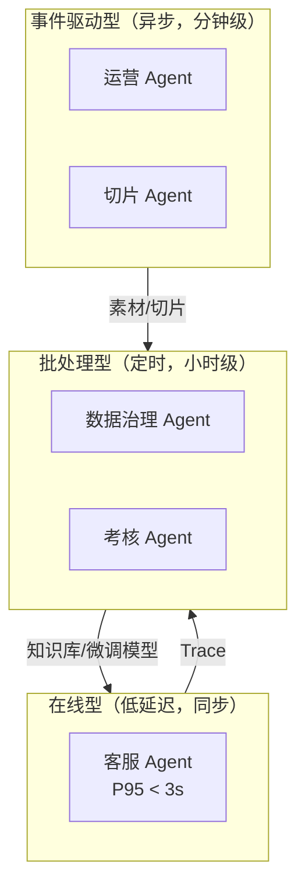
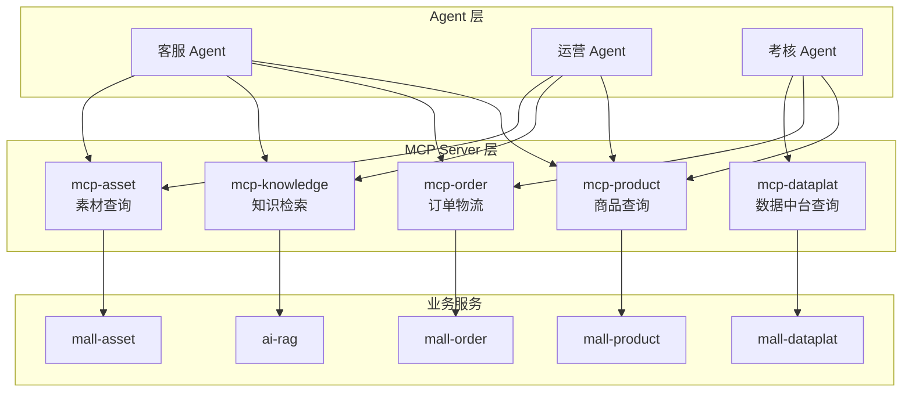
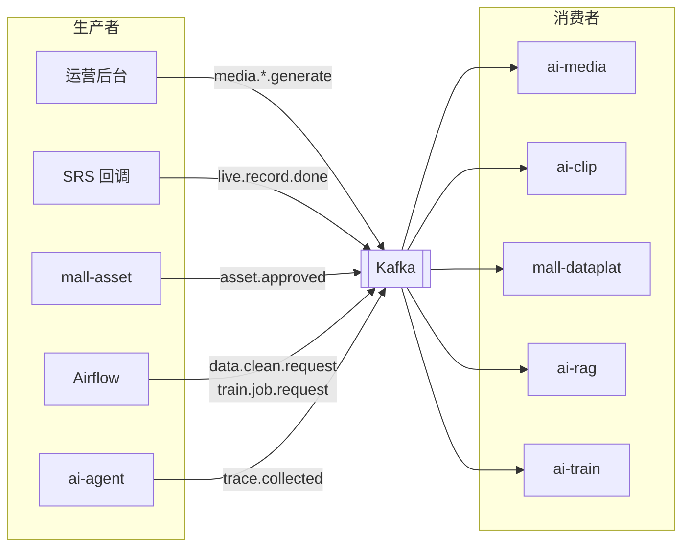
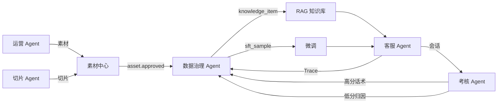

# 11 · Agent 集群协作

> 五个 Agent 如何被统一管理、如何调用业务能力、如何互相传递任务。
> **核心取舍：MCP 真做，A2A 只借概念。** 理由见第 4 节。

---

## 1. Agent 清单

| Agent | 类型 | 触发方式 | 主要产出 | 消费的数据 | 状态 |
|---|---|---|---|---|---|
| **客服 Agent** | 在线交互 | 用户消息（同步） | 对话回复 + Trace | RAG 知识库 | ✅ 已实现 |
| **导购 Agent** | 在线交互 | 用户消息（同步） | 商品推荐 + Trace | 商品/SKU 结构化数据 | ✅ 已实现 |
| **知识运维 Agent** | 定时批处理 | 手动 / Airflow | **待审**知识条目 | 转人工工单 + 商品数据 | ✅ 已实现 |
| **运营 Agent** | 离线任务 | 运营发起（异步） | 文案 / 图 / 视频 | 商品属性 + 高频问题 | 规划中 |
| **切片 Agent** | 事件驱动 | 直播录制完成 | 切片素材 + 口播话术 | 直播排品表 | ✅ 已实现 |
| **数据治理 Agent** | 定时批处理 | Airflow 调度 | 清洗后的知识与样本 | ODS 原始数据 | ✅ 已实现 |
| **考核 Agent** | 定时批处理 | 每日凌晨 | 会话评分与归因 | 会话明细 + 订单 | 规划中 |

### 知识运维 Agent：把飞轮的后半圈接上

原先「答不上来 → 工单 → 人工回答 → 知识 → 下次能答」这条回路卡在人身上：
`handover list` 把盲点列出来，然后每一条都要人从头查资料、从头写。
这个 Agent 接的就是这一段——**把人的工作从「写」降成「审」**。

链路：`读取盲点 → 复查知识库 → 收集依据 → 起草 → 依据核查 → 本轮查重 → 写入待审`

**每个节点都有权终止这条链**，这是它和另外两个 Agent 最大的编排差异。
客服和导购无论如何都得给用户一句话，链路总要走到底；这里正相反，
「不写」是随时可以、而且经常应该做出的决定：

| 情况 | 结论 | 为什么不能继续 |
|---|---|---|
| 复查发现库里已经有了 | `already_covered` | 再写就是重复知识；而且是**检索**问题，补知识没用 |
| 一条依据都找不到 | `needs_human` | 「你们仓库在哪个城市」商品表里没有，机器无从知道 |
| 模型自己说材料不足 | `needs_human` | 这是**预期内的正常输出**，不是失败 |
| 核查发现数字没出处 | `needs_human` | 见下 |
| 本轮已写过同样内容 | `duplicate` | 重复知识会占满检索 top-5，多样性归零 |

#### 两道锁

**1. 依据核查（`grounding.py`）。** 提示词里写了「一个数字都不能编」，
但提示词是请求不是约束——这个项目已经三次栽在同一件事上。所以起草完之后
做规则核查：草稿里出现的每个数字，必须在某条依据或用户原问题里出现过；
中文数字先归一（依据写「7天」草稿写「七天」不算编造）。再过一遍广告法检查——
知识条目最终会变成客服说出口的话，不能因为它躺在库里就豁免出口检查。

判据只覆盖数字，形容词编造（「版型偏宽松」）核查不了。**写清楚这个边界是
为了不让人以为「过了核查 = 内容正确」**——它只是把最容易错、也最好查的
那一类挡掉了，人工审核仍然是必须的。

**2. `review_status` 恒为 `pending`。** 机器不许给自己盖章。approved 的条目
直接进检索、被引用、被用户当成店铺的正式答复；让机器自己盖章，等于前面
那套核查全白做——它只需要写出一句「核查规则挑不出毛病」的话，而
「挑不出毛病」和「是对的」完全是两回事。机器起草的 `confidence` 给 0.5，
低于人工回流的 0.85，审核队列按它排序。

#### 为什么聚类和查重是两套机制

盲点按题面精确分组会把「怎么退货」和「退货怎么弄」算成两个 P2，
合起来它是一个 P1——补写顺序整个排错。所以先按词袋相似度聚类（阈值 0.30，
量出来的，见模块注释）。

但聚类救不了所有情况：实测「怎么洗」和「洗涤方式」**题面上一个 bigram 都不
共享**（相似度 0.00），而它们的草稿是逐字相同的。所以还要在**内容**上再查一次重。
`recheck` 也挡不住这种情况——它查的是检索索引，而本轮刚写进去的条目
`embedding_status` 还是 stale、根本没进索引。

### 客服与导购为什么是两个 Agent

两者都在线、都同步、都接同一条 WebSocket，看起来该合成一个。分开的理由
是**它们的目标函数不同**：

| | 客服 Agent | 导购 Agent |
|---|---|---|
| 形状 | 一问一答，链路基本是直的 | 带回退的收敛过程：搜不到→放宽→重搜 |
| 状态 | 历史只是上下文 | 累积的**结构化需求**驱动下一步做什么 |
| 数据源 | RAG 知识库（非结构化） | 商品/SKU 表（结构化，实时） |
| 答不上来时 | 转人工，并记成知识盲点 | 如实说没有，并给出放宽建议 |
| 核心风险 | 知识库没有却硬答 | 候选为零却硬推一件商品 |

合成一个的代价是那条收敛循环要塞进客服的直链里，而**那个循环才是导购
称得上 Agent 的原因**。两个 Agent 共用 `Deps`、工具层、输入安全检查与
埋点格式——同一套安全规则必须覆盖两个入口，为导购再写一份的结果一定是
两份规则渐行渐远，而先漏的那份不会有人发现。

入口是页面上两个显式页签，不是靠意图分类自动切。**意图分类会错，而错了
用户完全看不出发生了什么**，只觉得"它答非所问"；页签是用户自己选的，
选错了他自己知道怎么改回来。

### 三种运行形态



**这三种形态的资源诉求完全不同**，不能用同一套部署策略：
- 在线型要常驻、要低延迟、要高可用兜底
- 事件驱动型可排队、可失败重试、可长耗时
- 批处理型可占满资源、失败可重跑全量

---

## 2. MCP 工具层

所有 Agent 通过 MCP 协议访问业务能力，而不是各自写 HTTP 客户端。



### 2.1 为什么用 MCP 而不是直接调 HTTP

| 收益 | 说明 |
|---|---|
| **工具描述即文档** | MCP 的 tool schema 直接作为 LLM 的 function calling 定义，不需要另写一份 |
| **统一权限校验** | 权限检查在 MCP Server 层做一次，所有 Agent 共享。不依赖每个 Agent 的 prompt 自觉 |
| **统一审计** | 所有工具调用有统一的调用日志，谁在什么时候查了什么一目了然 |
| **可复用** | 新增 Agent 时直接接现有 MCP Server，零重复开发 |
| **生态标准** | MCP 已成为 Agent 连接工具的事实标准，由 Linux Foundation 托管 |

### 2.2 工具注册表

| MCP Server | 工具 | 权限 | 可调用者 |
|---|---|---|---|
| `mcp-product` | `get_product_detail` | 只读 | 全部 |
| | `get_sku_stock_price` | 只读 | 客服、考核 |
| | `get_size_chart` | 只读 | 客服 |
| | `recommend_products` | 只读 | 客服、运营 |
| | `get_scheduled_products` | 只读 | 切片 |
| `mcp-order` | `get_order_status` | 只读 + **用户绑定校验** | 客服、考核 |
| `mcp-knowledge` | `search_knowledge` | 只读 | 全部 |
| | `get_hot_questions` | 只读 | 运营（卖点提炼用） |
| `mcp-asset` | `search_asset` | 只读 | 客服、运营 |
| | `get_asset_batch` | 只读 | 客服 |
| `mcp-dataplat` | `get_session_detail` | 只读 | 考核 |
| | `create_knowledge_task` | **写** | 客服（转人工时创建知识补写任务） |

### 2.3 安全约束

**这一层是防越权的关键，不能依赖 prompt 约束。**

| 约束 | 实现 |
|---|---|
| 工具级白名单 | 每个 Agent 有独立的 API Key，MCP Server 校验该 Key 可调用的工具列表 |
| 参数级校验 | `get_order_status` 必须校验 `order_no` 归属于当前会话的 `user_id` |
| 只读为主 | 全部 12 个工具中只有 1 个写操作（创建知识补写任务），且不涉及资金与用户数据 |
| 调用频次限制 | 单会话内单工具调用 ≤ 5 次，防止 Agent 陷入循环调用 |
| 审计日志 | 全量记录 `agent_id / tool / params / result_summary / timestamp` |

⚠️ **`get_order_status` 的越权是真实攻击面**：用户可能说"帮我查一下订单 SM20260801888"（别人的订单号）。必须在 MCP Server 层强制校验归属，不能指望 Agent 自己判断。

---

## 3. Kafka 任务总线

Agent 之间不直接互相调用，全部通过 Kafka 解耦。



### 3.1 Topic 配置

| Topic | 分区 | 消费者并发 | 理由 |
|---|---|---|---|
| `media.image.generate` | 3 | 1 | ComfyUI 单实例，串行执行 |
| `media.video.generate` | **1** | **1** | 🔴 Wan2.2 独占 22G 显存，并行必然 OOM |
| `media.tts.generate` | 3 | 2 | CosyVoice2 轻量，可并发 |
| `live.record.done` | 2 | 1 | ASR 常驻但单场处理时间长 |
| `clip.done` | 3 | 3 | 纯 IO，可并发 |
| `asset.approved` | 3 | 3 | 触发 VLM 打标，走 API 可并发 |
| `data.clean.request` | 3 | 2 | CPU 密集 |
| `kb.index.request` | 3 | 1 | bge-m3 GPU，批量处理 |
| `trace.collected` | 6 | 3 | 高频小消息 |
| `train.job.request` | **1** | **1** | 🔴 训练独占 GPU |

**两个红色标记的 Topic 是显存约束的直接体现**：单分区 + 单消费者 = Kafka 天然的分布式锁，不需要额外的锁机制。这是用 Kafka 做 GPU 任务串行化的一个巧妙用法。

### 3.2 消息规范

统一信封格式：

```json
{
  "msg_id": "uuid",
  "topic": "media.video.generate",
  "trace_id": "关联的业务追踪 ID",
  "produced_by": "ai-agent",
  "produced_at": "2026-08-04T10:23:11Z",
  "retry_count": 0,
  "payload": { }
}
```

**可靠性策略**

| 项 | 策略 |
|---|---|
| 幂等 | 消费者按 `msg_id` 去重（Redis SETNX，TTL 24h） |
| 重试 | 失败后重投，最多 3 次，指数退避（1min / 5min / 15min） |
| 死信 | 3 次失败进 `{topic}.dlq`，运营后台可查看与手动重投 |
| 长耗时任务 | 视频生成等超过 Kafka `max.poll.interval.ms` 的任务，消费后立即 ack 并转入内部任务表，通过状态轮询跟踪 |

**最后一条是实际会踩的坑**：Wan2.2 生成一条视频要 16 分钟，如果消费后不 ack 一直处理，Kafka 会认为消费者失联并触发 rebalance，导致任务被重复投递。正确做法是消费后立即 ack，任务状态用数据库管理。

---

## 4. 关于 A2A：只借概念，不引入协议栈

### 4.1 背景

A2A（Agent2Agent Protocol）解决 Agent 之间如何发现能力、委托任务、协同执行。v1.0 于 2026 年 5 月发布，由 Linux Foundation 托管，150+ 组织在生产中使用，通过 Agent Card 元数据卡片实现跨厂商互通。

### 4.2 本项目的决策：**不引入完整 A2A 栈**

| A2A 的价值 | 在本项目是否成立 |
|---|---|
| 跨厂商 Agent 互通 | ❌ 五个 Agent 都是自研的，同一套代码库 |
| 动态能力发现 | ❌ Agent 拓扑是固定的，编译期就确定 |
| 跨组织任务委托 | ❌ 不涉及外部组织 |
| 标准化任务协议 | ⚠️ 有价值，但 Kafka 消息规范已经覆盖 |

**结论**：在一个五个 Agent、单一代码库、固定拓扑的系统里引入完整 A2A 协议栈是**过度设计**——增加了一层抽象和运维负担，换不来实际收益。

### 4.3 借用的概念：Agent Card 注册表

A2A 的 Agent Card 概念本身是有价值的——**用统一格式描述每个 Agent 的能力、输入输出、SLA**。本项目用一个轻量的注册表实现：

```yaml
# apps/python/ai-agent/agents/registry.yaml
agents:
  - id: customer-service
    name: 客服 Agent
    version: v2.1
    type: online
    description: 基于 RAG 的多模态电商客服
    capabilities:
      - text_qa
      - image_understanding
      - realtime_data_query
      - handover
    inputs:
      - { type: text, required: true }
      - { type: image, required: false }
    outputs:
      - { type: text }
      - { type: attachment, modality: [image, video] }
    tools: [mcp-product, mcp-order, mcp-knowledge, mcp-asset]
    model: qwen-plus | smartmall-cs-style-v1
    sla: { p95_latency_ms: 3000, availability: 0.99 }
    fallback: handover_to_human

  - id: marketing
    name: 运营 Agent
    version: v1.3
    type: event_driven
    capabilities: [copywriting, image_generation, video_generation]
    tools: [mcp-product, mcp-knowledge, mcp-asset]
    human_gates: [copy_review, image_selection, video_review]
    sla: { max_duration_min: 30 }
```

**这个注册表的实际用途**（不是为了好看）：

| 用途 | 说明 |
|---|---|
| 运营后台的 Agent 管理页 | 自动渲染 Agent 列表、能力、状态、SLA 达成情况 |
| 模型切换 | `model` 字段是 `ai-gateway` 的路由依据，改这里就能切模型 |
| 健康检查 | 按 `sla` 定义自动生成监控告警规则 |
| 依赖分析 | `tools` 字段生成 Agent → MCP → 业务服务的依赖图，改接口时知道影响面 |
| 未来接入 A2A | 若真需要对外开放 Agent 能力，这份注册表可直接转换为标准 Agent Card |

**最后一条是保留的扩展位**——现在不引入协议栈，但把元数据按 A2A 的信息结构组织好，将来要接入是配置转换而非重构。

---

## 5. Agent 间的协作模式

本项目的 Agent 协作是**流水线**，不是**讨论**。



**没有"多个 Agent 讨论出一个结论"的场景**，这也是否决 CrewAI / AutoGen 的原因——它们的核心能力（角色扮演、群聊、辩论）在这里用不上。

**唯一接近"协作"的场景**是运营 Agent 内部的三条子链路（文案 → 图 → 视频），但它们是**顺序依赖**，用 LangGraph 的图编排即可，不需要多 Agent 协商。

---

## 6. 统一的 Agent 基类

所有 Agent 共享一套基础设施，避免重复实现。

```python
# apps/python/ai-common/agent_base.py

class BaseAgent(ABC):
    """所有 Agent 的基类，统一处理横切关注点"""

    agent_id: str
    registry: AgentCard          # 从 registry.yaml 加载

    async def run(self, input: AgentInput) -> AgentOutput:
        trace = self.tracer.start(self.agent_id, input)
        try:
            self.guard.check_input(input)              # 输入安全
            output = await self._execute(input, trace) # 子类实现
            self.guard.check_output(output)            # 输出合规
            return output
        except Exception as e:
            return await self._fallback(input, e)      # 统一降级
        finally:
            trace.finish()                             # 统一埋点

    @abstractmethod
    async def _execute(self, input, trace) -> AgentOutput: ...

    @abstractmethod
    async def _fallback(self, input, error) -> AgentOutput: ...
```

**统一承担的横切关注点**

| 关注点 | 说明 |
|---|---|
| Trace 埋点 | 所有 Agent 的执行记录格式统一，便于跨 Agent 分析 |
| 输入安全检查 | prompt 注入、敏感内容 |
| 输出合规检查 | 复用 `ai-common/compliance/` 的同一套规则引擎 |
| 降级兜底 | 每个 Agent 必须实现 `_fallback`，禁止异常直接抛给调用方 |
| 成本记账 | 通过 `ai-gateway` 统一记账到 `agent_id` 维度 |
| 超时控制 | 按 registry 中的 SLA 定义自动设置超时 |

**合规规则引擎复用是重点**：客服 Agent 的输出检查、运营 Agent 的文案检查、切片话术的规整化检查，用的是同一套违禁词表和规则。规则更新一处生效，不会出现"客服拦住了但文案漏出去了"。

---

## 7. 可观测

统一通过 Langfuse，所有 Agent 的 Trace 结构一致（见 [12 · 评测与可观测](12-eval-observability.md)）。

**Agent 维度的核心监控项**

| 指标 | 告警阈值 |
|---|---|
| P95 延迟（在线型） | > SLA 定义值 |
| 失败率 | > 1% |
| 降级触发率 | > 5% |
| 工具调用失败率 | > 2% |
| 单次调用成本 | 超过基线 50% |
| 死信队列积压（异步型） | > 10 条 |

---

## 8. 验收标准

- [ ] 5 个 MCP Server 全部可用，12 个工具可被 Agent 正确调用
- [ ] 工具级白名单生效，未授权的 Agent 调用被拒绝
- [ ] `get_order_status` 的用户归属校验生效（越权测试通过）
- [ ] 工具调用频次限制生效
- [ ] 10 个 Kafka Topic 配置正确，两个 GPU 独占 Topic 为单分区单消费者
- [ ] 消息幂等、重试、死信队列全部可用
- [ ] 长耗时任务不触发 Kafka rebalance
- [ ] `registry.yaml` 完整，运营后台可渲染 Agent 管理页
- [ ] 依赖图可自动生成
- [ ] `BaseAgent` 基类被所有 Agent 继承，横切关注点无重复实现
- [ ] 任一 Agent 异常时能正确降级，不向调用方抛异常

---

**上一篇** ← [10 · 模型微调](10-finetune.md) ｜ **下一篇** → [12 · 评测与可观测](12-eval-observability.md)
