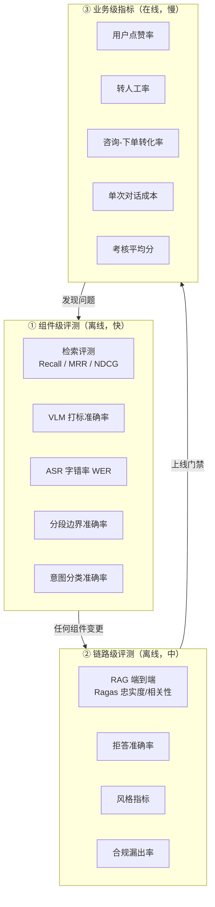
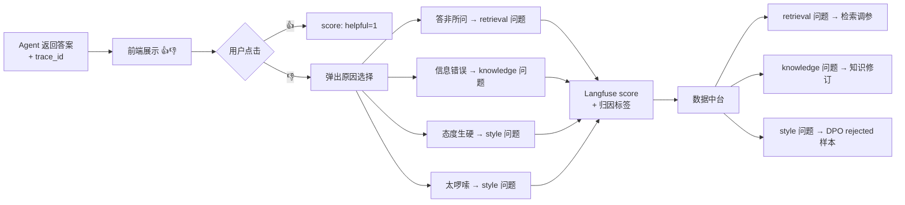
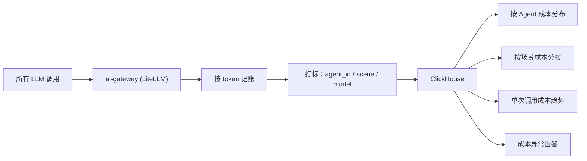
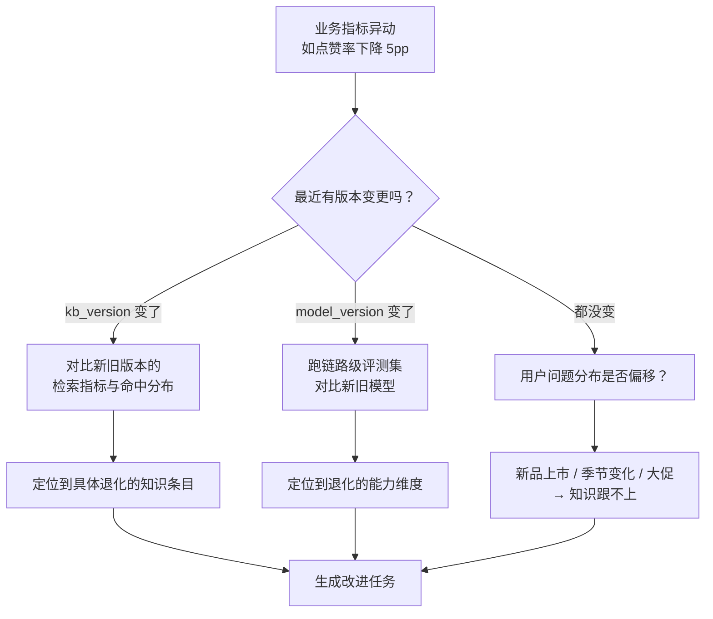

# 12 · 评测与可观测

> 这个体系有五个 Agent、两条数据流、三个模型版本维度。
> **没有统一的评测与可观测，任何"效果变好了"的判断都是错觉。**

---

## 1. 三层评测体系



| 层 | 执行时机 | 耗时 | 用途 |
|---|---|---|---|
| 组件级 | 每次组件变更（CI） | 分钟级 | 快速定位是哪个组件退化了 |
| 链路级 | 上线前门禁 | 十分钟级 | 决定能不能上 |
| 业务级 | 持续监控 | 天/周级 | 决定要不要回滚、下一步优化什么 |

**分层的意义**：业务指标下跌时，能顺着往下查是哪一层出的问题。只有业务指标而没有组件指标，就只能靠猜。

---

## 2. 评测集清单

全部存放在 `evals/`，与代码同仓版本管理。

| 评测集 | 规模 | 归属 | 构造方式 |
|---|---|---|---|
| `eval-retrieval` | 300 | RAG | 人工标注 query → 正确 `item_id` |
| `eval-answer` | 200 | RAG | 人工标注 query → golden 答案 |
| `eval-negative` | 100 | RAG | 知识库中无答案的问题（检验拒答） |
| `eval-multimodal` | 100 | RAG | 带图提问 → 期望返回的素材 |
| `eval-intent` | 300 | 客服 | query → 正确意图标签 |
| `eval-style` | 200 | 微调 | 风格盲评三元组 |
| `eval-rag-faithfulness` | 200 | 微调 | 防退化：忠实度 |
| `eval-instruction` | 100 | 微调 | 防退化：指令跟随 |
| `eval-safety` | 100 | 通用 | 违禁词、合规红线 |
| `eval-hallucination` | 100 | 通用 | 幻觉检测 |
| `eval-asr` | 50 场景 | 切片 | 人工转写的标准答案 |
| `eval-segment` | 30 场 | 切片 | 人工标注的分段边界 |
| `kpi-golden-set` | 300–500 | 考核 | 多人独立评分的中位数 |

**构造原则**

| 原则 | 说明 |
|---|---|
| 来自真实数据 | 评测集必须从线上 Trace 或真实数据集中抽样，不能凭空造 |
| 覆盖长尾 | 不能只放高频问题，要按 8:2 混入长尾问题 |
| 定期更新 | 每季度用新的线上数据替换 20%，防止评测集过拟合 |
| 与训练集隔离 | 评测集中的样本**绝不能**出现在 `sft_sample` 中，需按 `source_ref` 做硬性排除 |

⚠️ **最后一条是最容易出错的地方**。数据中台的样本和评测集都来自同一批 Trace，如果不做排除，会出现"模型在训练集上评测"的经典错误，指标虚高但线上无效。实现上：`dataset_version` 生成时，`filter_sql` 必须包含 `session_id NOT IN (SELECT session_id FROM eval_sample)`。

---

## 3. Langfuse Trace 体系

### 3.1 Trace 层级

```
Trace（一次 Agent 完整调用）
├── Span: input_guard
├── Span: vision_parse
│   └── Generation: qwen-vl-max
├── Span: intent_route
│   └── Generation: qwen-turbo
├── Span: retrieval
│   ├── Span: dense_search
│   ├── Span: sparse_search
│   └── Span: rerank
├── Span: tool_call (get_sku_stock_price)
├── Span: generate
│   └── Generation: qwen-plus
└── Span: post_check
```

每个 Span 记录耗时、输入输出；每个 Generation 额外记录模型、token 数、成本。

### 3.2 关键自定义字段

除标准字段外，本项目在 Trace 上打的标签：

| 标签 | 用途 |
|---|---|
| `kb_version` | 关联知识库版本，效果归因用 |
| `model_version` | 关联模型版本（含微调版本） |
| `rubric_version` | 考核 Agent 用 |
| `agent_id` | 区分五个 Agent |
| `ab_group` | A/B 实验分组 |
| `root_cause` | 低分归因（考核 Agent 回写） |

**这几个版本号标签是效果归因的基础**。没有它们，"这周点赞率降了"这句话无法定位到底是知识库更新导致的、还是模型切换导致的。

### 3.3 反馈采集



**点踩原因的四个选项是精心设计的**——每个选项直接对应一个不同的改进动作。如果只提供一个笼统的"不满意"，反馈数据就没有可操作性。

---

## 4. 监控看板

### 4.1 实时看板（Grafana + ClickHouse）

**客服 Agent 健康度**

| 面板 | 指标 |
|---|---|
| 流量 | QPS、会话数、消息数 |
| 延迟 | P50 / P95 / P99，按 Span 拆解（找瓶颈） |
| 质量 | 检索命中率、平均 rerank 分、拒答率、幻觉告警数 |
| 反馈 | 点赞率、点踩率及原因分布 |
| 兜底 | 转人工率、降级触发率 |
| 成本 | 单次对话成本、日累计成本、按模型拆分 |

**数据管道健康度**

| 面板 | 指标 |
|---|---|
| 清洗吞吐 | 各关卡的进出量与淘汰率 |
| 知识库 | 总条目数、待审核数、`stale` 数、索引延迟 |
| 标注队列 | Label Studio 待处理任务数、平均处理时长 |
| 素材 | 生成量、审核通过率、回灌延迟 |
| Kafka | 各 topic 积压、死信数 |

**GPU 资源**

| 面板 | 指标 |
|---|---|
| 显存占用 | 实时显存、各模型占用 |
| 任务队列 | 图/视频/训练任务排队数与等待时长 |
| 利用率 | GPU 利用率、任务耗时分布 |

### 4.2 周报（自动生成）

每周一自动生成并推送：

```
【smartMall 周报 2026-W31】

■ 客服
  会话量 8,432（+12%）  点赞率 78.3%（-1.2pp ⚠️）
  转人工率 9.1%（-0.8pp）  P95 延迟 2.8s
  ⚠️ 点赞率下降主要来自「信息错误」类点踩（+34 次），
     集中在类目「羽绒服」，疑似新品知识缺失

■ 知识库  kb-v4（8/1 发布）
  条目 12,847（+1,203）  从未命中条目占比 31%
  Top 缺口：羽绒服洗涤、大码尺码建议、七天无理由细则

■ 素材
  生成 图 342 / 视频 18   审核通过率 81%
  回灌知识库 289 条

■ 直播切片
  处理 6 场   切片 187 段   商品自动匹配率 74%

■ 考核
  人工客服均分 82.4   AI 客服均分 76.1
  申诉 12 起，成功 3 起（申诉成功率 25% ⚠️ 需检查「需求挖掘」rubric）

■ 成本
  API ¥1,247   GPU 电费估算 ¥180
```

**周报的价值在于它自动把问题归因了**——不是罗列数字，而是指出"点赞率下降来自羽绒服类目的知识缺失"。这需要看板层做交叉分析，不是简单的指标聚合。

---

## 5. 知识库健康度

这是本项目特有的、容易被忽略的监控维度。

| 指标 | 含义 | 健康阈值 | 不健康的处置 |
|---|---|---|---|
| **从未命中条目占比** | 建了但从没被检索到的知识 | ≤ 40% | 分析原因：是知识没用，还是检索不到？ |
| **高频命中条目集中度** | Top 100 条目承载的命中占比 | ≤ 60% | 过高说明知识库有效覆盖太窄 |
| **平均命中 rerank 分** | 检索质量 | ≥ 0.6 | 下降说明用户问题分布偏移，知识跟不上 |
| **待审核积压** | pending 状态条目数 | ≤ 500 | 人工审核成为瓶颈，需增加人力或调整推送策略 |
| **stale 条目数** | 内容改了但索引没更新 | ≤ 50 | 增量索引任务异常 |
| **过期未下线条目** | `valid_to` 已过但仍 approved | 0 | staleness 检查任务异常 |
| **冲突条目对数** | 同商品下语义相似但答案矛盾 | ≤ 10 | 推人工裁决 |

**「从未命中条目占比」是知识库建设方向的照妖镜**。如果超过 40%，说明知识库在按运营的想象建设，而不是按用户的真实需求建设。正确的做法是——用 Trace 中的用户真实问题分布来驱动知识补写（这正是 `dag_coverage_analysis` 做的事）。

---

## 6. 成本监控

混合模型策略下，成本必须精细到 Agent 与场景维度。



**成本基线**（日均，按 1000 会话 / 500 素材 / 6 场直播估算）

| 项 | 日成本 | 占比 |
|---|---|---|
| 客服对话（qwen-plus） | ¥35 | 42% |
| 考核评分（qwen-max） | ¥30 | 36% |
| 素材 VLM 打标 | ¥8 | 10% |
| 数据清洗（批量，均摊） | ¥6 | 7% |
| 切片语义分段 | ¥4 | 5% |
| **合计** | **~¥83/天** | |

**优化方向（按收益排序）**

| 优化 | 预期节省 |
|---|---|
| 闲聊分流到 qwen-turbo（约 30% 消息是纯寒暄） | 客服成本 -25% |
| 考核改为抽样评分 + 全量评低分会话 | 考核成本 -50% |
| 微调模型上线后承接部分流量 | 客服成本 -30%（换成 GPU 电费） |
| 检索结果缓存（高频问题） | 客服成本 -10% |

**告警规则**：单日成本超过基线 150% 触发告警——通常意味着有循环调用或异常重试。

---

## 7. 效果归因方法

当业务指标发生变化时，按这个顺序排查：



**能做这套归因的前提**，是每条 Trace 上都打了 `kb_version` 和 `model_version`。这就是为什么第 3.2 节强调这几个标签。

---

## 8. CI 集成

```yaml
# .github/workflows/eval.yml（示意）
on: [pull_request]
jobs:
  component-eval:
    steps:
      - 检索评测（eval-retrieval）      # 改了 ai-rag 才跑
      - 意图分类评测（eval-intent）      # 改了 ai-agent 才跑
      - 合规规则评测（eval-safety）      # 改了 compliance 才跑
      - 门禁：任一指标低于基线 3% 则失败
```

**按变更路径触发对应评测**，避免每次 PR 都跑全量（耗时且费 API）。基线值存在 `evals/baseline.json`，随主干更新。

---

## 9. 验收标准

- [ ] 13 个评测集全部就位，存放在 `evals/` 并版本管理
- [ ] 评测集与训练集的隔离机制生效（`filter_sql` 硬性排除）
- [ ] Langfuse 接入完成，Trace 层级结构正确
- [ ] 6 个版本标签（kb/model/rubric/agent/ab_group/root_cause）全部落库
- [ ] 前端反馈组件可用，点踩原因四分类可回写
- [ ] Grafana 三个看板（客服健康度、数据管道、GPU）可用
- [ ] 知识库健康度 7 项指标可查
- [ ] 成本按 Agent 与场景维度可拆分，异常告警生效
- [ ] 周报可自动生成并包含归因分析
- [ ] CI 按变更路径触发对应评测，门禁生效

---

**上一篇** ← [11 · Agent 集群协作](11-agent-cluster.md) ｜ **下一篇** → [13 · 里程碑路线图](13-roadmap.md)
