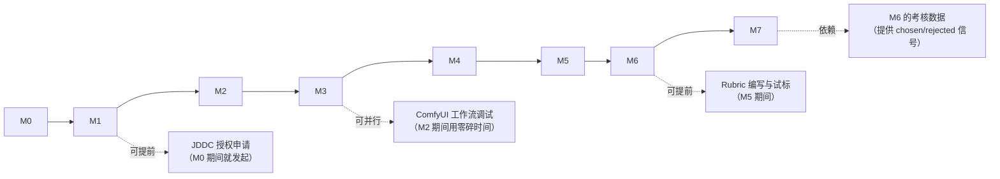

# 13 · 里程碑路线图

> 八个阶段，约 4–5 个月（单人业余投入估算）。
> **每个阶段必须有可演示的产出**——否则做到一半失去反馈，容易偏离方向。

---

## 1. 总体排期

```mermaid
gantt
    title smartMall 实施路线（周）
    dateFormat X
    axisFormat %s

    section 基建
    M0 基础设施          :m0, 0, 2w

    section 数据与知识
    M1 数据中台 + RAG    :m1, after m0, 4w

    section 客服
    M2 文本 AI 客服      :m2, after m1, 3w

    section 素材
    M3 素材中心 + 运营Agent :m3, after m2, 4w
    M4 多模态客服        :m4, after m3, 2w

    section 直播
    M5 直播切片          :m5, after m4, 3w

    section 度量与进化
    M6 销售考核          :m6, after m5, 2w
    M7 模型微调          :m7, after m6, 3w
```

| 阶段 | 周期 | 累计 | 核心产出 |
|---|---|---|---|
| M0 | 2 周 | 2 周 | 全套中间件跑起来，骨架服务可互通 |
| M1 | 4 周 | 6 周 | 数据中台四道清洗跑通，RAG 知识库建成 |
| M2 | 3 周 | 9 周 | **文本 AI 客服可对外演示** |
| M3 | 4 周 | 13 周 | 能批量生成商品文案、宣传图、宣传视频 |
| M4 | 2 周 | 15 周 | **多模态 AI 客服可对外演示** |
| M5 | 3 周 | 18 周 | 直播自动切片 + 话术回灌 |
| M6 | 2 周 | 20 周 | 销售考核系统上线 |
| M7 | 3 周 | 23 周 | **微调模型上线，去 AI 味** |

---

## 2. 分阶段详情

### M0 · 基础设施（2 周）

**目标**：所有中间件跑起来，骨架服务能互相调通。这一阶段不写业务逻辑。

| 任务 | 产出 |
|---|---|
| Monorepo 目录结构搭建 | `apps/` `pipelines/` `deploy/` `evals/` |
| docker-compose 三件套 | `base.yml`（中间件）/ `app.yml`（服务）/ `gpu.yml`（GPU） |
| MySQL + Redis + Kafka + ClickHouse + Milvus 部署 | 可连通 |
| 对象存储部署（SeaweedFS 或接 OSS） | 可上传下载 |
| Java 五个服务骨架 + 网关路由 | `/health` 全绿 |
| Python 六个服务骨架 | `/health` 全绿 |
| LiteLLM 网关接入 DashScope / DeepSeek | 可调通并记账 |
| Langfuse 部署 + SDK 接入 | 能看到第一条 Trace |
| Airflow 3 部署 | 示例 DAG 可跑 |
| Label Studio 部署 | 可创建项目 |
| GPU 环境：CUDA + PyTorch + 常驻模型（FunASR/CosyVoice2/bge-m3） | 显存占用 ≤ 6G |

**✅ 可演示**：一条命令拉起全栈，健康检查页面全绿，能通过网关调用 LLM 并在 Langfuse 看到 Trace。

**风险**：Milvus + Kafka + ClickHouse 内存占用之和较大，单机内存建议 ≥ 32G。

---

### M1 · 数据中台 + RAG 知识库（4 周）

**目标**：数据从原始到可用知识的完整管道跑通。

| 周 | 任务 |
|---|---|
| W1 | JDDC 数据集授权申请与导入 ODS；建表（`knowledge_item` / `sft_sample` / ODS / DWD / 版本表） |
| W2 | 关卡①机器清洗（Data-Juicer 配方）+ 关卡②规则清洗（自定义算子）；PII 脱敏 |
| W3 | 关卡③模型清洗（LLM 判定 + QA 抽取 + 风格标注）；关卡④ Label Studio 接入与 ML Backend 预标注 |
| W4 | `ai-rag` 服务：切分、bge-m3 向量化、Milvus 混合检索、rerank；数据资产版本发布；知识覆盖度矩阵 |

**✅ 可演示**：
- 后台展示四道关卡的漏斗图（进 100 万 → 出 1 万）
- Label Studio 中有待标注任务，标注后能回写并自动向量化
- 检索调试台输入问题，能返回 Top-5 知识条目及分数
- 能发布 `kb-v1` 版本

**关键风险**：JDDC 授权申请可能耗时。**缓解**：并行准备 LLM 合成数据作为备选冷启动来源，不阻塞进度。

---

### M2 · 文本 AI 客服（3 周）

**目标**：第一个真正能用的 Agent。

| 周 | 任务 |
|---|---|
| W1 | LangGraph 状态机搭建；意图分类；5 个 MCP Server + 12 个工具 |
| W2 | 检索链路接入；上下文管理；查询改写；PostCheck 合规检查；转人工 |
| W3 | WebSocket 流式前端；Trace 全字段埋点；反馈采集；4 个评测集与门禁 |

**✅ 可演示**：**这是第一个能给人看的完整 Demo。** 打开对话页面，问商品问题，AI 基于知识库回答并给出引用来源；问库存价格，走实时工具；问知识库没有的问题，正确拒答并转人工；点踩后能在 Langfuse 看到反馈。

**验收门槛**：评测集指标达标（Recall@5 ≥ 0.85，Faithfulness ≥ 0.90，拒答准确率 ≥ 0.90）。

---

### M3 · AI 素材中心 + 运营 Agent（4 周）

**目标**：内容生产能力，以及素材回灌知识库的链路。

| 周 | 任务 |
|---|---|
| W1 | `mall-asset` 服务：数据模型、生命周期状态机、双审核流、AI 标识校验 |
| W2 | ComfyUI 部署 + 工作流版本化（manifest）；`ai-media` 图像链路；IP-Adapter 主体一致性；质量筛选 |
| W3 | 文案链路（卖点提炼含高频问题来源）+ 合规检查；Wan2.2 视频链路 + CosyVoice2 口播 + FFmpeg 合成 |
| W4 | 素材回灌：VLM 打标 → 描述审核界面 → `knowledge_item` → 向量化 |

**✅ 可演示**：选一个商品，一键生成 6 种文案 + 4 张宣传图 + 1 条 30 秒带口播的视频；审核通过后，素材出现在知识库中。

**关键风险**：Wan2.2 部署与调参可能不顺（显存、依赖版本）。**缓解**：视频链路排在最后，即使延期也不影响图像链路的演示；保留云端视频 API 作为兜底通道。

---

### M4 · 多模态客服（2 周）

**目标**：把 M2 的文本客服升级为图文视频客服。

| 周 | 任务 |
|---|---|
| W1 | 图片输入链路：VLM 理解 → 视觉属性 → 检索 query 与过滤条件；`vision_context` 缓存 |
| W2 | 素材挂载：答案返回 attachments；前端图文视频渲染；多模态评测集 |

**✅ 可演示**：**这是最有冲击力的 Demo。** 用户拍一张衣服照片问"这个什么面料"，AI 识别出商品、检索知识、回答面料，并附上该商品的细节图和主播讲解视频片段。

**为什么只要 2 周**：M2 和 M3 已经把地基打好了——检索链路、素材中心、VLM 打标都是现成的。这一阶段只是把它们连起来。这也验证了前面"统一抽象"设计的价值。

---

### M5 · 直播切片（3 周）

| 周 | 任务 |
|---|---|
| W1 | SRS 部署 + 录制回调；FunASR 全片转写 + 热词注入 + 说话人分离 |
| W2 | 滑窗 LLM 语义分段；卖点与异议处理抽取；商品对齐 + 人工确认队列 + 别名回写 |
| W3 | FFmpeg 切片；注册素材中心；口播话术规整化 → `knowledge_item(biz_type=script)` |

**✅ 可演示**：推一段模拟直播流（可用录好的视频推流），系统自动转写、分段、切出 N 段带商品标签的短视频；客服回答相关问题时能挂载对应切片。

**关键风险**：语义分段准确率不达标。**缓解**：FunClip 的 Gradio 界面作为人工兜底工具，先保证链路通，再迭代分段算法。

---

### M6 · 销售考核（2 周）

| 周 | 任务 |
|---|---|
| W1 | 三类指标计算；Rubric 编写；Judge 实现；`kpi_score` 存储 |
| W2 | **校准**（人工标注 300 会话 → 一致性检验 → Judge 对齐）；申诉流程；六类报表；优秀话术回流 |

**✅ 可演示**：考核看板展示客服评分、雷达图、低分会话清单；点开任一评分能看到 Judge 引用的原话证据；校准报告显示 Spearman ρ ≥ 0.7。

**关键风险**：**校准是这个阶段的真正瓶颈**——需要 3 位标注者独立评 300 通会话。单人项目下可自己分三次在不同时间标注（间隔至少 3 天，减少记忆干扰），或降低样本量到 150 通。这个环节不能跳过，跳过整个系统就没有可信度。

---

### M7 · 模型微调（3 周）

| 周 | 任务 |
|---|---|
| W1 | `sft_sample` 导出与清洗（去偏、参数化、场景均衡）；对照生成构造 DPO `rejected`；5 个评测集 |
| W2 | LLaMA-Factory SFT（~4h）+ DPO（~1.5h）训练；评测与调参迭代 |
| W3 | vLLM 部署 LoRA；`ai-gateway` 按用户分流；A/B 实验 7 天；放量决策 |

**✅ 可演示**：并排展示同一个问题的三种回答（真人客服 / 微调前 / 微调后），盲评投票；A/B 报表显示点赞率与考核亲和力分的提升。

**关键风险**：训练需清空常驻 GPU 模型，且要跑 6 小时。**缓解**：安排夜间执行；准备好回滚脚本；若 24G 卡训练 8B 吃力，降级到 Qwen3-4B。

---

## 3. 关键路径与并行机会

**三个可以提前启动的事项**（都是"等待时间长但不占开发时间"的）：
1. **JDDC 数据集授权申请** —— M0 期间就发起，避免 M1 卡住
2. **ComfyUI 工作流调试** —— 出图效果调优是试错过程，可以在 M2 开发间隙分散进行
3. **考核 Rubric 编写与试标** —— 写 Rubric 是纯文档工作，M5 期间就能做

**一个硬依赖**：M7 依赖 M6，因为考核系统提供了"哪些回复是好的"这个监督信号。如果跳过 M6 直接做 M7，`sft_sample` 的正负例只能靠人工挑，工作量翻数倍。

---

## 4. 如果时间不够：可裁剪的部分

按裁剪优先级排序（先裁上面的）：

| 可裁剪项 | 影响 | 节省 |
|---|---|---|
| 宣传视频链路（保留图像） | 演示少一个亮点，但图像链路已能证明架构 | 1.5 周 |
| ClickHouse（改用 MySQL 聚合） | 数据量小时性能足够 | 3 天 |
| 直播切片（M5 整个阶段） | 少一条数据来源，但架构完整性不受损 | 3 周 |
| DPO 阶段（只做 SFT） | 去 AI 味效果打折，但仍有明显改善 | 1 周 |
| 考核的申诉流程 | 单人项目本就没有申诉方 | 3 天 |

**绝对不能裁剪的**（裁了整个方案就不成立）：
- 数据中台的四道清洗关卡 —— 这是核心叙事
- `knowledge_item` 统一抽象 —— 这是架构主张
- 考核系统的校准环节 —— 不校准的评分没有可信度
- 微调的防退化评测 —— 不测就上线是危险的

---

## 5. 每阶段的"可演示"定义

作品集项目最大的风险是**做了很多但演示不出来**。因此每个阶段都要明确"演示什么、给谁看、看多久"。

| 阶段 | 演示形式 | 时长 | 讲什么 |
|---|---|---|---|
| M0 | 架构图 + 健康检查页 | 2 分钟 | 技术栈选型与理由 |
| M1 | 清洗漏斗图 + 标注界面 + 检索调试台 | 5 分钟 | 数据治理的四道关卡设计 |
| M2 | 对话演示（含拒答与转人工） | 5 分钟 | RAG 链路与可溯源性 |
| M3 | 一键生成文案+图+视频 | 5 分钟 | 内容生产流水线与合规闸门 |
| M4 | 拍照提问 → 图文视频回答 | 3 分钟 | 多模态方案的工程取舍 |
| M5 | 直播 → 自动切片 → 话术入库 | 5 分钟 | 双出口设计 |
| M6 | 考核看板 + 校准报告 | 4 分钟 | 为什么校准比实现更重要 |
| M7 | 三方盲评 + A/B 报表 | 5 分钟 | RAG 管说什么、微调管怎么说 |

**完整演示约 35 分钟**，可根据场合裁剪为 10 分钟版（M2 + M4 + M7）。

---

## 6. 验收总表

| 阶段 | 硬性验收项 |
|---|---|
| M0 | 一键拉起全栈；LLM 可调通并记账；第一条 Trace 可见 |
| M1 | `knowledge_item` ≥ 5000 条且 95% 已审核；可发布 `kb-v1`；任一条目可溯源到 ODS |
| M2 | 4 项评测指标达标；意图分类 ≥ 0.85；越权测试通过；转人工链路完整 |
| M3 | 4 个 ComfyUI 工作流可用；CLIP 相似度 ≥ 0.75；AI 标识三件套强制生效；素材可回灌 |
| M4 | 图片提问链路跑通；素材正确挂载且可播放；多模态评测达标 |
| M5 | 商品名识别 ≥ 0.9；分段准确率 ≥ 0.8；商品自动匹配率 ≥ 0.7；话术正确入库 |
| M6 | 人工一致性 α ≥ 0.7；Judge ρ ≥ 0.7；MAE ≤ 0.5；证据强制输出 |
| M7 | 盲评「像真人」≥ 40%；三条防退化红线守住；A/B 跑满 7 天有结论 |

各阶段详细验收清单见对应文档末尾。

---

**上一篇** ← [12 · 评测与可观测](12-eval-observability.md) ｜ **下一篇** → [14 · 基础设施](14-infra.md)
