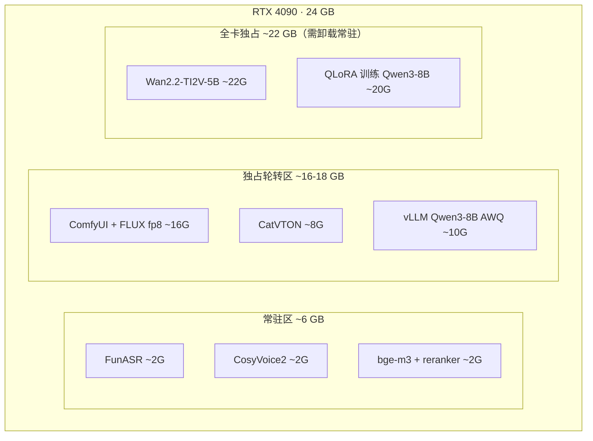

# 14 · 基础设施

> 单机 + 单卡 24G 的部署方案。
> **核心约束是显存**——它决定了哪些模型能常驻、哪些必须排队，进而决定了任务调度的设计。

---

## 1. 硬件配置

### 1.1 基线配置（推荐）

| 部件 | 配置 | 说明 |
|---|---|---|
| GPU | RTX 4090 24G / A10 24G | Wan2.2-TI2V-5B 需 ~22G，这是硬下限 |
| CPU | 16 核 | Kafka + Milvus + ClickHouse + 5 个 Java 服务 |
| 内存 | **64 GB** | 见下方内存预算 |
| 系统盘 | 500 GB NVMe | 模型权重约 120G |
| 数据盘 | 2 TB | 素材、直播录像、数据集 |
| OS | Ubuntu 22.04 LTS | Wan2.2 官方推荐环境 |
| CUDA | 12.1+ | PyTorch 2.5.1+cu121 |

### 1.2 内存预算

| 组件 | 内存 |
|---|---|
| Milvus Standalone（含 etcd + 存储引擎） | 6 GB |
| Kafka + Zookeeper | 4 GB |
| ClickHouse | 4 GB |
| MySQL 8 | 4 GB |
| Redis | 1 GB |
| Java 服务 × 5（每个 1.5G） | 7.5 GB |
| Python 服务 × 6 | 6 GB |
| Airflow（调度器 + Worker） | 4 GB |
| Label Studio | 2 GB |
| Langfuse + PostgreSQL | 3 GB |
| SRS | 1 GB |
| ComfyUI（CPU 侧） | 4 GB |
| 系统 + 缓冲 | 8 GB |
| **合计** | **~55 GB** |

**32G 内存不够**，会在 Milvus 索引构建或 ClickHouse 查询时 OOM。若只有 32G，需要裁剪：ClickHouse 换 MySQL、Milvus 换 pgvector、Label Studio 与 Airflow 按需启停。

### 1.3 升级路径

| 配置 | 解除的约束 | 成本 |
|---|---|---|
| **48G 卡**（L20 / A6000 / 2×4090） | 所有模型可常驻，无需分时调度，视频生成与其他任务可并行 | GPU 成本约 2 倍 |
| **按需租用 GPU**（AutoDL / 阿里云 GPU 竞价） | 训练与视频生成按需拉起，日常只跑轻量模型 | 训练一次约 ¥20–40 |

**对作品集项目的建议**：本地 24G 卡跑日常开发与演示，训练和批量视频生成时租按量 GPU。这是成本最优解。

---

## 2. 磁盘布局

```
/data/
├── models/                    # ~120 GB
│   ├── qwen3-8b/              # 16 GB（微调基座）
│   ├── wan2.2-ti2v-5b/        # 12 GB
│   ├── comfyui/
│   │   ├── checkpoints/       # FLUX / Qwen-Image  ~40 GB
│   │   ├── controlnet/        # ~10 GB
│   │   ├── ipadapter/         # ~2 GB
│   │   └── catvton/           # ~4 GB
│   ├── funasr/                # ~2 GB
│   ├── cosyvoice2/            # ~2 GB
│   ├── bge-m3/                # ~2 GB
│   ├── bge-reranker-v2-m3/    # ~1 GB
│   └── lora/                  # 微调产物，每版本 ~200 MB
├── storage/                   # 对象存储（SeaweedFS）
├── live/                      # 直播录像（3h ≈ 6 GB，需定期清理）
├── datasets/                  # JDDC 等原始数据集
├── mysql/  clickhouse/  milvus/  kafka/
└── logs/
```

**直播录像的清理策略**：切片完成且素材审核通过后，原始录像转低频存储；30 天后删除（切片已保留，原片价值低）。不清理的话 2TB 撑不过 3 个月。

---

## 3. GPU 分时调度（核心机制）

### 3.1 显存分配



**三个层级的调度规则**

| 层级 | 规则 |
|---|---|
| 常驻区 | 服务启动即加载，不卸载。这三个模型是在线链路的一部分，卸载会导致客服不可用 |
| 独占轮转区 | 同一时刻只能有一个。通过 Kafka 单消费者 + 分布式锁保证 |
| 全卡独占 | 执行前必须卸载常驻模型，执行完重新加载。**只在夜间窗口执行** |

### 3.2 显存看门狗

```python
# apps/python/ai-common/gpu_scheduler.py

class GpuScheduler:
    """GPU 任务调度器：管理显存分配与模型加卸载"""

    async def acquire(self, task: GpuTask) -> GpuLease:
        if task.level == "full_exclusive":
            await self._wait_online_idle()        # 等待在线请求排空
            await self._unload_residents()         # 卸载常驻模型
            await self._set_maintenance_mode(True) # 在线服务切降级模式

        lock = await self.redis.lock(f"gpu:{task.level}", timeout=task.max_duration)
        await self._verify_free_vram(task.required_gb)
        return GpuLease(lock, task)

    async def release(self, lease: GpuLease):
        await self._empty_cache()                  # torch.cuda.empty_cache()
        if lease.task.level == "full_exclusive":
            await self._load_residents()
            await self._set_maintenance_mode(False)
        await lease.lock.release()
```

**降级模式（maintenance mode）的行为**

| 能力 | 全卡独占期间 |
|---|---|
| 客服文本问答 | ⚠️ 降级——检索走 CPU 版 bge-m3（慢但可用），或用缓存的 embedding |
| 客服图片理解 | ❌ 不可用——转人工 |
| 语音合成 | ❌ 排队等待 |
| 直播切片 | ❌ 排队等待 |

**因此全卡独占任务必须安排在夜间**（02:00–06:00），此时客服流量最低。

### 3.3 任务调度时间表

| 时段 | GPU 用途 |
|---|---|
| 08:00–22:00 | 常驻模型 + ComfyUI 图像生成（响应运营即时需求） |
| 22:00–02:00 | 常驻模型 + 直播切片 ASR（直播通常晚间结束） |
| 02:00–06:00 | **全卡独占窗口**：Wan2.2 批量视频生成 / 模型训练 |
| 06:00–08:00 | 常驻模型 + 增量向量化（bge-m3 批量） |

---

## 4. docker-compose 拆分

三个文件分层，可按需启停。

### 4.1 `deploy/docker-compose.base.yml` — 中间件

```yaml
services:
  mysql:          # 8.0，业务数据
  redis:          # 7，缓存与会话
  kafka:          # KRaft 模式，免 Zookeeper
  clickhouse:     # 分析
  milvus-standalone:  # 含 etcd + minio-compatible 存储
  seaweedfs:      # 对象存储（或省略，接阿里云 OSS）
  postgres:       # Langfuse 用
```

### 4.2 `deploy/docker-compose.app.yml` — 应用服务

```yaml
services:
  mall-gateway:   # 8080
  mall-product:   # 8081
  mall-asset:     # 8082
  mall-dataplat:  # 8083
  mall-kpi:       # 8084
  ai-gateway:     # 9000
  ai-rag:         # 9001
  ai-agent:       # 9002
  ai-media:       # 9003
  ai-clip:        # 9004
  ai-train:       # 9005
  web:            # 前端
  airflow-webserver / airflow-scheduler / airflow-worker
  label-studio:
  langfuse:
  srs:
```

### 4.3 `deploy/docker-compose.gpu.yml` — GPU 服务

```yaml
services:
  comfyui:
    runtime: nvidia
    environment: [NVIDIA_VISIBLE_DEVICES=0]
    volumes: [/data/models/comfyui:/models]
    deploy: { resources: { reservations: { devices: [{ capabilities: [gpu] }] }}}

  vllm:            # 微调模型上线后启用
    command: >
      --model /models/qwen3-8b --enable-lora
      --lora-modules style-v1=/models/lora/sft-dpo-v1
      --quantization awq --gpu-memory-utilization 0.45
```

**FunASR / CosyVoice2 / bge-m3 不单独起容器**，而是作为 `ai-clip` / `ai-media` / `ai-rag` 服务内的常驻模型加载——避免跨进程的显存管理复杂度。

### 4.4 启动顺序

```bash
docker compose -f deploy/docker-compose.base.yml up -d      # 1. 中间件
./deploy/scripts/init-db.sh                                  # 2. 建表与初始化
docker compose -f deploy/docker-compose.gpu.yml up -d        # 3. GPU 服务
docker compose -f deploy/docker-compose.app.yml up -d        # 4. 应用
./deploy/scripts/health-check.sh                             # 5. 健康检查
```

---

## 5. 模型下载与管理

```bash
# deploy/scripts/download-models.sh
# 统一用 ModelScope（国内速度快于 HuggingFace）

modelscope download --model qwen/Qwen3-8B                    --local_dir /data/models/qwen3-8b
modelscope download --model Wan-AI/Wan2.2-TI2V-5B            --local_dir /data/models/wan2.2-ti2v-5b
modelscope download --model iic/speech_paraformer-large_asr_nat-zh-cn-16k-common-vocab8404-pytorch \
                                                              --local_dir /data/models/funasr
modelscope download --model iic/CosyVoice2-0.5B              --local_dir /data/models/cosyvoice2
modelscope download --model BAAI/bge-m3                      --local_dir /data/models/bge-m3
modelscope download --model BAAI/bge-reranker-v2-m3          --local_dir /data/models/bge-reranker-v2-m3
```

**模型版本锁定**：所有模型下载后记录 commit hash 到 `deploy/models.lock`，保证环境可复现。模型更新是一次显式操作，不允许自动拉取最新版——上游模型更新可能改变输出分布，导致评测结果不可比。

---

## 6. 成本估算

### 6.1 一次性成本

| 项 | 金额 |
|---|---|
| RTX 4090 24G（二手/新） | ¥12,000–16,000 |
| 整机其余部件（CPU/内存 64G/存储 2.5T） | ¥6,000–8,000 |
| **合计** | **¥18,000–24,000** |

**替代方案**：不买硬件，全程租用云 GPU。按每天 8 小时开发使用，4090 约 ¥2/小时 → 月成本约 ¥480，5 个月约 ¥2,400。**对作品集项目这个方案更划算**，缺点是数据每次要重新挂载。

### 6.2 运行成本（月）

| 项 | 月成本 | 说明 |
|---|---|---|
| LLM API | ¥2,500 | 按 [12 · 评测与可观测](12-eval-observability.md) 的日均 ¥83 估算 |
| 电费（整机 600W × 16h/天） | ¥170 | 按 ¥0.6/度 |
| 对象存储（若用阿里云 OSS，500 GB + CDN） | ¥150 | 自建 SeaweedFS 则为 0 |
| 域名 + 备案（若需公网演示） | ¥10 | |
| **合计** | **~¥2,830/月** | |

### 6.3 降本措施

| 措施 | 节省 |
|---|---|
| 开发期用小模型（qwen-turbo 替代 qwen-plus） | API -60% |
| 数据清洗的模型清洗环节分批跑，避免重复调用 | API -15% |
| 考核评分改抽样（20%）+ 全量评低分 | API -25% |
| 非演示期停掉 GPU 服务 | 电费 -50% |
| 用 DeepSeek 替代部分 qwen 调用 | API -20% |

**实际开发期的月成本可控制在 ¥1,200 以内**，全量成本只在演示准备期短暂出现。

---

## 7. 备份与恢复

| 数据 | 策略 | 频率 |
|---|---|---|
| MySQL | `mysqldump` → 对象存储 | 每日 |
| Milvus | 不备份 —— **可从 MySQL 完整重建** | — |
| ClickHouse | 不备份 —— 可从 MySQL 重算 | — |
| 对象存储（素材） | 异地同步或云端备份 | 每周 |
| 模型权重 | 不备份 —— 可重新下载（有 `models.lock`） | — |
| LoRA 训练产物 | 备份 —— 训练成本高 | 每次训练后 |
| 数据集快照 | 备份 —— 数据资产的核心 | 每次发版 |

**"Milvus 不备份"是有意的设计**：向量索引是 `knowledge_item` 的派生物，MySQL 在则一切可重建（5 万条约 15 分钟）。备份派生数据是浪费。这也是把 `knowledge_item` 放在 MySQL 而非只存 Milvus 的原因之一。

---

## 8. 开发环境

**不需要全栈才能开发。** 按模块分离依赖：

| 开发模块 | 最小依赖 |
|---|---|
| Java 业务服务 | MySQL + Redis |
| `ai-rag` | Milvus + MySQL + GPU（bge-m3） |
| `ai-agent` | ai-rag + LiteLLM + Redis |
| `ai-media` | ComfyUI + GPU |
| `ai-clip` | GPU（FunASR）+ 一段测试视频 |
| 前端 | Mock 数据即可 |

`deploy/docker-compose.dev.yml` 提供最小依赖集（MySQL + Redis + Milvus），约 12G 内存即可跑，适合笔记本开发。

---

## 9. 验收标准（M0 阶段）

- [ ] 三个 docker-compose 文件可分别启停，启动顺序脚本可用
- [ ] 全部中间件健康检查通过
- [ ] 11 个应用服务 `/health` 全绿
- [ ] LiteLLM 可调通 DashScope 与 DeepSeek，成本记账正确
- [ ] Langfuse 可看到第一条 Trace
- [ ] GPU 常驻模型（FunASR + CosyVoice2 + bge-m3）加载后显存 ≤ 6G
- [ ] `nvidia-smi` 可在容器内正常访问 GPU
- [ ] `download-models.sh` 可一键下载全部模型，`models.lock` 生成
- [ ] GPU 调度器可正确加锁、卸载常驻模型、恢复
- [ ] 备份脚本可执行，MySQL 可从备份恢复

---

**上一篇** ← [13 · 里程碑路线图](13-roadmap.md) ｜ **下一篇** → [15 · 风险与合规](15-risks-compliance.md)
